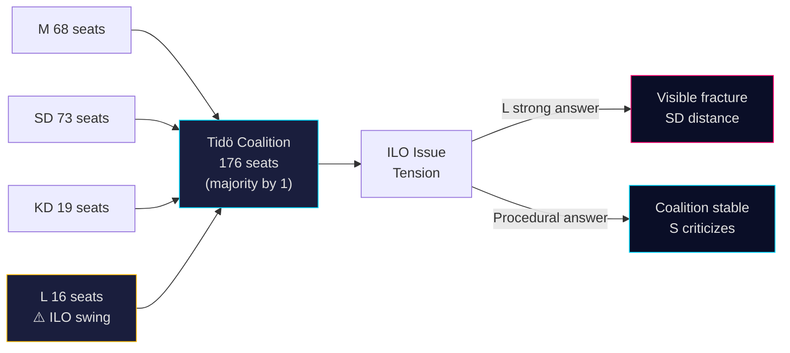

# Coalition Mathematics — Interpellations 2026-05-07

**Author**: James Pether Sörling  
**Date**: 2026-05-07

## Tidö Coalition Seat Map

**Coalition composition**: M (Moderaterna) + SD (Sverigedemokraterna) + KD (Kristdemokraterna) + L (Liberalerna)

| Party | Seats (2022) | Minister posts | ILO position |
|-------|-------------|---------------|-------------|
| M | 68 | PM (Ulf Kristersson) + majority | Historically pro-multilateral |
| SD | 73 | Support party (no ministry) | Skeptical of multilateralism |
| KD | 19 | 2 ministries | Moderate multilateral support |
| L | 16 | 4 ministries incl. acting labor | Strong multilateral credentials |
| **Total** | **176** | | |

**Majority threshold**: 175 seats (350 total / 2)  
**Working majority**: 176 (razor-thin +1)

## ILO Issue and Coalition Tensions

### SD Position on ILO
SD's 2022 election platform expressed skepticism toward "multilateral elite projects." While SD has not explicitly targeted ILO, their general stance creates internal coalition tension when L/M seek strong multilateral positions.

**Risk**: If minister Britz gives a strong pro-ILO answer and SD publicly distances, this creates a visible coalition fracture — rare but electorally damaging for government coherence narrative.

**More likely**: SD stays silent; L minister gives measured answer; no public fracture occurs.

### L (Liberalerna) Position
L has historically been the strongest pro-international labor rights party within the center-right. Johan Britz as acting labor minister is from L — this creates incentive for him to give a substantive ILO answer to protect L's brand.

**Incentive alignment**: L wants strong ILO answer; SD wants minimal multilateral commitment; M/KD want avoidance of coalition fracture.

## Coalition Math: ILO Vote Scenario

If ILO becomes a votation issue (e.g., S motions on ILO funding):

| Party | Expected Vote | Seats |
|-------|--------------|-------|
| S | Yes (pro-ILO funding) | 107 |
| V | Yes | 24 |
| MP | Yes | 18 |
| C | Yes | 24 |
| **Left total** | | **173** |
| M | No | 68 |
| SD | No | 73 |
| KD | No | 19 |
| L | Abstain or Yes | 16 |
| **Right total** | | **176** |

If L votes Yes on ILO motion: 173 + 16 = 189 vs 160 → Motion passes  
If L votes No: 173 vs 176 → Motion fails by 3 votes  
**L becomes the swing party on any ILO vote** — high political leverage for S.

## Coalition Stability Chart

## Assessment

The Tidö coalition's thin 1-seat majority makes coalition management the dominant governing constraint. The ILO issue creates a genuine tension between L's multilateral identity and SD's skepticism. The most likely outcome is Scenario B (Procedural Deflection) — not because the government doesn't care about ILO, but because coalition coherence demands an answer that avoids fracturing the majority. This is rational coalition behavior but creates electoral vulnerability.
