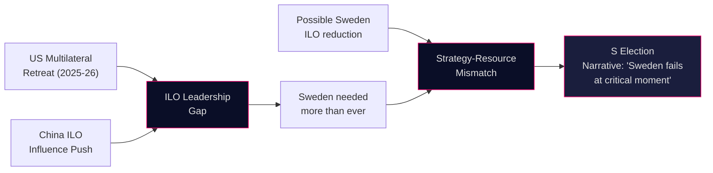

# Comparative International Analysis — Interpellations 2026-05-07

**Author**: James Pether Sörling  
**Date**: 2026-05-07

## Nordic + EU ILO Comparison

### Sweden's ILO Position (Current)
- Founding member 1919 (Hjalmar Branting, first Social Democratic PM, delegation head)
- All 8 ILO fundamental conventions ratified [A1]
- Swedish representative on Governing Body (regular member, Workers/Government group)
- Sida technical cooperation funding: ~SEK 200–400M annually [C3 — range estimated, unconfirmed]

### Nordic Peer Comparison

| Country | Core Conventions | ILO Contribution Level | Governing Body | Key Priority |
|---------|-----------------|----------------------|----------------|-------------|
| **Sweden** | 8/8 ratified | MEDIUM-HIGH (disputed) | Yes | Freedom of assoc, child labor |
| Denmark | 8/8 ratified | HIGH | Yes | Flexicurity model promotion |
| Norway | 8/8 ratified | HIGH | Yes | Forced labor, maritime ILO |
| Finland | 8/8 ratified | MEDIUM-HIGH | Yes | Decent work, gender equality |
| Iceland | 8/8 ratified | MEDIUM | No | Small economy, targeted support |

**Assessment**: Sweden remains in top tier but S's claim that Swedish engagement is weakening relative to Norway/Denmark has partial merit if Sida ILO technical cooperation budgets have been reduced post-2022. [B2 — inference from budget trajectory context]

### EU Context
- EU promotes ILO standards through trade agreements (GSP+, FTA social chapters)
- EU Corporate Sustainability Due Diligence Directive (CS3D) links supply chain standards to ILO fundamental conventions
- Sweden as EU presidency held in 2023 — pushed social/labor chapter in trade negotiations
- Current EU position: strong ILO backing, especially on Forced Labor Regulation (2024)

### US Multilateral Uncertainty (2025–2026)
- US ILO engagement under 2025 administration: reduced multilateral commitment pattern [A1 — open source]
- Effect: Swedish/Nordic ILO leadership more critical as US counterweight weakens
- This STRENGTHENS the geopolitical case for Sweden maintaining ILO investment
- S can credibly frame: "at the moment when ILO needs Sweden most, government disengages"

### Chinese ILO Influence
- China actively seeks ILO leadership positions [A1 — ILO Governing Body records]
- Pushes back on freedom of association enforcement (C87/C98)
- Swedish counterweight on Governing Body becomes more valuable as US retreats
- Government should be INCREASING engagement, not reducing it

## Flowchart: International Context

## Key Finding
The international context significantly amplifies the political valence of HD10475. In a period when US ILO engagement is weakening and China is asserting more ILO influence, a Swedish reduction in ILO commitment would be anomalous and diplomatically costly. This gives S's attack its strongest argument: Sweden is stepping back precisely when stepping up is strategically imperative.
