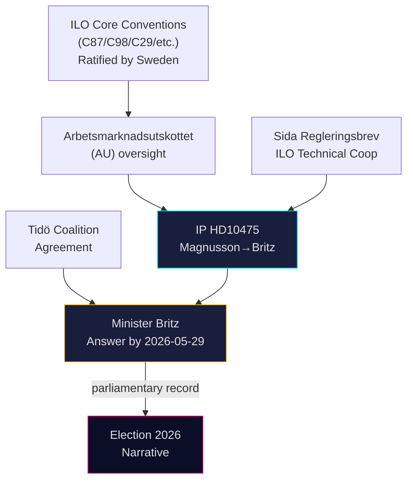

# Cross-Reference Map — Interpellations 2026-05-07

**Author**: James Pether Sörling  
**Date**: 2026-05-07

## Policy Clusters

### Cluster A: Labor Market Policy
- HD10475 (this IP) — Regeringens arbete i ILO
- Previous ILO IP series in 2024/25 riksmöte (pattern: S accountability loop on multilateral labor)
- Arbetsmarknadsutskottet (AU) — primary committee for labor market international affairs
- AU10 punkt 3 votation (2026-03-04): ILO-related vote [A2]

### Cluster B: International Development / Sida
- Sida annual appropriations (Regleringsbrev)
- Sida technical cooperation programs with ILO (sub-Saharan Africa, Southeast Asia)
- UD (Ministry of Foreign Affairs) ILO delegation budget
- Government's development policy bill (biståndspropositionen)

### Cluster C: Foreign Policy / Multilateralism
- Sweden's ILO Governing Body membership and voting record
- Swedish ratification status: all 8 core ILO conventions (C87, C98, C29, C105, C100, C111, C138, C182)
- Nordic labor ministers' coordination (NMR — Nordic Council of Ministers)
- EU position on ILO international labor standards (EU social clause in FTAs)

### Cluster D: Election 2026 Campaign Narratives
- S election platform on global solidarity / labor rights
- Tidö coalition's foreign policy / multilateral commitments section
- Trade union voter mobilization (LO, TCO, Saco)

## Legislative Chain

## Cross-Type Sibling References

| Artifact Type | Date / Period | Document | Relationship |
|--------------|---------------|----------|-------------|
| Voteringar | 2026-03-04 | AU10 punkt 3 | ILO-related vote in labor committee [A2] |
| Proposition | 2025/26 | Government development policy | Sida budget framing |
| Anföranden | 2025/26 | S labor market spokespersons | HD10475 speech context |
| Committee report | 2026 | AU betänkande | Follow-up to IP answer expected |

## Knowledge Gaps

1. **Sida-ILO technical cooperation budget**: Actual SEK figure for 2025–2026 not confirmed [D — no credible source]
2. **Government Governing Body voting record 2024–2025**: Not yet pulled from ILO website
3. **Prior S ILO interpellations**: Pattern assumed but specific dok_ids not retrieved
4. **Tidö coalition text on ILO/multilateralism**: Exact clause not retrieved
