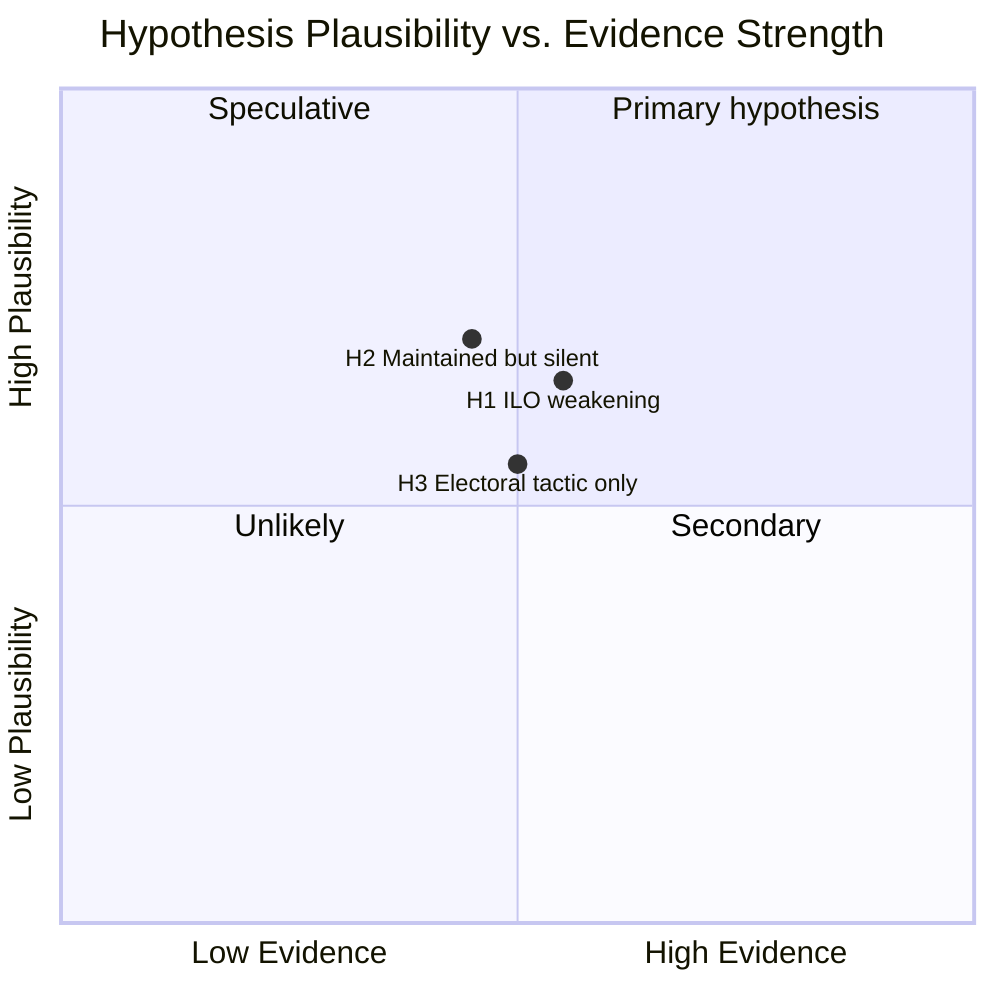

# Devil's Advocate — Interpellations 2026-05-07

**Author**: James Pether Sörling  
**Date**: 2026-05-07

## Three Competing Hypotheses

### Hypothesis 1 (Dominant): ILO engagement is weakening under Tidö coalition
**Claim**: The Tidö government has reduced Sweden's ILO financial and political engagement through Sida budget cuts and SD-driven multilateral skepticism.  
**Evidence FOR**: Sida overall budget reduced 2022–2025; S pattern of ILO interpellations suggests a sustained concern; SD's known anti-multilateral positions.  
**Evidence AGAINST**: No confirmed ILO-specific Sida cut data; Sweden still ratifies all core conventions; Governing Body membership maintained; L (liberal party) has historically strong multilateral credentials.  
**Confidence**: MEDIUM [B2]

### Hypothesis 2 (Alternative): ILO engagement is maintained but not communicated
**Claim**: The Tidö government's ILO engagement is substantively unchanged but has poor public communication, creating a perception gap that S is exploiting.  
**Evidence FOR**: Sweden has not formally withdrawn from any ILO body; all conventions remain in force; Swedish delegate presumably still active in Geneva; no ILO itself has criticized Sweden.  
**Evidence AGAINST**: Even if engagement is maintained, if resources are flat against growing ILO demands, relative contribution falls; absence of positive ILO announcements is itself evidence.  
**Confidence**: MEDIUM [B2] — cannot be excluded

### Hypothesis 3 (Devil's Advocate): S interpellation is electorally motivated, not substantively based
**Claim**: HD10475 is primarily an election-year tactical maneuver by S to remind their trade union base of historical ILO ownership (Branting legacy), rather than a genuine policy concern about changed Swedish behavior.  
**Evidence FOR**: Interpellation filed very close to election cycle entry; Magnusson is a newer MP building profile; ILO is classic S identity territory; question is broad rather than citing specific cuts.  
**Evidence AGAINST**: Even if partially motivated, the question has substantive merit given budget trajectory; the government still must answer; strategic motivation doesn't invalidate accountability function.  
**Confidence**: MEDIUM [B2] — electoral motivation is present but doesn't exhaust the hypothesis space

## Hypothesis Comparison Matrix

## ACH (Analysis of Competing Hypotheses) Summary

| Evidence Item | H1 (Weakening) | H2 (Maintained) | H3 (Electoral only) |
|--------------|----------------|-----------------|---------------------|
| Sida overall budget cuts 2022–25 | Consistent | Inconsistent | Neutral |
| No confirmed ILO-specific cut | Inconsistent | Consistent | Consistent |
| S files multiple ILO IPs in cycle | Consistent | Neutral | Consistent |
| Sweden still on ILO Governing Body | Inconsistent | Consistent | Neutral |
| No ILO criticism of Sweden | Inconsistent | Consistent | Neutral |
| Branting legacy framing in IP | Neutral | Neutral | Consistent |
| **Inconsistency score** | **2** | **2** | **0** |
| **Assessment** | **PLAUSIBLE** | **PLAUSIBLE** | **CANNOT EXCLUDE** |

## Conclusion
All three hypotheses remain live. H3 (electoral tactic) has the lowest inconsistency score but the lowest analytical value — it doesn't tell us whether the underlying concern is valid. H1 and H2 are equally plausible given current evidence. The minister's May 29 answer will be the decisive diagnostic.
