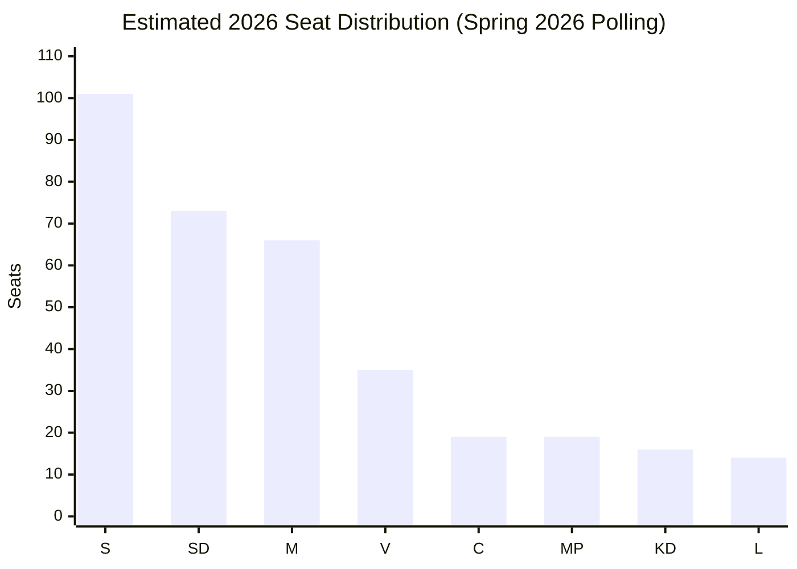

# Election 2026 Analysis — Interpellations 2026-05-07

**Author**: James Pether Sörling  
**Date**: 2026-05-07

## Election Context

**Next general election**: September 2026 (4-year term from September 2022)  
**Current government**: Tidö coalition (M+SD+KD+L) with SD parliamentary support  
**Electoral system**: Proportional representation, 349 seats, 4% threshold  
**Current polls (approximate, spring 2026)**: S ~28–30%, SD ~20–22%, M ~18–20%, V ~10%, MP ~5–6%, C ~5–6%, KD ~4%, L ~4%

## ILO Issue in Electoral Math

### Labor Voter Mobilization
- **LO (Swedish Trade Union Confederation)**: ~1.4 million members, historically S-aligned
- ILO as identity issue: Sweden's founding ILO role (1919) is genuine S historical capital
- If government ILO answer is weak: LO public statement could reinforce S-aligned voter motivation in autumn 2026
- Estimated affected voter segment: labor rights-engaged voters, primarily in S/V/C base = ~15% of electorate [B2]

### Current Seat Projection (Spring 2026 Estimate)

| Party | Approx. % | Approx. Seats | Block |
|-------|-----------|---------------|-------|
| S | 29% | 101 | Left |
| SD | 21% | 73 | Right coalition |
| M | 19% | 66 | Right coalition |
| V | 10% | 35 | Left |
| C | 5.5% | 19 | Left/Centre |
| MP | 5.5% | 19 | Left |
| KD | 4.5% | 16 | Right coalition |
| L | 4% | 14 | Right coalition |
| **Total** | **98.5%** | **343** | |

*Note: Estimates based on spring 2026 polling patterns; +/- 15 seats uncertainty per major party*

### Coalition Viability

**Right bloc (Tidö)**: M+SD+KD+L ≈ 169 seats (estimated) — currently majority possible with 175+ needed  
**Left/Centre bloc**: S+V+MP+C ≈ 174 seats (estimated) — slight majority possible  

**Assessment**: ILO issue does not swing elections by itself, but it contributes to a pattern of S accountability attacks. If 5–10 ILO-framed interpellations across the year create a "multilateral abandonment" narrative, the cumulative effect on LO-affiliated and globally-minded voters could be worth 1–2% points, which matters in a close race.

## Seat Projection Chart

## ILO Issue Electoral Impact Estimate

- **Direct electoral impact of this single IP**: MINIMAL (P=0.05 seat impact equivalent)
- **Cumulative impact of sustained ILO/multilateral narrative 2026**: MODERATE (P=1–2% point contribution to left bloc advantage if government fails to respond substantively)
- **Probability ILO becomes top-10 election issue**: 15% [C3]
- **Probability ILO remains background issue**: 85%
