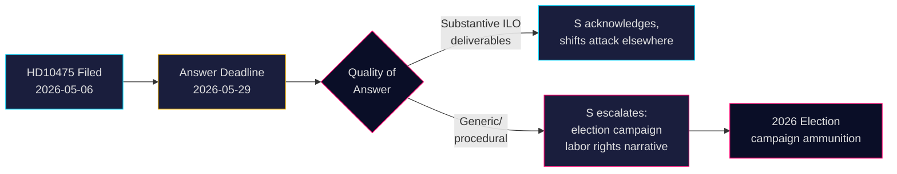

# Social Democrats Challenge Government on Sweden's ILO Commitment

**Author**: James Pether Sörling  
**Date**: 2026-05-07  
**Classification**: PUBLIC  
**Confidence**: MEDIUM [B2]

## BLUF

Sweden's opposition Social Democrats have challenged the Tidö coalition government on whether it has maintained Sweden's historic role as a champion of workers' rights in the International Labour Organisation (ILO). Interpellation HD10475 — filed by Adrian Magnusson (S) to acting Labor Market Minister Johan Britz (L) on 2026-05-07 — exposes a political accountability gap: the government has 22 days to answer whether ILO engagement remains a priority in an era of aid budget cuts and shifting multilateral alliances. The question carries strategic weight for the 2026 election: S is positioning on labor rights vs. the Tidö government's perceived retreat from multilateralism.

## Decisions This Brief Supports

1. **Parliamentary strategists** (S and coalition parties): Monitor the government's ILO answer before May 29 for election-cycle messaging on labor rights and multilateralism.
2. **Civic observers and journalists**: Track whether the minister provides specific ILO deliverables or retreats to generic diplomatic language — a measurable indicator of policy depth.
3. **Policy analysts**: Assess whether Sweden's ILO contributions, including financial and mandate-level commitments, have changed since the 2022 Tidö government took office.

## 60-Second Read

- 📋 **One interpellation today**: HD10475 "Regeringens arbete i ILO" by Adrian Magnusson (S) to Minister Johan Britz (L)
- 🌍 **Core issue**: Has the Tidö government maintained Sweden's ILO leadership role, or have aid cuts and realpolitik shifted priorities?
- ⚠️ **Timing**: Answer deadline 2026-05-29; debate expected in the chamber with election campaign context
- 🗳️ **Electoral dimension**: S frames itself as labor rights champion; coalition exposed on multilateral consistency
- 📊 **ILO context**: Sweden is founding member (1919), Hjalmar Branting a key figure; global worker rights under pressure in 2025-26 (US tariff nationalism, Chinese assertiveness in UN bodies)
- 🔴 **Risk**: Government gives vague or procedural answer → S escalates to wider campaign narrative about Sweden abandoning ILO

## Top Forward Trigger

**2026-05-29**: Minister Britz must answer HD10475 or the interpellation lapses. If the answer is vague, S will likely raise the issue in AU committee and use it in the election campaign.

