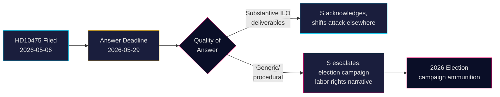

&#x200F;# الديمقراطيون الاجتماعيون يتحدون الحكومة بشأن التزام السويد تجاه منظمة العمل الدولية

**المؤلف**: James Pether Sörling  
**التاريخ**: 2026-05-07  
**التصنيف**: عام  
**مستوى الثقة**: متوسط [B2]

## الملخص التنفيذي

تحدّى حزب الديمقراطيين الاجتماعيين المعارض السويدي حكومة ائتلاف تيدو بشأن ما إذا كانت قد حافظت على الدور التاريخي للسويد بوصفها بطلةً لحقوق العمال في منظمة العمل الدولية (ILO). الاستجواب HD10475 — المقدَّم من Adrian Magnusson (S) إلى وزير سوق العمل بالنيابة Johan Britz (L) بتاريخ 7 مايو 2026 — يكشف عن فجوة في المساءلة السياسية: تملك الحكومة 22 يومًا للإجابة عمّا إذا كان الانخراط في منظمة العمل الدولية لا يزال أولوية في حقبة تشهد خفضًا في الميزانيات الإنمائية وتحوّلًا في التحالفات متعددة الأطراف. تحمل هذه المسألة ثقلًا استراتيجيًا لانتخابات 2026: يُعيد حزب S تموضعه حول حقوق العمال في مقابل ما يُوصف بتراجع حكومة تيدو عن الاتجاه متعدد الأطراف.

## القرارات التي يدعمها هذا التقرير

1. **الاستراتيجيون البرلمانيون** (S والأحزاب الائتلافية): رصد رد الحكومة على منظمة العمل الدولية قبل 29 مايو للاستفادة منه في الرسائل الانتخابية المتعلقة بحقوق العمال والتعددية.
2. **المراقبون المدنيون والصحفيون**: متابعة ما إذا كان الوزير يقدّم نتائج ملموسة تخص منظمة العمل الدولية أم يلجأ إلى اللغة الدبلوماسية العامة — مؤشر قابل للقياس على العمق السياسي.
3. **المحللون السياسيون**: تقييم ما إذا كانت مساهمات السويد في منظمة العمل الدولية، بما فيها الالتزامات المالية وعلى مستوى التفويض، قد تغيّرت منذ تولّي حكومة تيدو السلطة عام 2022.

## القراءة في 60 ثانية

- 📋 **استجواب واحد اليوم**: HD10475 "Regeringens arbete i ILO" من Adrian Magnusson (S) إلى الوزير Johan Britz (L)
- 🌍 **المسألة الجوهرية**: هل حافظت حكومة تيدو على دور السويد القيادي في منظمة العمل الدولية، أم أن خفض المساعدات والسياسة الواقعية أعادا توجيه الأولويات؟
- ⚠️ **الجدول الزمني**: الموعد النهائي للرد 2026-05-29؛ يُتوقع انعقاد نقاش في مجلس النواب في سياق الحملة الانتخابية
- 🗳️ **البُعد الانتخابي**: يُقدّم حزب S نفسه بطلًا لحقوق العمال؛ الائتلاف مكشوف أمام تساؤلات حول الاتساق متعدد الأطراف
- 📊 **سياق منظمة العمل الدولية**: السويد عضو مؤسس (1919)، Hjalmar Branting شخصية محورية؛ حقوق العمال العالمية تحت الضغط 2025-26 (قومية التعريفات الجمركية الأمريكية، التوكيد الصيني في هيئات الأمم المتحدة)
- 🔴 **الخطر**: إذا قدّمت الحكومة إجابةً مبهمة أو إجرائية → سيُصعّد حزب S الأمر إلى روايةٍ حملاتية أشمل حول تخلّي السويد عن منظمة العمل الدولية

## أبرز المحفزات المستقبلية

**2026-05-29**: يجب على الوزير Britz الإجابة على HD10475 وإلا يسقط الاستجواب. إن جاءت الإجابة مبهمة، سيطرح حزب S المسألة على الأرجح في لجنة AU ويوظّفها في الحملة الانتخابية.

<!-- source-sha: 2609a9ed259812c2115622a78da9175f9fbea8ad -->
