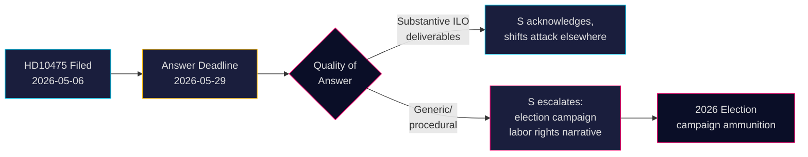

# Socialdemokraterne udfordrer regeringen om Sveriges ILO-forpligtelse

**Forfatter**: James Pether Sörling  
**Dato**: 2026-05-07  
**Klassifikation**: OFFENTLIG  
**Konfidensgrad**: MEDIUM [B2]

## RESUMÉ

Sveriges oppositionsparti Socialdemokraterne har udfordret Tidö-koalitionsregeringen om, hvorvidt den har opretholdt Sveriges historiske rolle som forkæmper for arbejdstagernes rettigheder i Den Internationale Arbejdsorganisation (ILO). Interpellation HD10475 — indgivet af Adrian Magnusson (S) til fungerende arbejdsmarkedsminister Johan Britz (L) den 7. maj 2026 — afslører et politisk ansvarsgab: regeringen har 22 dage til at svare på, om ILO-engagement fortsat er en prioritet i en tid med bistandsbesparelser og forskydning af multilaterale alliancer. Spørgsmålet har strategisk vægt for valget i 2026: S positionerer sig om arbejdstagerrettigheder over for Tidö-regeringens opfattede tilbagetrækning fra multilateralisme.

## Beslutninger dette underlag understøtter

1. **Parlamentariske strateger** (S og koalitionspartier): Overvåg regeringens ILO-svar inden den 29. maj for budskaber om arbejdstagerrettigheder og multilateralisme i valgkampagnen.
2. **Civile observatører og journalister**: Følg op på, om ministeren leverer konkrete ILO-resultater eller falder tilbage til generelt diplomatisk sprog — en målbar indikator for politisk dybde.
3. **Politiske analytikere**: Vurdér, om Sveriges ILO-bidrag, herunder finansielle og mandatniveauforpligtelser, har ændret sig, siden Tidö-regeringen tiltrådte i 2022.

## 60-sekunders læsning

- 📋 **Én interpellation i dag**: HD10475 "Regeringens arbete i ILO" af Adrian Magnusson (S) til minister Johan Britz (L)
- 🌍 **Kernespørgsmål**: Har Tidö-regeringen opretholdt Sveriges ILO-lederrolle, eller har bistandsbesparelser og realpolitik forskudt prioriteterne?
- ⚠️ **Tidslinje**: Svarfrist 2026-05-29; debat forventes i kammeret med valgkampagnekontekst
- 🗳️ **Valgdimension**: S fremstiller sig selv som forkæmper for arbejdstagerrettigheder; koalitionen er eksponeret på multilateral konsekvens
- 📊 **ILO-kontekst**: Sverige er stiftende medlem (1919), Hjalmar Branting en nøglefigur; globale arbejdstagerrettigheder under pres i 2025-26 (USA-toldnationalisme, kinesisk assertivitet i FN-organer)
- 🔴 **Risiko**: Regeringen giver et vagt eller proceduremæssigt svar → S eskalerer til bredere kampagnefortælling om, at Sverige forlader ILO

## Vigtigste fremadrettede udløser

**2026-05-29**: Minister Britz skal besvare HD10475, ellers bortfalder interpellationen. Hvis svaret er vagt, vil S sandsynligvis rejse spørgsmålet i AU-udvalget og bruge det i valgkampagnen.

<!-- source-sha: 2609a9ed259812c2115622a78da9175f9fbea8ad -->
