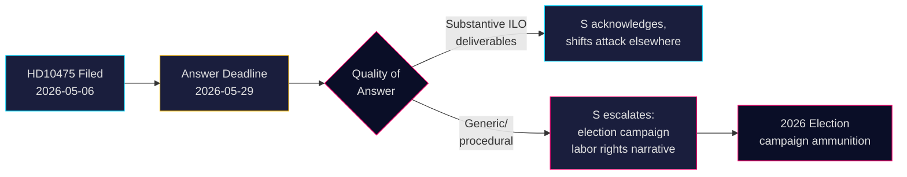

# Sozialdemokraten fordern Regierung zu Schwedens ILO-Verpflichtung heraus

**Autor**: James Pether Sörling  
**Datum**: 2026-05-07  
**Klassifizierung**: ÖFFENTLICH  
**Konfidenzniveau**: MITTEL [B2]

## ZUSAMMENFASSUNG

Schwedens Oppositionspartei Sozialdemokraten hat die Tidö-Koalitionsregierung herausgefordert, ob sie Schwedens historische Rolle als Verfechter von Arbeitnehmerrechten in der Internationalen Arbeitsorganisation (ILO) aufrechterhalten hat. Interpellation HD10475 — eingereicht von Adrian Magnusson (S) an den amtierenden Arbeitsmarktminister Johan Britz (L) am 7. Mai 2026 — legt eine politische Rechenschaftslücke offen: Die Regierung hat 22 Tage Zeit zu antworten, ob das ILO-Engagement in einer Ära von Hilfskürzungen und sich verschiebenden multilateralen Allianzen weiterhin Priorität hat. Die Frage hat strategisches Gewicht für die Wahl 2026: S positioniert sich in Bezug auf Arbeitnehmerrechte gegenüber dem wahrgenommenen Rückzug der Tidö-Regierung vom Multilateralismus.

## Entscheidungen, die dieses Briefing unterstützt

1. **Parlamentarische Strategen** (S und Koalitionsparteien): Beobachten Sie die ILO-Antwort der Regierung vor dem 29. Mai für Wahlkampfbotschaften zu Arbeitnehmerrechten und Multilateralismus.
2. **Zivilbeobachter und Journalisten**: Verfolgen Sie, ob der Minister konkrete ILO-Ergebnisse liefert oder auf allgemeine diplomatische Sprache ausweicht — ein messbarer Indikator für politische Tiefe.
3. **Politikanalysten**: Bewerten Sie, ob Schwedens ILO-Beiträge, einschließlich finanzieller und mandatsbezogener Verpflichtungen, sich seit dem Amtsantritt der Tidö-Regierung 2022 verändert haben.

## 60-Sekunden-Lektüre

- 📋 **Eine Interpellation heute**: HD10475 "Regeringens arbete i ILO" von Adrian Magnusson (S) an Minister Johan Britz (L)
- 🌍 **Kernfrage**: Hat die Tidö-Regierung Schwedens ILO-Führungsrolle aufrechterhalten, oder haben Hilfskürzungen und Realpolitik die Prioritäten verschoben?
- ⚠️ **Zeitplan**: Antwortfrist 2026-05-29; Debatte im Plenum mit Wahlkampfkontext erwartet
- 🗳️ **Wahldimension**: S präsentiert sich als Verfechter der Arbeitnehmerrechte; Koalition ist in Bezug auf multilaterale Konsistenz exponiert
- 📊 **ILO-Kontext**: Schweden ist Gründungsmitglied (1919), Hjalmar Branting eine Schlüsselfigur; globale Arbeitnehmerrechte stehen 2025-26 unter Druck (US-Zollnationalismus, chinesische Assertivität in UN-Gremien)
- 🔴 **Risiko**: Regierung gibt vage oder prozedurale Antwort → S eskaliert zu breiterem Kampagnennarrativ über Schwedens Aufgabe der ILO

## Wichtigster vorausschauender Auslöser

**2026-05-29**: Minister Britz muss HD10475 beantworten, oder die Interpellation verfällt. Wenn die Antwort vage ist, wird S die Frage wahrscheinlich im AU-Ausschuss aufgreifen und sie im Wahlkampf nutzen.

<!-- source-sha: 2609a9ed259812c2115622a78da9175f9fbea8ad -->
