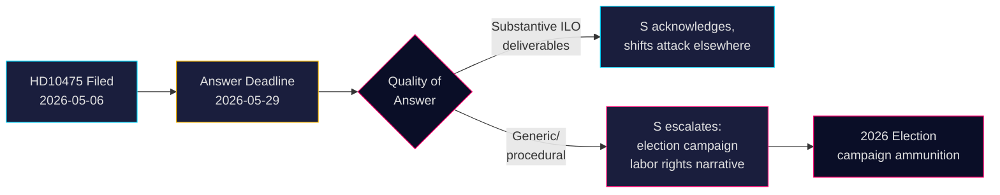

# Los socialdemócratas desafían al gobierno sobre el compromiso de Suecia con la OIT

**Autor**: James Pether Sörling  
**Fecha**: 2026-05-07  
**Clasificación**: PÚBLICO  
**Nivel de confianza**: MEDIO [B2]

## RESUMEN

El partido de oposición Socialdemócrata sueco ha desafiado al gobierno de coalición Tidö sobre si ha mantenido el papel histórico de Suecia como campeón de los derechos de los trabajadores en la Organización Internacional del Trabajo (OIT). La interpelación HD10475 — presentada por Adrian Magnusson (S) al ministro de trabajo interino Johan Britz (L) el 7 de mayo de 2026 — expone una brecha de responsabilidad política: el gobierno tiene 22 días para responder si el compromiso con la OIT sigue siendo una prioridad en una era de recortes a la ayuda y alianzas multilaterales cambiantes. La pregunta tiene peso estratégico para las elecciones de 2026: S se posiciona en torno a los derechos laborales frente a la percibida retirada del gobierno Tidö del multilateralismo.

## Decisiones que este informe apoya

1. **Estrategas parlamentarios** (S y partidos de la coalición): Vigilar la respuesta del gobierno a la OIT antes del 29 de mayo para los mensajes de campaña electoral sobre derechos laborales y multilateralismo.
2. **Observadores cívicos y periodistas**: Hacer un seguimiento de si el ministro proporciona resultados concretos de la OIT o recurre a un lenguaje diplomático genérico — un indicador medible de profundidad política.
3. **Analistas políticos**: Evaluar si las contribuciones de Suecia a la OIT, incluyendo compromisos financieros y de nivel de mandato, han cambiado desde que el gobierno Tidö asumió el cargo en 2022.

## Lectura en 60 segundos

- 📋 **Una interpelación hoy**: HD10475 "Regeringens arbete i ILO" de Adrian Magnusson (S) al ministro Johan Britz (L)
- 🌍 **Cuestión central**: ¿Ha mantenido el gobierno Tidö el papel de liderazgo de Suecia en la OIT, o los recortes a la ayuda y la realpolitik han desplazado las prioridades?
- ⚠️ **Cronograma**: Plazo de respuesta 2026-05-29; se espera debate en la cámara en contexto de campaña electoral
- 🗳️ **Dimensión electoral**: S se presenta como campeón de los derechos laborales; la coalición está expuesta en cuanto a coherencia multilateral
- 📊 **Contexto OIT**: Suecia es miembro fundador (1919), Hjalmar Branting figura clave; derechos laborales globales bajo presión en 2025-26 (nacionalismo arancelario de EEUU, asertividad china en organismos de la ONU)
- 🔴 **Riesgo**: El gobierno da una respuesta vaga o procesal → S escala a una narrativa de campaña más amplia sobre Suecia abandonando la OIT

## Principal desencadenante prospectivo

**2026-05-29**: El ministro Britz debe responder a HD10475 o la interpelación caduca. Si la respuesta es vaga, S probablemente planteará el asunto en el comité AU y lo utilizará en la campaña electoral.

<!-- source-sha: 2609a9ed259812c2115622a78da9175f9fbea8ad -->
