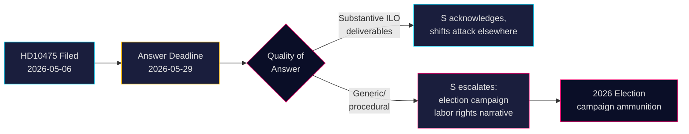

# Sosiaalidemokraatit haastavat hallituksen Ruotsin ILO-sitoumuksesta

**Tekijä**: James Pether Sörling  
**Päivämäärä**: 2026-05-07  
**Luokitus**: JULKINEN  
**Luottamustaso**: MEDIUM [B2]

## TIIVISTELMÄ

Ruotsin oppositiopuolue Sosiaalidemokraatit on haastanut Tidö-koalitiohallituksen siitä, onko se ylläpitänyt Ruotsin historiallista roolia työntekijöiden oikeuksien puolestapuhujana Kansainvälisessä työjärjestössä (ILO). Kyselytunti HD10475 — Adrian Magnussonin (S) jättämä vt. työmarkkina­ministeri Johan Britzille (L) 7. toukokuuta 2026 — paljastaa poliittisen vastuuaukon: hallituksella on 22 päivää aikaa vastata, onko ILO-sitoutuminen edelleen etusijalla kehitysapuleikkausten ja muuttuneiden monenvälisten liittoutumien aikakaudella. Kysymyksellä on strateginen paino vuoden 2026 vaaleja ajatellen: S asemoituu työntekijänoikeuksiin Tidö-hallituksen koetun monenvälistyksestä vetäytymisen vastakohtana.

## Tiedotteen tukemat päätökset

1. **Parlamentaariset strategit** (S ja koalitiопuolueet): Seuraa hallituksen ILO-vastausta ennen 29. toukokuuta vaaliviestin kannalta työntekijänoikeuksista ja monenvälistyksestä.
2. **Kansalaishavainnoijat ja toimittajat**: Seuraa, toimittaako ministeri konkreettisia ILO-tuloksia vai vetäytyykö yleiseen diplomaattiseen kieleen — mitattava poliittisen syvyyden indikaattori.
3. **Politiikan analyytikot**: Arvioi, ovatko Ruotsin ILO-panokset, mukaan lukien taloudelliset ja mandaattitason sitoumukset, muuttuneet sitten kun Tidö-hallitus aloitti tehtävänsä vuonna 2022.

## 60 sekunnin lukeminen

- 📋 **Yksi kyselytunti tänään**: HD10475 "Regeringens arbete i ILO" — Adrian Magnusson (S) ministerille Johan Britz (L)
- 🌍 **Ydinkysymys**: Onko Tidö-hallitus ylläpitänyt Ruotsin ILO-johtajuusroolia, vai ovatko kehitysapuleikkaukset ja reaalipolitiikka siirtäneet prioriteetteja?
- ⚠️ **Aikataulu**: Vastausmääräaika 2026-05-29; väittely odotetaan salissa vaalikauden kontekstissa
- 🗳️ **Vaalidimensio**: S esittää itsensä työntekijänoikeuksien puolestapuhujana; koalitio on alttiina monenvälisen johdonmukaisuuden suhteen
- 📊 **ILO-konteksti**: Ruotsi on perustajaijäsen (1919), Hjalmar Branting avainhenkilö; maailmanlaajuiset työntekijänoikeudet paineessa 2025-26 (Yhdysvaltain tullitullioikeuksissa, Kiinan assertiivisuus YK:n elimissä)
- 🔴 **Riski**: Hallitus antaa epämääräisen tai menettelyllisen vastauksen → S laajentaa kampanjatarinaksi Ruotsin ILO:sta luopumisesta

## Tärkein ennakoiva laukaisu

**2026-05-29**: Ministeri Britzin on vastattava HD10475:een tai kyselytunti raukeaa. Jos vastaus on epämääräinen, S nostaa todennäköisesti asian AU-valiokunnassa ja käyttää sitä vaalikampanjassa.

<!-- source-sha: 2609a9ed259812c2115622a78da9175f9fbea8ad -->
