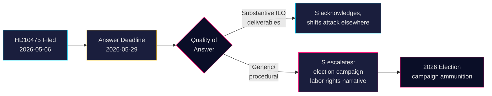

# Les sociaux-démocrates défient le gouvernement sur l'engagement de la Suède envers l'OIT

**Auteur** : James Pether Sörling  
**Date** : 2026-05-07  
**Classification** : PUBLIC  
**Niveau de confiance** : MOYEN [B2]

## RÉSUMÉ

Le parti d'opposition social-démocrate suédois a défié le gouvernement de coalition Tidö sur la question de savoir s'il a maintenu le rôle historique de la Suède en tant que champion des droits des travailleurs à l'Organisation internationale du travail (OIT). L'interpellation HD10475 — déposée par Adrian Magnusson (S) auprès du ministre intérimaire du marché du travail Johan Britz (L) le 7 mai 2026 — expose une lacune de responsabilité politique : le gouvernement dispose de 22 jours pour répondre si l'engagement envers l'OIT reste une priorité à une époque de réductions de l'aide et d'alliances multilatérales changeantes. La question revêt un poids stratégique pour les élections de 2026 : S se positionne sur les droits des travailleurs face au retrait perçu du gouvernement Tidö du multilatéralisme.

## Décisions que ce briefing soutient

1. **Stratèges parlementaires** (S et partis de coalition) : Surveillez la réponse du gouvernement à l'OIT avant le 29 mai pour les messages de campagne électorale sur les droits des travailleurs et le multilatéralisme.
2. **Observateurs civiques et journalistes** : Suivez si le ministre fournit des résultats concrets de l'OIT ou se retranche derrière un langage diplomatique générique — un indicateur mesurable de la profondeur politique.
3. **Analystes politiques** : Évaluez si les contributions de la Suède à l'OIT, y compris les engagements financiers et de niveau de mandat, ont changé depuis l'entrée en fonctions du gouvernement Tidö en 2022.

## Lecture en 60 secondes

- 📋 **Une interpellation aujourd'hui** : HD10475 "Regeringens arbete i ILO" d'Adrian Magnusson (S) au ministre Johan Britz (L)
- 🌍 **Question centrale** : Le gouvernement Tidö a-t-il maintenu le rôle de leadership de la Suède à l'OIT, ou les réductions de l'aide et la realpolitik ont-elles déplacé les priorités ?
- ⚠️ **Calendrier** : Date limite de réponse 2026-05-29 ; débat attendu en séance plénière dans le contexte de la campagne électorale
- 🗳️ **Dimension électorale** : S se présente comme champion des droits des travailleurs ; la coalition est exposée sur la cohérence multilatérale
- 📊 **Contexte OIT** : La Suède est membre fondateur (1919), Hjalmar Branting figure clé ; droits des travailleurs mondiaux sous pression en 2025-26 (nationalisme tarifaire américain, assertivité chinoise dans les organes de l'ONU)
- 🔴 **Risque** : Le gouvernement donne une réponse vague ou procédurale → S fait escalader vers un récit de campagne plus large sur l'abandon de l'OIT par la Suède

## Principal déclencheur prospectif

**2026-05-29** : Le ministre Britz doit répondre à HD10475 ou l'interpellation expire. Si la réponse est vague, S soulèvera probablement la question au sein du comité AU et l'utilisera dans la campagne électorale.

<!-- source-sha: 2609a9ed259812c2115622a78da9175f9fbea8ad -->
