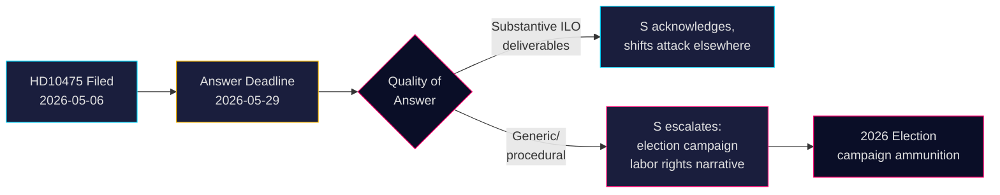

&#x200F;# הסוציאל-דמוקרטים מאתגרים את הממשלה על מחויבות שוודיה ל-ILO

**מחבר**: James Pether Sörling  
**תאריך**: 2026-05-07  
**סיווג**: ציבורי  
**רמת ביטחון**: בינונית [B2]

## סיכום מנהלים

מפלגת האופוזיציה הסוציאל-דמוקרטית בשוודיה אתגרה את ממשלת קואליציית טידו בשאלה האם שמרה על תפקידה ההיסטורי של שוודיה כאלופת זכויות העובדים בארגון העבודה הבינלאומי (ILO). שאילתת HD10475 — שהגיש Adrian Magnusson (S) לשר העבודה הממלא מקום Johan Britz (L) ב-7 במאי 2026 — חושפת פער אחריות פוליטית: לממשלה יש 22 ימים להשיב האם מעורבות ILO עדיין בראש סדר העדיפויות בעידן של קיצוצי סיוע וברית רב-צדדיות משתנות. לשאלה יש משקל אסטרטגי לבחירות 2026: S מציבה עצמה סביב זכויות עובדים לעומת הנסיגה הנתפסת של ממשלת טידו מרב-צדדיות.

## החלטות שתדריך זה תומך בהן

1. **אסטרטגים פרלמנטריים** (S ומפלגות הקואליציה): עקבו אחר תשובת הממשלה בנושא ILO לפני ה-29 במאי לצורך מסרי מסע בחירות על זכויות עובדים ורב-צדדיות.
2. **משקיפים אזרחיים ועיתונאים**: עקבו האם השר מספק תוצאות ILO קונקרטיות או נסוג לשפה דיפלומטית כללית — מחוון מדיד לעומק מדיני.
3. **אנליסטים פוליטיים**: העריכו האם תרומותיה של שוודיה ל-ILO, כולל התחייבויות פיננסיות ועל רמת מנדט, השתנו מאז ממשלת טידו התמנתה ב-2022.

## קריאה של 60 שניות

- 📋 **שאילתא אחת היום**: HD10475 "Regeringens arbete i ILO" מאת Adrian Magnusson (S) לשר Johan Britz (L)
- 🌍 **השאלה המרכזית**: האם ממשלת טידו שמרה על תפקיד ההנהגה של שוודיה ב-ILO, או שקיצוצי סיוע ורזון מדיני הסיטו את העדיפויות?
- ⚠️ **לוח זמנים**: מועד אחרון לתשובה 2026-05-29; צפוי ויכוח במליאה בהקשר של קמפיין בחירות
- 🗳️ **ממד בחירות**: S מציגה עצמה כאלופת זכויות עובדים; הקואליציה חשופה לשאלות עקביות רב-צדדית
- 📊 **הקשר ILO**: שוודיה חברת מייסד (1919), Hjalmar Branting דמות מפתח; זכויות עובדים גלובליות תחת לחץ ב-2025-26 (לאומנות מכסים אמריקאית, נחרצות סינית בגופי האו"ם)
- 🔴 **סיכון**: הממשלה נותנת תשובה עמומה או פרוצדורלית → S מסלימה לנרטיב קמפיין רחב יותר על נטישת שוודיה את ILO

## הטריגר הצופה העיקרי

**2026-05-29**: שר Britz חייב לענות על HD10475 או השאילתא פוקעת. אם התשובה עמומה, S תעלה כנראה את הנושא בוועדת AU ותשתמש בו בקמפיין הבחירות.

<!-- source-sha: 2609a9ed259812c2115622a78da9175f9fbea8ad -->
