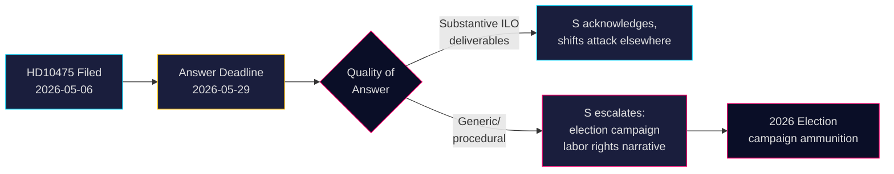

# 社会民主党がスウェーデンのILOへのコミットメントについて政府に問う

**著者**: James Pether Sörling  
**日付**: 2026-05-07  
**分類**: 公開  
**信頼度**: 中程度 [B2]

## 要旨

スウェーデンの野党・社会民主党は、チドー連立政権が国際労働機関（ILO）における労働者の権利の擁護者としてのスウェーデンの歴史的役割を維持してきたかどうかについて問いただした。代表質問HD10475 — 2026年5月7日にAdrian Magnusson（S）が労働市場担当代理大臣Johan Britz（L）に提出 — は政治的説明責任のギャップを露わにしている：政府は、援助予算削減と多国間同盟の変容の時代においてILOへの関与が引き続き優先事項であるかどうかについて22日以内に答える必要がある。この問題は2026年選挙に向けて戦略的な重みを持つ：Sは労働者の権利について、多国主義からの後退とみなされるチドー政権に対し立場を明確にしている。

## このブリーフィングが支援する決定

1. **議会戦略家**（Sおよび連立政党）：労働者の権利と多国主義に関する選挙サイクルのメッセージのために、5月29日前の政府のILO回答を監視する。
2. **市民観察者および記者**：大臣が具体的なILO成果を提供するか、一般的な外交的言語に退却するかを追跡する — 政策の深さの測定可能な指標。
3. **政策アナリスト**：チドー政権が2022年に発足して以来、財政的および権限レベルのコミットメントを含め、スウェーデンのILOへの貢献が変化したかどうかを評価する。

## 60秒要約

- 📋 **本日の代表質問**: HD10475「Regeringens arbete i ILO」— Adrian Magnusson（S）から大臣Johan Britz（L）へ
- 🌍 **核心的問題**: チドー政権はスウェーデンのILOリーダーシップ役割を維持してきたか、それとも援助削減と現実政治が優先事項を転換したか？
- ⚠️ **タイムライン**: 回答期限 2026-05-29；選挙キャンペーンの文脈で議会討論が予想される
- 🗳️ **選挙的側面**: Sは労働者の権利の擁護者として自らを位置づける；連立政権は多国間の一貫性に関して露呈している
- 📊 **ILOの文脈**: スウェーデンは創設メンバー（1919年）、Hjalmar Brantingが重要人物；2025-26年に世界的な労働者の権利が圧力下（米国の関税ナショナリズム、国連機関における中国の主張）
- 🔴 **リスク**: 政府が曖昧または手続き的な回答をする → Sはスウェーデンがを見捨てたという広範な選挙運動の物語にエスカレートする

## 最重要の先行トリガー

**2026-05-29**: 大臣Britzは HD10475に回答しなければならず、さもなければ代表質問は失効する。回答が曖昧であれば、SはAU委員会でその問題を提起し、選挙運動で使用する可能性が高い。

<!-- source-sha: 2609a9ed259812c2115622a78da9175f9fbea8ad -->
