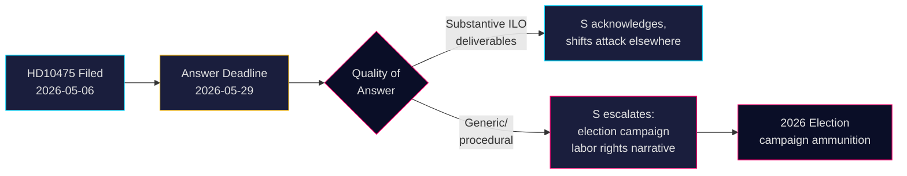

# 사회민주당, ILO에 대한 스웨덴의 의지를 두고 정부 추궁

**저자**: James Pether Sörling  
**날짜**: 2026-05-07  
**분류**: 공개  
**신뢰도**: 중간 [B2]

## 요약

스웨덴 야당 사회민주당이 티도 연립정부를 상대로, 스웨덴이 국제노동기구(ILO)에서 노동자 권리의 옹호자로서의 역사적 역할을 유지해왔는지 추궁했다. 대정부질문 HD10475 — Adrian Magnusson(S)이 2026년 5월 7일 노동시장부 대행장관 Johan Britz(L)에게 제출 — 는 정치적 책임 공백을 드러낸다: 정부는 개발원조 예산 삭감과 다자 동맹 변화의 시대에 ILO 참여가 여전히 우선순위인지에 대해 22일 이내에 답해야 한다. 이 문제는 2026년 선거에서 전략적 무게를 갖는다: S는 다자주의에서 후퇴하는 것으로 인식되는 티도 정부에 맞서 노동자 권리를 두고 입장을 정하고 있다.

## 이 브리핑이 지원하는 결정

1. **의회 전략가들** (S 및 연립 정당들): 노동자 권리와 다자주의에 관한 선거 주기 메시지를 위해 5월 29일 이전 정부의 ILO 답변을 모니터링한다.
2. **시민 관찰자 및 기자들**: 장관이 구체적인 ILO 성과물을 제공하는지 아니면 일반적인 외교적 언어로 후퇴하는지 추적한다 — 정책 깊이의 측정 가능한 지표.
3. **정책 분석가들**: 2022년 티도 정부 출범 이후 재정적·위임 수준 약속을 포함한 스웨덴의 ILO 기여가 변화했는지 평가한다.

## 60초 요약

- 📋 **오늘의 대정부질문**: HD10475 "Regeringens arbete i ILO" — Adrian Magnusson(S)이 장관 Johan Britz(L)에게
- 🌍 **핵심 문제**: 티도 정부가 ILO에서 스웨덴의 리더십 역할을 유지해왔는가, 아니면 원조 삭감과 현실 정치가 우선순위를 바꿨는가?
- ⚠️ **일정**: 답변 마감 2026-05-29; 선거 운동 맥락에서 의회 토론 예상
- 🗳️ **선거적 차원**: S는 노동자 권리의 옹호자로 자신을 내세우고; 연립은 다자 일관성에서 노출됨
- 📊 **ILO 맥락**: 스웨덴은 창설 회원국(1919), Hjalmar Branting 핵심 인물; 세계 노동자 권리가 2025-26년 압박 하에 있음 (미국 관세 민족주의, UN 기구에서의 중국 주장)
- 🔴 **위험**: 정부가 모호하거나 절차적인 답변을 제공 → S가 스웨덴의 ILO 포기에 관한 광범위한 캠페인 내러티브로 확대

## 최우선 전향적 트리거

**2026-05-29**: 장관 Britz는 HD10475에 답해야 하며 그렇지 않으면 대정부질문이 소멸된다. 답변이 모호하면, S는 AU 위원회에서 이 문제를 제기하고 선거 운동에 활용할 가능성이 높다.

<!-- source-sha: 2609a9ed259812c2115622a78da9175f9fbea8ad -->
