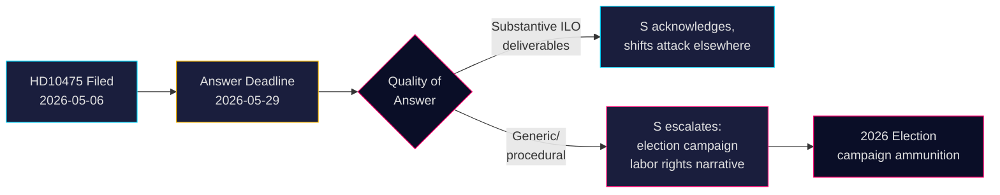

# Sociaal-democraten daagen regering uit over Zweeds ILO-engagement

**Auteur**: James Pether Sörling  
**Datum**: 2026-05-07  
**Classificatie**: OPENBAAR  
**Betrouwbaarheidsniveau**: GEMIDDELD [B2]

## SAMENVATTING

De Zweedse oppositiepartij Sociaal-Democraten heeft de Tidö-coalitieregering uitgedaagd over de vraag of zij de historische rol van Zweden als kampioen van de rechten van werknemers in de Internationale Arbeidsorganisatie (ILO) heeft gehandhaafd. Interpellatie HD10475 — ingediend door Adrian Magnusson (S) bij waarnemend minister van Arbeidsmarkt Johan Britz (L) op 7 mei 2026 — legt een politiek verantwoordingsgebrek bloot: de regering heeft 22 dagen om te antwoorden of ILO-engagement prioriteit blijft in een tijdperk van bezuinigingen op hulpverlening en verschuivende multilaterale allianties. De vraag heeft strategisch gewicht voor de verkiezingen van 2026: S positioneert zich op het gebied van arbeidsrechten tegenover de waargenomen terugtrekking van de Tidö-regering uit het multilateralisme.

## Beslissingen die dit briefing ondersteunt

1. **Parlementaire strategen** (S en coalitiepartijen): Volg het ILO-antwoord van de regering vóór 29 mei voor campagneboodschappen over arbeidsrechten en multilateralisme.
2. **Burgerobservatoren en journalisten**: Volg of de minister concrete ILO-resultaten levert of terugvalt op generieke diplomatieke taal — een meetbare indicator van politieke diepgang.
3. **Beleidsanalisten**: Beoordeel of Zweden's ILO-bijdragen, inclusief financiële en mandaatniveauverplichtingen, zijn veranderd sinds de Tidö-regering in 2022 aantrad.

## 60-seconden lezing

- 📋 **Één interpellatie vandaag**: HD10475 "Regeringens arbete i ILO" door Adrian Magnusson (S) aan minister Johan Britz (L)
- 🌍 **Kernvraag**: Heeft de Tidö-regering de leiderschapsrol van Zweden bij de ILO gehandhaafd, of hebben bezuinigingen op hulp en realpolitiek de prioriteiten verschoven?
- ⚠️ **Tijdlijn**: Antwoorddeadline 2026-05-29; debat in de kamer verwacht in de context van de verkiezingscampagne
- 🗳️ **Verkiezingsdimensie**: S presenteert zichzelf als kampioen van arbeidsrechten; coalitie is blootgesteld aan multilaterale consistentie
- 📊 **ILO-context**: Zweden is oprichtend lid (1919), Hjalmar Branting sleutelfiguur; mondiale arbeidsrechten onder druk in 2025-26 (Amerikaans tariefnationalisme, Chinese assertiviteit in VN-organen)
- 🔴 **Risico**: Regering geeft vaag of procedureel antwoord → S escaleert naar breder campagnenarrativum over Zweden dat de ILO verlaat

## Belangrijkste vooruitkijkende trigger

**2026-05-29**: Minister Britz moet HD10475 beantwoorden of de interpellatie vervalt. Als het antwoord vaag is, zal S de kwestie waarschijnlijk in de AU-commissie aan de orde stellen en deze gebruiken in de verkiezingscampagne.

<!-- source-sha: 2609a9ed259812c2115622a78da9175f9fbea8ad -->
