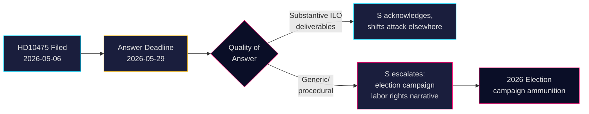

# Sosialdemokratene utfordrer regjeringen om Sveriges ILO-forpliktelse

**Forfatter**: James Pether Sörling  
**Dato**: 2026-05-07  
**Klassifisering**: OFFENTLIG  
**Konfidensnivå**: MEDIUM [B2]

## SAMMENDRAG

Sveriges opposisjonsparti Sosialdemokratene har utfordret Tidö-koalisjonsregjeringen om hvorvidt den har opprettholdt Sveriges historiske rolle som forkjemper for arbeidstakerrettigheter i Den internasjonale arbeidsorganisasjonen (ILO). Interpellasjon HD10475 — innlevert av Adrian Magnusson (S) til konstituert arbeidsmarkedsminister Johan Britz (L) den 7. mai 2026 — avdekker et politisk ansvarsgap: regjeringen har 22 dager på seg til å svare på om ILO-engasjement fortsatt er en prioritet i en tid med bistandskutt og skiftende multilaterale allianser. Spørsmålet har strategisk vekt for valget i 2026: S posisjonerer seg rundt arbeidstakerrettigheter mot Tidö-regjeringens oppfattede tilbaketrekning fra multilateralisme.

## Beslutninger dette underlaget støtter

1. **Parlamentariske strateger** (S og koalisjonspartier): Overvåk regjeringens ILO-svar innen 29. mai for valgkampanjebudskap om arbeidstakerrettigheter og multilateralisme.
2. **Sivile observatører og journalister**: Følg opp om statsråden leverer konkrete ILO-resultater eller tyr til generelt diplomatisk språk — en målbar indikator for politisk dybde.
3. **Politiske analytikere**: Vurder om Sveriges ILO-bidrag, inkludert finansielle og mandatnivåforpliktelser, har endret seg siden Tidö-regjeringen tiltrådte i 2022.

## 60-sekunders lesning

- 📋 **Én interpellasjon i dag**: HD10475 "Regeringens arbete i ILO" av Adrian Magnusson (S) til statsråd Johan Britz (L)
- 🌍 **Kjernespørsmål**: Har Tidö-regjeringen opprettholdt Sveriges ILO-lederrolle, eller har bistandskutt og realpolitikk forskjøvet prioriteringene?
- ⚠️ **Tidslinje**: Svarfrist 2026-05-29; debatt forventes i stortingssalen med valgkampanjekontekst
- 🗳️ **Valgdimensjon**: S fremstiller seg selv som forkjemper for arbeidstakerrettigheter; koalisjonen er eksponert på multilateral konsistens
- 📊 **ILO-kontekst**: Sverige er grunnleggende medlem (1919), Hjalmar Branting en nøkkelfigur; globale arbeidstakerrettigheter under press i 2025-26 (USA-tollnasjonalisme, kinesisk assertivitet i FN-organer)
- 🔴 **Risiko**: Regjeringen gir et vagt eller prosessuelt svar → S eskalerer til bredere kampanjefortelling om at Sverige forlater ILO

## Viktigste fremadrettede utløser

**2026-05-29**: Statsråd Britz må besvare HD10475 eller interpellasjonen bortfaller. Hvis svaret er vagt, vil S sannsynligvis reise spørsmålet i AU-komiteen og bruke det i valgkampanjen.

<!-- source-sha: 2609a9ed259812c2115622a78da9175f9fbea8ad -->
