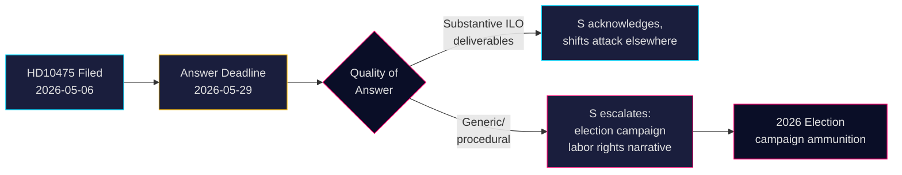

# Socialdemokraterna utmanar regeringen om Sveriges ILO-åtagande

**Författare**: James Pether Sörling  
**Datum**: 2026-05-07  
**Klassificering**: OFFENTLIG  
**Konfidensgrad**: MEDIUM [B2]

## SAMMANFATTNING

Sveriges oppositionsparti Socialdemokraterna har utmanat Tidökoalitionens regering om huruvida den har upprätthållit Sveriges historiska roll som en förkämpe för arbetstagarrättigheter i Internationella arbetsorganisationen (ILO). Interpellation HD10475 — inlämnad av Adrian Magnusson (S) till tf. arbetsmarknadsminister Johan Britz (L) den 7 maj 2026 — blottlägger en politisk ansvarsgap: regeringen har 22 dagar på sig att svara om ILO-engagemanget fortfarande är en prioritet i en era med biståndsnedskärningar och förskjutna multilaterala allianser. Frågan bär strategisk vikt inför valet 2026: S positionerar sig kring arbetstagarrättigheter kontra Tidöregeringens upplevda tillbakadragande från multilateralism.

## Beslut som detta underlag stödjer

1. **Parlamentariska strateger** (S och koalitionspartier): Bevaka regeringens ILO-svar innan den 29 maj för valcykelsbudskap om arbetstagarrättigheter och multilateralism.
2. **Civila observatörer och journalister**: Följ upp om ministern tillhandahåller konkreta ILO-leverabler eller retretar till generellt diplomatspråk — en mätbar indikator på politiskt djup.
3. **Politiska analytiker**: Bedöm om Sveriges ILO-bidrag, inklusive finansiella åtaganden och mandatnivå, har förändrats sedan Tidöregeringen tillträdde 2022.

## 60-sekunders läsning

- 📋 **En interpellation idag**: HD10475 "Regeringens arbete i ILO" av Adrian Magnusson (S) till minister Johan Britz (L)
- 🌍 **Kärnfråga**: Har Tidöregeringen upprätthållit Sveriges ILO-ledarroll, eller har biståndsnedskärningar och realpolitik förskjutit prioriteringarna?
- ⚠️ **Tidslinje**: Svarsfrist 2026-05-29; debatt förväntas i kammaren med valkampanjskontext
- 🗳️ **Valaspekt**: S framställer sig som förkämpe för arbetstagarrättigheter; koalitionen är exponerad vad gäller multilateral konsekvens
- 📊 **ILO-kontext**: Sverige är grundande medlem (1919), Hjalmar Branting en nyckelfigur; globala arbetstagarrättigheter under press 2025-26 (US-tariffdrivet nationalism, kinesisk assertivitet i FN-organ)
- 🔴 **Risk**: Regeringen ger ett vagt eller procedurellt svar → S eskalerar till bredare kampanjnarrativ om att Sverige överger ILO

## Viktigaste framåtblickande utlösare

**2026-05-29**: Minister Britz måste besvara HD10475 eller interpellationen förfaller. Om svaret är vagt kommer S sannolikt att väcka frågan i AU-utskottet och använda den i valkampanjen.

<!-- source-sha: 2609a9ed259812c2115622a78da9175f9fbea8ad -->
