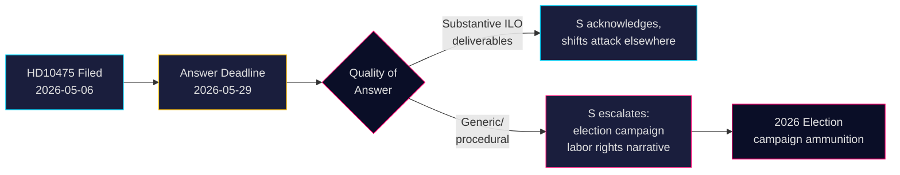

# 社会民主党就瑞典对国际劳工组织的承诺向政府发起挑战

**作者**: James Pether Sörling  
**日期**: 2026-05-07  
**分类**: 公开  
**可信度**: 中等 [B2]

## 执行摘要

瑞典反对党社会民主党已就蒂多联合政府是否维持了瑞典在国际劳工组织（ILO）中作为工人权利倡导者的历史性角色提出质疑。质询 HD10475 — 由 Adrian Magnusson（S）于2026年5月7日向劳动市场代理部长 Johan Britz（L）提交 — 揭示了政治问责空缺：政府有22天时间回答在援助预算削减和多边联盟转变的时代，国际劳工组织参与是否仍是优先事项。这一问题对2026年大选具有战略意义：社会党正在劳工权利议题上进行定位，对抗蒂多政府被认为从多边主义退缩的立场。

## 本简报支持的决策

1. **议会战略家**（S及联合政党）：在5月29日之前监测政府对国际劳工组织的答复，以掌握有关劳工权利和多边主义的选举周期信息。
2. **公民观察员及记者**：追踪部长是否提供具体的国际劳工组织成果，还是退守通用外交语言 — 衡量政策深度的可测量指标。
3. **政策分析人士**：评估自2022年蒂多政府上台以来，包括财务和任务层面承诺在内的瑞典对国际劳工组织的贡献是否发生了变化。

## 60秒摘要

- 📋 **今日一项质询**: HD10475《Regeringens arbete i ILO》— Adrian Magnusson（S）向部长 Johan Britz（L）提出
- 🌍 **核心问题**: 蒂多政府是否维持了瑞典在国际劳工组织中的领导角色，还是援助削减和现实政治已使优先事项转向？
- ⚠️ **时间线**: 答复截止日期 2026-05-29；预计将在议会就选举背景展开辩论
- 🗳️ **选举维度**: S将自身定位为劳工权利的捍卫者；联合政府在多边一致性方面暴露弱点
- 📊 **国际劳工组织背景**: 瑞典为创始成员国（1919年），Hjalmar Branting 为关键人物；2025-26年全球劳工权利承压（美国关税民族主义、中国在联合国机构中的强硬姿态）
- 🔴 **风险**: 政府给出含糊或程序性答复 → S将此升级为关于瑞典放弃国际劳工组织的更广泛竞选叙事

## 最重要的前瞻性触发因素

**2026-05-29**: 部长 Britz 必须回答 HD10475，否则质询失效。如果答复模糊，S可能会在AU委员会提出该问题并在选举活动中加以利用。

<!-- source-sha: 2609a9ed259812c2115622a78da9175f9fbea8ad -->
