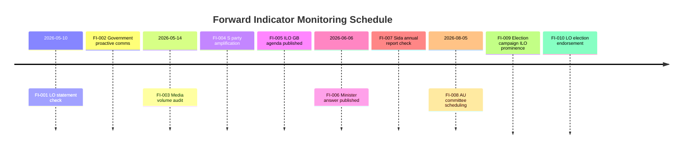

# Forward Indicators — Interpellations 2026-05-07

**Author**: James Pether Sörling  
**Date**: 2026-05-07

## Priority Intelligence Requirements (PIR) Monitoring Framework

10 dated indicators across 4 horizons to track whether the ILO interpellation HD10475 escalates or dissipates.

## Horizon 1: Immediate (T+72h = by 2026-05-10)

### FI-001: LO Monitoring for Public Statement
**Indicator**: Does LO issue any public statement referencing HD10475 or Sweden's ILO engagement?  
**Collection**: LO website, LO press releases, LO-tidningen  
**Threshold for escalation**: Any formal LO statement = Scenario B→C escalation signal  
**Expected**: Silence (70%), Statement (30%)

### FI-002: Government Communication Team Response
**Indicator**: Does Ministry of Employment/UD issue any pro-active ILO communication within 72 hours of HD10475 publication?  
**Collection**: Regeringen.se press releases, minister social media  
**Threshold**: Proactive communication = Scenario B→A de-escalation signal  
**Expected**: Silence (80%), Proactive (20%)

## Horizon 2: Week (T+7d = by 2026-05-14)

### FI-003: Media Coverage Volume
**Indicator**: Number of mainstream media articles referencing HD10475 or Sweden-ILO  
**Collection**: Retriever/Mediearkivet search (not automated — manual check)  
**Threshold**: >5 articles = elevated political salience  
**Expected**: 0–3 articles (75%), >5 articles (25%)

### FI-004: S Party Communications
**Indicator**: Does S party (social media, website, press releases) amplify HD10475 as a campaign message?  
**Collection**: S website, @socialdemokraterna social media  
**Threshold**: 3+ party amplifications = deliberate campaign launch  
**Expected**: 1–2 mentions (60%), Campaign launch (25%), Silence (15%)

### FI-005: ILO Governing Body May–June Session Agenda Published
**Indicator**: Does the ILO Governing Body May–June 2026 session agenda include any items where Swedish position would be scrutinized?  
**Collection**: ILO website ilo.org/gb  
**Threshold**: Swedish position item on agenda = external legitimacy test  
**Expected**: Not yet published (50%), Published with relevant item (50%)

## Horizon 3: Month (T+30d = by 2026-06-06)

### FI-006: Minister Britz Answer Published
**Indicator**: Content quality of minister's formal answer to HD10475 (due 2026-05-29)  
**Collection**: Riksdag document system — IP answer document  
**Threshold**: Answer with specific budget figures/programs = Scenario A; vague answer = Scenario B; delay or minimal = Scenario C  
**Expected**: Answer by deadline (90%), Delay (10%); Scenario B content (45%), Scenario A (35%), Scenario C (20%)

### FI-007: Sida Annual Report 2025 (if published)
**Indicator**: Does Sida's 2025 annual report (expected spring 2026) show ILO technical cooperation budget changes?  
**Collection**: Sida.se annual reports  
**Threshold**: Any documented reduction in ILO technical cooperation = confirms H1  
**Expected**: Not yet published by this date (60%), Published with ILO data (40%)

## Horizon 4: Quarter (T+90d = by 2026-08-05)

### FI-008: AU Committee Scheduling
**Indicator**: Does Arbetsmarknadsutskottet schedule any ILO-specific hearings or follow-up after HD10475 debate?  
**Collection**: AU calendar, Riksdag committee announcements  
**Threshold**: Scheduled hearing = sustained political interest  
**Expected**: No follow-up hearing (70%), Hearing scheduled (30%)

### FI-009: Election Campaign ILO Prominence
**Indicator**: Does ILO/multilateral labor rights appear in any party election manifestos or major campaign speeches?  
**Collection**: Party manifestos (published August–September 2026)  
**Threshold**: ILO mention in S top-10 priorities = campaign escalation  
**Expected**: Background mention (60%), Top-10 priority (25%), Absent (15%)

### FI-010: LO Election Endorsement Timing
**Indicator**: When does LO formally indicate electoral preference (if at all), and does ILO feature in the rationale?  
**Collection**: LO press conference, August 2026  
**Threshold**: LO cites ILO weakening as reason for S preference = full escalation  
**Expected**: Standard S alignment (70%), ILO-specific citation (15%), No formal endorsement (15%)

## Forward Indicator Dashboard

