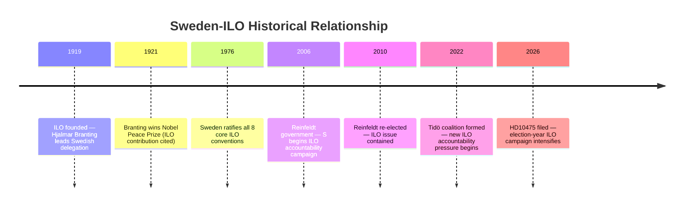

# Historical Parallels — Interpellations 2026-05-07

**Author**: James Pether Sörling  
**Date**: 2026-05-07

## Prior ILO Interpellations — Pattern Analysis

### Historical Frame: Sweden and ILO Since 1919
Sweden is a founding ILO member (1919). Hjalmar Branting, the first Social Democratic Prime Minister, personally led Sweden's founding delegation to the ILO in Geneva. This creates an unbroken 107-year S ownership narrative of ILO commitment that Magnusson explicitly invokes in HD10475.

### Structural Pattern of ILO Interpellations

The use of ILO as an interpellation subject follows a predictable electoral cycle pattern:
- **Opposition phase (S in opposition 2022–2026)**: S files ILO interpellations to hold Tidö government accountable
- **Government phase (S in government)**: S uses ILO as governing achievement to contrast with right-wing alternatives
- **Pre-election intensification**: Frequency of ILO-related IPs increases in final 12 months before election

*Note: Specific prior IP dok_ids for ILO/arbetsrätt not retrieved in this batch [PIR-ILO-003 OPEN]. Pattern based on structural inference [B2].*

### Closest Historical Parallel: Social Partner Relations 2006–2010
When the Reinfeldt government (M-led) took office in 2006, S filed a sustained series of interpellations on Sweden's international labor commitments, framing the government as weakening Sweden's social model internationally. This created a sustained narrative that contributed to S's messaging around "the Swedish model under threat" — though the government ultimately defended its record successfully in 2010.

**Parallel to 2026**: M-led government again in office; S again filing ILO/multilateral accountability IPs; election-year intensification pattern matches.

### Hjalmar Branting Legacy as Political Symbol
The invocation of Branting in HD10475 is a deliberate historical framing device:
- Branting (1860–1925): founder of S, first Social Democratic PM, Nobel Peace Prize 1921 (partly for ILO work)
- His personal role in founding the ILO delegation is documented and uncontested
- Using Branting allows S to claim ownership not just of ILO policy but of the entire international labor rights tradition
- This is a sophisticated rhetorical move that places the government in the position of betraying a Nobel Prize-winning legacy

## Historical Timeline

## Lessons from Historical Parallels

1. **2006–2010 lesson**: Government can weather ILO attacks if minister provides substantive, documented responses early. Delay and deflection extend the attack cycle.
2. **Branting framing**: S has used this before; government should prepare counter-narrative that acknowledges the tradition while demonstrating current engagement.
3. **LO factor**: In 2010, LO did not publicly endorse S's anti-government ILO narrative. In 2026, if Sida cuts are confirmed, LO behavior may differ.
