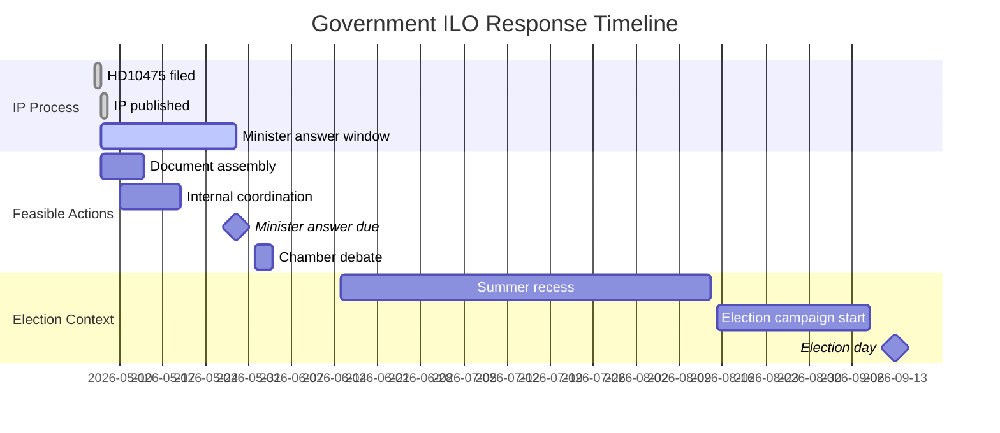

# Implementation Feasibility — Interpellations 2026-05-07

**Author**: James Pether Sörling  
**Date**: 2026-05-07

## Delivery Risk Assessment

This artifact assesses the feasibility of the government actually delivering on different levels of ILO commitment, as implied by the interpellation HD10475.

## Scenario A Implementation: Full ILO Re-engagement

**What it would require**:
1. Sida budget reallocation: +SEK 100–200M for ILO technical cooperation programs [C3 estimate]
2. New Swedish ILO initiative (e.g., Nordic labor rights cooperation program)
3. Active Governing Body voting record documentation and public communication
4. Minister-level bilateral meetings with ILO Director-General

**Feasibility constraints**:
- **Coalition constraint**: SD support required for any Sida budget increase (or at least acquiescence)
- **Timeline constraint**: Election is September 2026 — any new initiative must be announced before summer recess to have campaign value
- **Budget constraint**: Tidö coalition has reduced development aid; reversal politically difficult
- **Operational constraint**: Sida capacity to execute new programs within 6 months is limited

**Feasibility score**: MEDIUM-LOW (30%)

## Scenario B Implementation: Substantive Answer Without New Resources

**What it would require**:
1. Compile existing Swedish ILO Governing Body voting record (publicly available)
2. Document existing Sida-ILO technical cooperation programs (Sida annual report data)
3. Outline Swedish priorities for ILO Governing Body 2026–2028
4. Minister's statement commits to maintaining (not increasing) current level

**Feasibility constraints**:
- **Timeline constraint**: 22 days — achievable for document assembly
- **Political constraint**: Must navigate SD without triggering public statement
- **Risk**: If documented budget shows cuts, this backfires

**Feasibility score**: HIGH (75%) — this is the most feasible path

## Scenario C Implementation: Unavoidable Escalation

**Trigger conditions**:
- Investigative journalism surfaces specific Sida-ILO cuts
- LO issues formal statement
- ILO Governing Body June session shows Sweden abstaining on key resolution

**Government response options if escalated**:
1. Emergency reversal announcement (HIGH cost politically; damages coalition with SD)
2. Damage limitation (admit cuts but frame as budget necessity; maintain conventions)
3. Distraction (announce other labor rights initiative to change subject)

**Most feasible response if escalated**: Option 2 (damage limitation) — budget necessity framing is consistent with broader Tidö fiscal narrative.

## Implementation Timeline

## Feasibility Summary

| Scenario | Feasibility | Key Bottleneck |
|----------|-------------|---------------|
| A: Full re-engagement | 30% | Coalition + budget |
| B: Substantive answer | 75% | SD navigation + risk of exposed cuts |
| C: Escalation path | 20% (avoid) | Investigative journalism trigger |

**Recommendation**: Scenario B is the highest-feasibility, lowest-risk path. Government should proactively compile ILO record documentation and publish a substantive minister's answer by mid-May 2026 to pre-empt escalation risk.
