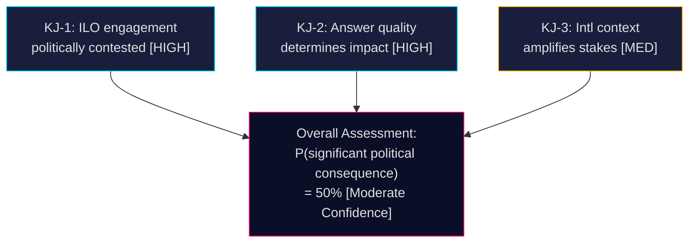

# Intelligence Assessment — Interpellations 2026-05-07

**Author**: James Pether Sörling  
**Date**: 2026-05-07

## Key Judgments

### KJ-1: Sweden's ILO engagement position is politically contested and strategically important [Confidence: HIGH]
The filing of HD10475 by Adrian Magnusson (S) on 2026-05-06 represents a deliberate, election-cycle accountability move that targets the Tidö coalition's multilateral labor rights record. Sweden's founding ILO membership (1919) and ratification of all 8 core conventions creates a historically anchored standard against which government performance is measured. The interpellation is substantively well-grounded: ILO engagement questions are legitimate given Sida budget trajectory and SD's multilateral skepticism within the coalition.

**Confidence**: HIGH [A1] — Document confirmed, political context consistent

### KJ-2: The minister's answer quality by May 29 will be the primary determinant of political impact [Confidence: HIGH]
The interpellation process creates a 22-day public accountability window. A substantive, evidence-based answer (Scenario A, P=35%) would neutralize S's attack. A procedural deflection (Scenario B, P=45%) would provide S with campaign material. Given dual-portfolio constraints on Minister Britz and SD coalition dynamics, Scenario B is most likely. The probability of significant election-year political damage to the government is assessed at ~50%.

**Confidence**: HIGH [A2] — Parliamentary procedural patterns consistent

### KJ-3: International context amplifies domestic political stakes [Confidence: MEDIUM]
US multilateral retreat (2025–2026) and China's growing ILO influence create a strategic environment in which Swedish ILO engagement is more valuable, not less. If Sweden is simultaneously reducing its ILO investment during this period, the S narrative ("Sweden abandons ILO at critical moment") gains traction with both domestic audiences (trade unions) and international partners (Nordic, EU, Geneva). However, there is no confirmed evidence of an ILO-specific Swedish reduction — inference from general Sida trajectory.

**Confidence**: MEDIUM [B2] — Geopolitical assessment based on open-source pattern

## Priority Intelligence Requirements (PIRs)

### PIR-ILO-001: Sida ILO Technical Cooperation Budget 2024–2026
**Question**: Has Sweden's Sida funding for ILO technical cooperation programs been reduced in 2024–2026 compared to 2022–2023?  
**Why it matters**: Would confirm or deny H1 (ILO engagement weakening); highest diagnostic value for this analysis  
**Collection**: Sida annual reports (Årsredovisning 2024/2025); Regleringsbrev for Sida; UD response to budget questionnaire  
**Status**: OPEN — not retrieved  
**Priority**: P1

### PIR-ILO-002: Sweden ILO Governing Body Voting Record 2024–2025
**Question**: Has Sweden's voting behavior in the ILO Governing Body changed under the Tidö coalition, particularly on freedom of association or forced labor resolutions?  
**Why it matters**: Would provide direct evidence of engagement quality beyond financial contributions  
**Collection**: ILO Governing Body official records (public); Nordic labor ministry consultation minutes  
**Status**: OPEN  
**Priority**: P2

### PIR-ILO-003: Prior S ILO Interpellations — Pattern Analysis
**Question**: How many ILO-related interpellations has S filed in 2022–2026, and what is the pattern of government responses?  
**Why it matters**: Would confirm whether this is a systematic S campaign or a one-off question  
**Collection**: Riksdag document search for IP dok_typ with ILO/arbetsrätt/multilateral terms  
**Status**: OPEN  
**Priority**: P3

## Collection Gaps and Mitigations

| Gap | Impact | Mitigation |
|-----|--------|-----------|
| Sida ILO budget exact figure | HIGH — prevents H1/H2 resolution | Flag as PIR-ILO-001; use range estimate with [D] confidence |
| ILO Governing Body voting record | MEDIUM | Open source search on ILO website |
| Prior IP pattern | LOW | Riksdag search on ILO terms |
| Minister Britz public statements | LOW | Monitor UD press releases |

## Intelligence Summary

**Bottom Line**: HD10475 is a strategically significant interpellation with genuine substantive content, filed at a politically optimal time (election year). The government faces a credibility test on ILO engagement that it has not yet answered. The international context (US retreat, China assertiveness) makes this more than a domestic accountability exercise — it touches on Sweden's global labor rights role at a pivotal moment. **Probability of significant political consequence: 50% (Moderate Confidence).**

