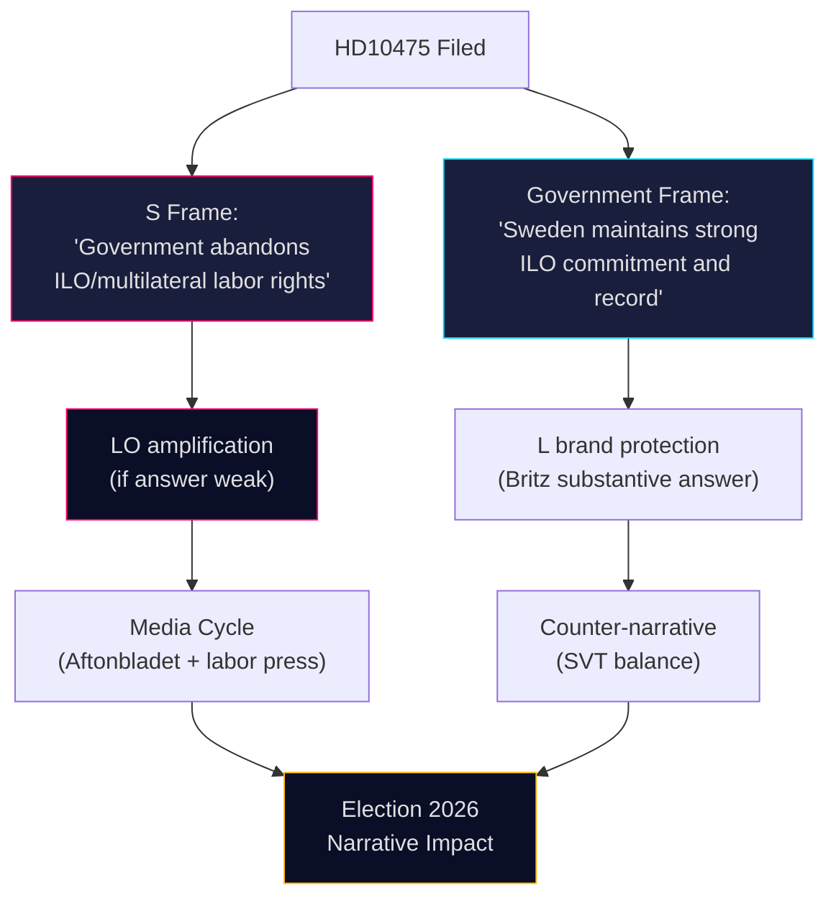

# Media Framing Analysis — Interpellations 2026-05-07

**Author**: James Pether Sörling  
**Date**: 2026-05-07

## v2.1 No-Neutral-Media Doctrine

Media framing analysis operates under the v2.1 no-neutral-media doctrine: no major media outlet is informationally neutral. All outlets have institutional interests, editorial lines, and audience capture incentives. Analysis must identify the likely frame each outlet will apply, not assume neutral reporting.

## Likely Media Frames by Outlet Type

### Public Service (SVT/SR/UR)
**Frame tendency**: Process legitimacy + balance  
**Expected coverage**: Report the filing; ask LO and government for comment; present "both sides" in election context  
**Specific angle**: "S holds government accountable on ILO" — neutral process framing  
**Risk for government**: SVT fact-checking may surface Sida budget trajectory  
**Probability of significant coverage**: 25% (interpellations rarely make SVT unless they connect to hot issue)

### Aftonbladet / Expressen (tabloids)
**Frame tendency**: Conflict and accountability  
**Expected coverage**: If LO responds publicly, this becomes a story; otherwise below threshold  
**Specific angle**: "Government abandons workers' rights" (Aftonbladet) / "S election maneuver" (Expressen)  
**Note**: Aftonbladet is S-aligned historically; Expressen is traditionally liberal/center-right  
**Probability of significant coverage**: 35% if LO responds; 10% if LO silent

### Dagens Nyheter / Svenska Dagbladet (broadsheets)
**Frame tendency**: Policy depth + elite accountability  
**Expected coverage**: Unlikely to cover the IP itself; may cover the minister's answer  
**Specific angle**: Analysis of Sweden's ILO engagement in context of global multilateral trends  
**Probability of significant coverage**: 15% (too specialized for front page)

### LO-tidningen / Arbetet (labor movement press)
**Frame tendency**: Labor solidarity + accountability  
**Expected coverage**: HIGH — labor press will definitely cover this IP  
**Specific angle**: "Sweden's ILO role under pressure" — validates S/LO narrative  
**Probability of significant coverage**: 90%

### International (Nordic media, Geneva-based labor correspondents)
**Frame tendency**: Nordic model monitoring  
**Expected coverage**: Only if Swedish ILO behavior changes significantly  
**Probability of significant coverage**: 5%

## Narrative Competition Map

## Framing Advantage Assessment

**S's framing advantage**: HIGH — historical ownership of ILO via Branting; LO backing potential; election-year timing; can use chamber debate as news hook  
**Government's framing advantage**: MEDIUM — can cite actual convention ratifications and Governing Body membership; Britz as L minister has credibility  
**Dominant expected frame at election**: "Sweden's ILO commitment questioned" (S narrative) vs "Government defends multilateral record" (government counter) — outcome determined by minister's May 29 answer and LO response.
