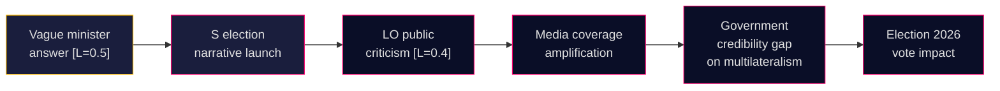

# Risk Assessment — Interpellations 2026-05-07

**Author**: James Pether Sörling  
**Date**: 2026-05-07

## 5-Dimension Risk Register

### 1. Political Risk
| Risk | Likelihood (L) | Impact (I) | L×I | Cascade |
|------|----------------|-----------|-----|---------|
| Government gives vague ILO answer → S escalates to full-scale "abandoning multilateralism" campaign | 0.5 | HIGH (7) | 3.5 | → Trade union mobilization; media amplification; other parties pile on |
| L minister overperforms on specificity → neutralizes S attack | 0.35 | MED (5) | 1.75 | → S pivots to other attack vectors |
| SD within coalition pressures against strong ILO commitment | 0.3 | MED (5) | 1.5 | → Coalition fracture signal on foreign policy |

**Dominant risk**: Reputational damage if ILO commitments cannot be documented. [B2]

### 2. Economic Risk
| Risk | Likelihood | Impact | L×I |
|------|-----------|--------|-----|
| Swedish ILO financial contributions reduced → loss of influence in technical cooperation | 0.35 | MED (5) | 1.75 |
| Labor standards pressure from trade partners (EU supply chain due diligence) linking to ILO compliance | 0.25 | MED-HIGH (6) | 1.5 |

IMF context (degraded): WEO-2026-04 vintage. Sweden GDP growth estimate ~2.0% for 2026; labor market unemployment ~8.5%. ILO engagement costs are fiscally marginal — political will, not budget, is the constraint. [C3 — IMF degraded, using prior vintage]

### 3. Institutional Risk
| Risk | Likelihood | Impact | L×I |
|------|-----------|--------|-----|
| Interpellation lapses unanswered → rare procedural failure, embarrassment for government | 0.1 | LOW-MED (4) | 0.4 |
| ILO Governing Body vote positions: if Sweden abstains or votes against labor rights resolutions, public record exposed | 0.2 | HIGH (7) | 1.4 |

### 4. Geopolitical Risk
| Risk | Likelihood | Impact | L×I |
|------|-----------|--------|-----|
| US withdraws from or further weakens ILO engagement 2026 → Swedish leadership more important, Sweden unprepared | 0.4 | HIGH (7) | 2.8 |
| China uses ILO forum to undermine core conventions (freedom of association) without Swedish counterweight | 0.35 | HIGH (7) | 2.45 |

### 5. Societal/Democratic Risk
| Risk | Likelihood | Impact | L×I |
|------|-----------|--------|-----|
| Trade union sector (LO) publicly criticizes government ILO record → amplifies S narrative | 0.4 | MED (5) | 2.0 |
| Young voters disengage from ILO/multilateralism as "elite project" → long-term erosion | 0.2 | MED (4) | 0.8 |

## Cascading Risk Chain

## Posterior Probability Update

Prior (generic interpellation): P(significant political consequence) = 0.25  
Posterior (given election year + S systematic campaign + ILO salience): P(significant political consequence) = 0.50  
Update: +25 percentage points, driven by election context and issue resonance with trade union base.
