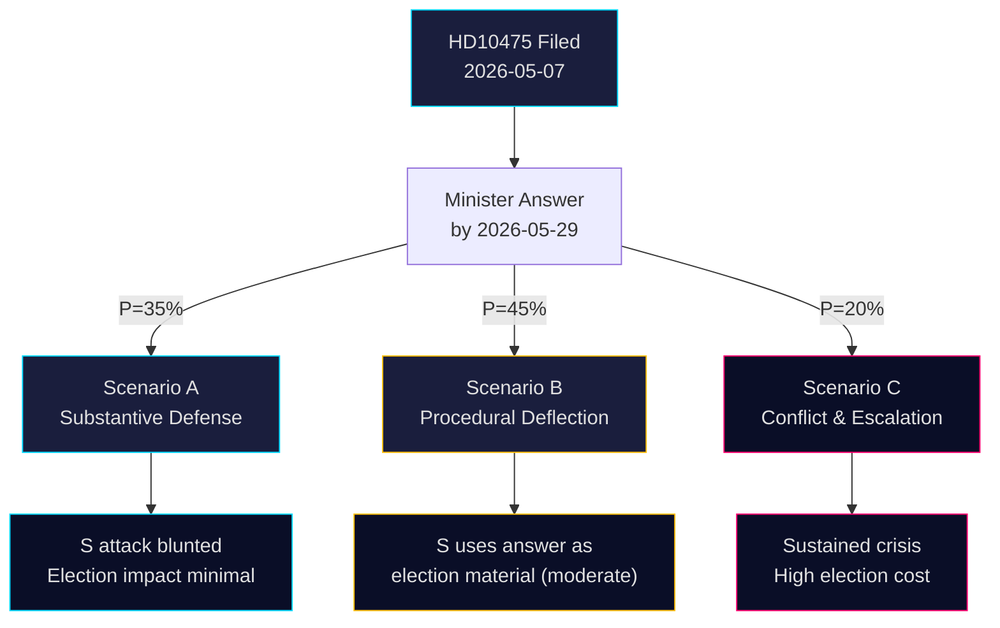

# Scenario Analysis — Interpellations 2026-05-07

**Author**: James Pether Sörling  
**Date**: 2026-05-07

## Three Primary Scenarios (probabilities sum to 100%)

### Scenario A — "Substantive Defense" (P = 35%)
**Description**: Minister Britz delivers a detailed, evidence-based answer by May 29, citing Sweden's ILO contributions, Governing Body position statements, and convention ratification record. Government announces new ILO initiative or increased contribution ahead of 2026 session.

**Conditions**: L-party uses IP as opportunity to differentiate from SD; coalition allows proactive ILO stance; Sida cuts to ILO are modest or reversed.

**Consequences**:
- S attack blunted; narrative shifts to "government defends multilateral record"
- LO remains neutral or mildly critical
- Election-year damage limited
- Nordic partners reassured

**Indicators to watch**: Budget amendments; Minister Britz public statements before May 29; press releases from UD on ILO

---

### Scenario B — "Procedural Deflection" (P = 45%)
**Description**: Minister gives formal, legally adequate but politically thin answer. Reiterates Sweden's convention ratifications without addressing Sida budget or specific ILO programs. No new commitments.

**Conditions**: SD coalition pressure limits minister's room; bandwidth constraints (dual-portfolio minister); political calculus avoids amplification.

**Consequences**:
- S uses weak answer as material for election campaign
- LO may issue statement
- Media coverage moderate
- Nordic diplomatic concern muted but present

**Indicators to watch**: Answer length and specificity; LO/TCO response; AU follow-up question scheduling

---

### Scenario C — "Conflict and Escalation" (P = 20%)
**Description**: Answer reveals actual ILO budget cuts or voting record inconsistencies; S and LO launch coordinated media campaign; issue gains sustained election-cycle prominence.

**Conditions**: Leaked Sida documents; investigative journalism; EU partners raise concerns; ILO itself issues statement.

**Consequences**:
- High political cost to government
- SD-L coalition friction visible
- International reputation damage
- Potential for government reversal on ILO contribution

**Indicators to watch**: Sida annual report release; investigative media queries; ILO Governing Body June session outcomes

---

## Scenario Tree

## Dominant Scenario Assessment

**Scenario B (Procedural Deflection) is the most likely outcome** given: dual-portfolio bandwidth constraints on Minister Britz; SD's known preference for national framing of international commitments; election-year caution favoring avoidance of specifics. Probability 45%.

The key branching variable is whether S can force the Sida budget numbers into public discourse independently of the minister's answer — if so, Scenario C probability rises to 30% at the expense of B.
