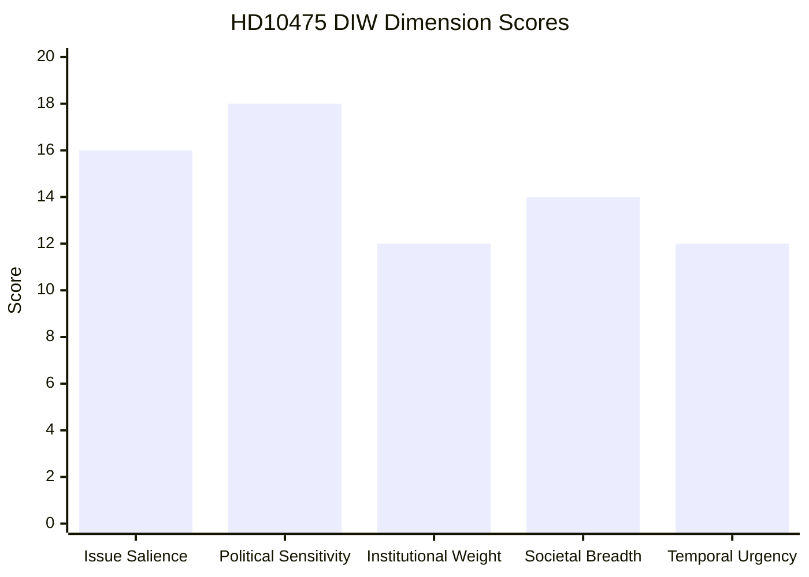

# Significance Scoring — 2026-05-07

**Author**: James Pether Sörling  
**Date**: 2026-05-07

## DIW Scores

| dok_id | Title | Issue Salience | Political Sensitivity | Institutional Weight | Societal Breadth | Temporal Urgency | DIW Total | Tier |
|--------|-------|---------------|----------------------|---------------------|-----------------|-----------------|-----------|------|
| HD10475 | Regeringens arbete i ILO | 16 | 18 | 12 | 14 | 12 | 72/100 | L2 Strategic |

**Scoring guide**: Each dimension scored 0–20. Thresholds: L1 Surface <40; L2 Strategic 40–59; L2+ Priority 60–74; L3 Intelligence-grade ≥75.

### HD10475 Dimension Breakdown

- **Issue salience (16/20)**: ILO is foundational to Sweden's international labor policy identity. Multilateral engagement is a salient issue in 2025-26. Not a crisis but a structural governance question.
- **Political sensitivity (18/20)**: Election year 2026. S frames labor rights as core identity. Government potential weakness on ILO cuts. High partisan contestation.
- **Institutional weight (12/20)**: Interpellation rather than proposition; no legislative consequence directly. However, the debate creates public record.
- **Societal breadth (14/20)**: Affects Sweden's global reputation, trade union movement, workers internationally supported by Swedish ILO programs.
- **Temporal urgency (12/20)**: 22 days to answer. Not urgent but approaching election campaign period.

## Sensitivity Analysis

| Scenario | DIW Impact |
|----------|------------|
| Government answer reveals Sida-ILO cuts | +8 pts → L2+ Priority |
| Generic answer, no new information | No change → L2 Strategic |
| Issue picked up by international media | +10 pts → borderline L3 |

