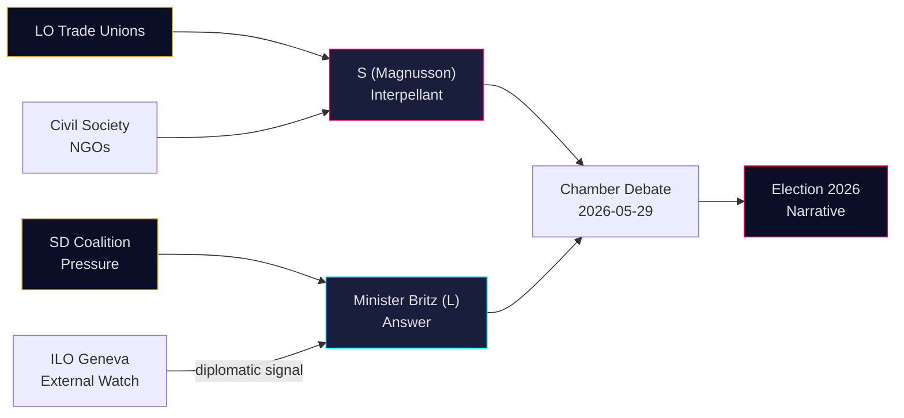

# Stakeholder Perspectives — Interpellations 2026-05-07

**Author**: James Pether Sörling  
**Date**: 2026-05-07

## 6-Lens Stakeholder Matrix

### 1. The Interpellant — Adrian Magnusson (S)
**Role**: Opposition MP (Social Democrats), Riksdag  
**Interest**: Hold government accountable on ILO/labor rights; build election campaign material; signal S's commitment to international labor solidarity  
**Influence**: MEDIUM — can force public answer, control narrative timing  
**Position**: Critical of perceived government disengagement from ILO  
**Expected behavior**: Will scrutinize the minister's answer closely; likely to criticize any vague response; may raise issue in AU committee and party communications  

### 2. Minister Johan Britz (L)
**Role**: Acting Labor Market Minister (also acting Climate/Environment Minister), Liberalerna  
**Interest**: Demonstrate government's ILO credentials without creating coalition tensions with SD; manage bandwidth across two portfolios  
**Influence**: HIGH — controls the government's formal response  
**Position**: Likely to emphasize Swedish ILO contributions and convention ratifications; will avoid specific budget numbers that expose Sida cuts  
**Expected behavior**: Provide formal, measured answer by May 29; cite specific Swedish ILO priorities for 2026–28; deflect on Sida cuts  

### 3. LO (Swedish Trade Union Confederation)
**Role**: Major stakeholder in labor market policy; historically aligned with S  
**Interest**: Ensure Swedish government maintains strong ILO position, especially on freedom of association and forced labor conventions  
**Influence**: HIGH — can amplify criticism through media channels and member communications  
**Position**: Supportive of S's interpellation; watching government answer closely  
**Expected behavior**: If answer is weak, LO may issue public statement; this would significantly amplify political impact  

### 4. SD (Sverigedemokraterna)
**Role**: Support party in Tidö coalition; de facto power broker  
**Interest**: Maintain coalition cohesion; limit multilateral commitments; frame any ILO discussion in terms of Swedish national interest  
**Influence**: HIGH within coalition  
**Position**: Skeptical of expansive ILO mandates; likely to support procedural answer rather than strong multilateral commitment  
**Expected behavior**: Internal pressure on minister to give measured, nationally-framed ILO answer  

### 5. International Partners (ILO Geneva, Nordic partners)
**Role**: External actors watching Swedish ILO engagement  
**Interest**: Maintain Swedish contributions to ILO technical cooperation programs, especially in Asia and Africa  
**Influence**: MEDIUM — can use diplomatic channels  
**Position**: Sweden is expected to maintain strong engagement; any visible weakening would concern Nordic labor ministries  

### 6. Civil Society / Labor Rights NGOs
**Role**: Swedish civil society organizations working on global labor rights  
**Interest**: Ensure Sweden continues to ratify and implement ILO conventions; maintain Sida funding for ILO programs  
**Influence**: MEDIUM — can mobilize public opinion  
**Expected behavior**: Monitor government answer; may issue reports comparing government claims to actual Sida/ILO budgets  

## Influence Network

