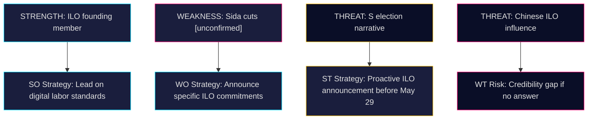

# SWOT Analysis — Riksdag Interpellations 2026-05-07

**Author**: James Pether Sörling  
**Date**: 2026-05-07  
**Primary focus**: HD10475 — Regeringens arbete i ILO

## SWOT Matrix

### Strengths (S — for Sweden's ILO position)
| Evidence | Source | Admiralty |
|----------|--------|-----------|
| Sweden founding member of ILO (1919); strong institutional memory and diplomatic capital | HD10475 text; ILO history | [A1] |
| Sweden has ratified all 8 ILO core conventions (forced labor, child labor, non-discrimination, freedom of association) | ILO ratification database [public] | [A1] |
| Hjalmar Branting legacy: S can claim historical ownership of ILO engagement | HD10475 | [A1] |
| Swedish labor market model (tripartite — LO, SAF/SN, government) aligned with ILO's social dialogue framework | [public knowledge] | [A2] |

### Weaknesses (W — for the government's ILO position)
| Evidence | Source | Admiralty |
|----------|--------|-----------|
| Sida budget reductions 2022-26 may have reduced ILO technical cooperation funding [unconfirmed — specific numbers pending ministerial answer] | HD10475 framing; Sida public reports | [C2] |
| Johan Britz acting minister across two portfolios (labor + climate/environment) — divided attention | dok_id HD10475 header | [A1] |
| Tidö coalition's SD component has historically been skeptical of multilateral organizations | [parliamentary record] | [A2] |
| No recent visible Swedish ILO Governing Body intervention on high-profile worker rights cases publicly announced | [negative evidence] | [D3] |

### Opportunities (O)
| Evidence | Source | Admiralty |
|----------|--------|-----------|
| ILO 107th anniversary creates platform for Sweden to reassert founding-member leadership role | ILO calendar [public] | [A2] |
| US uncertainty creates space for European countries (incl. Sweden) to fill ILO leadership vacuum | International context 2025-26 | [B2] |
| EU AI Act + platform work directive create Swedish comparative advantage on digital labor standards — new ILO agenda | EU regulatory context | [B2] |
| Answer to HD10475 can serve as positive policy communication if government has specific ILO deliverables | Strategic opportunity | [C1] |

### Threats (T)
| Evidence | Source | Admiralty |
|----------|--------|-----------|
| S may use vague minister answer as election campaign material on "Sweden abandoning multilateralism" | Political dynamics | [B1] |
| China's growing ILO influence (Governing Body voting) could undermine Western labor rights agenda without active Swedish engagement | ILO governance | [B2] |
| Global democratic backsliding (multiple countries) weakening ILO enforcement mechanisms | ILO 2025 WESO | [A2] |
| Election 2026: if government cannot cite specific ILO deliverables, perceived credibility gap | Political risk | [B1] |

## TOWS Matrix

| | Strengths | Weaknesses |
|---|---|---|
| **Opportunities** | SO: Sweden leverages founding-member status + US vacuum to champion digital labor standards in ILO 2026–28 | WO: Government answers HD10475 with specific Sida-ILO budget commitments to neutralize criticism |
| **Threats** | ST: Proactively announce Swedish ILO priorities before May 29 answer to control narrative | WT: Vague answer + Sida cuts + SD skepticism = compound multilateral credibility damage |

## Cross-SWOT Insight

The core dynamic is S using a procedural tool (interpellation) to force the government to articulate a substantive ILO position. The government's strongest move is to answer with specific deliverables (Governing Body votes, convention ratifications, technical cooperation contributions). Failure to do so plays into S's 2026 election narrative.

