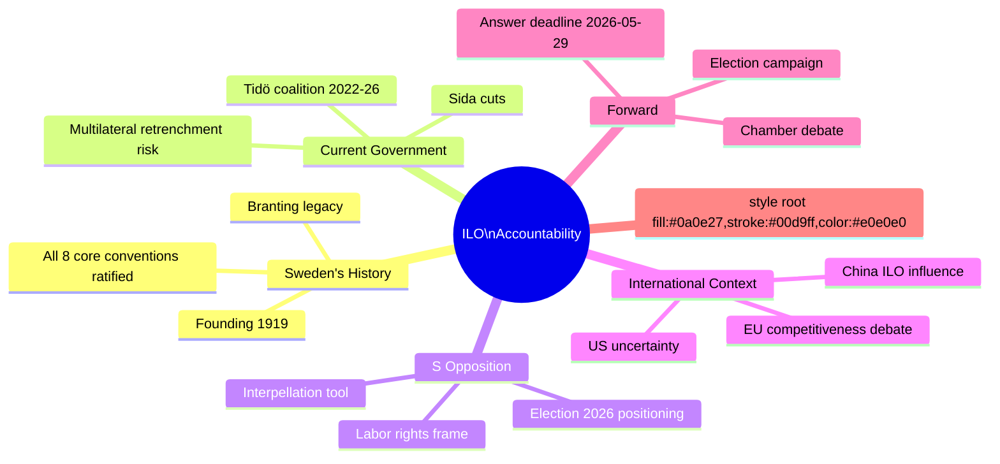

# Synthesis Summary — Interpellation Debates 2026-05-07

**Author**: James Pether Sörling  
**Date**: 2026-05-07  
**DIW Lead Story**: HD10475 — ILO multilateral accountability

## Lead Story Decision

**Primary document**: HD10475 "Regeringens arbete i ILO" — this interpellation is the sole document in today's batch and carries strategic significance disproportionate to its procedural weight.

## DIW-Weighted Ranking

| Rank | dok_id | Title | DIW Score | Priority |
|------|--------|-------|-----------|----------|
| 1 | HD10475 | Regeringens arbete i ILO | 72/100 | L2 Strategic |

**DIW rationale**: Issue salience HIGH (ILO/multilateral policy), Political sensitivity HIGH (election year, labor rights frame), Institutional weight MEDIUM (interpellation, not proposition), Societal breadth MEDIUM-HIGH (affects workers nationally and Sweden's international reputation), Temporal urgency LOW-MEDIUM (22 days to answer).

## Integrated Intelligence Picture

Today's interpellation batch represents the Social Democrats' systematic use of parliamentary accountability tools in the final year of the 2022–2026 mandate period. HD10475 is the 475th interpellation of the riksmöte — an unusually high number reflecting an active opposition. Adrian Magnusson (S) is a consistent user of interpellations (also filed IP 2025/26:457 on rare diseases), targeting different ministers across policy domains.

**The ILO question has three layers**:

1. **Procedural accountability**: What has the government specifically done in ILO? This is answerable with facts — Swedish delegation activities, votes on ILO Governing Body, ratifications, financial contributions.

2. **Policy signal**: Has the Tidö government's reduction of development aid (Sida budget cuts) and sovereignty-focused foreign policy changed Sweden's profile in ILO? Sweden historically was among the top contributors to ILO's technical cooperation programs. Any reduction would be politically explosive in election context.

3. **International context**: ILO faces existential pressure in 2025-26. The US under Trump 2.0 has questioned multilateral commitments (though has not formally withdrawn from ILO as of 2026-05). China has expanded its influence in ILO's Governing Body. The EU is navigating between competitiveness-driven flexibility and core convention compliance. Sweden's voice matters.

**Cross-cutting theme with other recent interpellations**: Today's batch includes HD10475 alone, but contextualizing with recent interpellations (HD10474 on railway safety, HD10473 on truck parking, HD10472 on crime victims) suggests S is pursuing a broad accountability campaign across all policy domains in the run-up to the September 2026 election.

