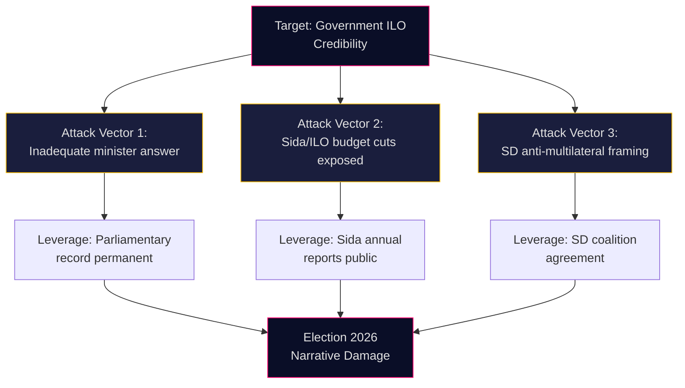

# Threat Analysis — Interpellations 2026-05-07

**Author**: James Pether Sörling  
**Date**: 2026-05-07

## Political Threat Taxonomy

### Threat-1: Election-Cycle Narrative Attack
**Type**: Opposition Accountability Campaign  
**Actor**: S (Social Democrats) — Adrian Magnusson, party leadership  
**Target**: Tidö coalition government (specifically L minister Britz, but also M/KD/SD)  
**Vector**: Parliamentary interpellation → chamber debate → media narrative → voter mobilization  
**Attack surface**: Government ILO record, Sida cuts, multilateral credibility  
**Severity**: HIGH in election-year context  
**Confidence**: HIGH [A1] — pattern confirmed by IP series

### Threat-2: Coalition Internal Tension
**Type**: Coalition Coherence Stress  
**Actor**: SD (Sverigedemokraterna) — skepticism toward multilateral organizations  
**Target**: ILO commitment within coalition  
**Vector**: Behind-closed-doors influence on ILO position  
**Severity**: MEDIUM  
**Confidence**: MEDIUM [B2]

## Attack Tree

## MITRE-Style TTP Mapping (Political Context)

| TTP-ID | Technique | Observed |
|--------|-----------|----------|
| T-POL-001 | Interpellation as accountability tool | HD10475 filed |
| T-POL-002 | Electoral framing of policy questions | S ILO = labor rights identity |
| T-POL-003 | Historical precedent citation | Hjalmar Branting invoked |
| T-POL-004 | Deadline pressure on executive | 22-day answer window |
| T-POL-005 | Coalition coherence stress probe | ILO exposes SD-L tension |

## Attack Chain Analysis

1. **Reconnaissance**: S identifies ILO as government vulnerability via Sida budget reports
2. **Weaponization**: Magnusson frames IP with historical S ownership (Branting legacy)
3. **Delivery**: HD10475 filed 2026-05-06, published 2026-05-07 [A1]
4. **Exploitation**: Chamber debate creates permanent public record
5. **Installation**: "Sweden weakening ILO role" narrative enters media cycle
6. **Command and Control**: S party leadership amplifies in election campaign
7. **Action**: Voter mobilization on labor rights issue

**Current chain position**: Step 3 (Delivery). Government has until May 29 to disrupt at Step 4 with substantive answer.
