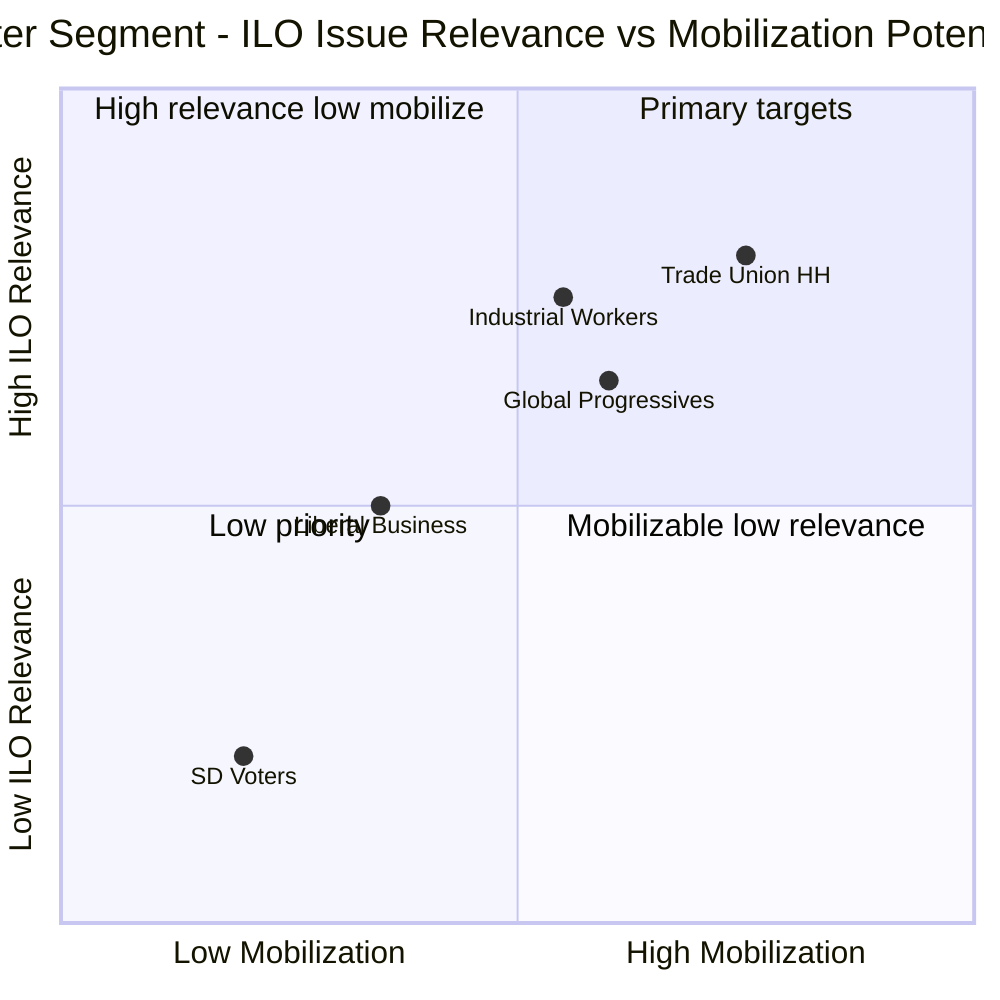

# Voter Segmentation — Interpellations 2026-05-07

**Author**: James Pether Sörling  
**Date**: 2026-05-07

## Demographic Impact Assessment — ILO/Labor Rights Issue

### Segment 1: Trade Union Households (LO/TCO/Saco affiliated)
**Size**: ~3.5 million union members (many households with dual membership)  
**Party alignment**: S (primary), V (secondary), some C and L  
**ILO relevance**: HIGH — ILO core conventions directly protect their workplace rights  
**Mobilization potential**: HIGH if LO issues public statement on HD10475 answer  
**Current engagement**: Moderate — ILO is background commitment, not daily issue  

### Segment 2: Globally-Engaged Progressive Voters
**Size**: ~500K–800K voters  
**Party alignment**: S, V, MP  
**ILO relevance**: MEDIUM-HIGH — multilateral labor standards align with values  
**Mobilization potential**: MEDIUM  
**Profile**: University-educated, urban, follow international news  

### Segment 3: Industrial Workers (manufacturing, construction, transport)
**Size**: ~600K voters  
**Party alignment**: Historically S, some SD migration since 2014  
**ILO relevance**: HIGH (C87/C98 freedom of association is existential for this group)  
**Mobilization potential**: MEDIUM — SD migration creates competing loyalty  
**Key question**: Will ILO framing pull back S-to-SD migrant voters? Unlikely on its own.  

### Segment 4: Sweden Democrats Voters
**Size**: ~600K–700K voters  
**Party alignment**: SD  
**ILO relevance**: LOW — SD base skeptical of multilateral organizations  
**Impact**: Negative for S narrative — hardens SD base against ILO framing  

### Segment 5: Liberal / Business Voters (L/C/M)
**Size**: ~1M voters  
**Party alignment**: L, C, M  
**ILO relevance**: MIXED — support ILO conventions but skeptical of Sida cost  
**Impact**: Monitor L minister Britz's answer quality; weak answer may fracture some L support  

## Segmentation Map

## Electoral Segmentation Summary

**Primary target voters for S's ILO narrative**: Trade union households (Segment 1) and global progressive voters (Segment 2) — combined ~4M voters, predominantly S/V/MP aligned. Impact is reinforcement of existing S loyalty rather than persuasion of new voters.

**Most at-risk segment for government**: Industrial workers with dual S/SD loyalty (Segment 3) — if ILO becomes salient, some SD-leaning industrial workers may re-anchor to S on labor rights identity.

**Probability of meaningful vote shift from this issue alone**: 5–10% (LOW). ILO must be part of a sustained narrative campaign, not a single interpellation, to influence votes.
