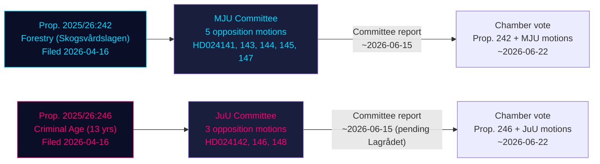

# Cross-Reference Map — Opposition Motions 2026-05-07

**Framework**: Policy clusters, legislative chains, coordination patterns
**Date**: 2026-05-07 | **Author**: James Pether Sörling

## Policy Clusters

### Cluster A: Forestry Reform (MJU / Skogsvårdslagen)
**Anchor proposition**: Prop. 2025/26:242

| Motion | Party | Relation to Prop. 242 | Common Yrkanden |
|--------|-------|----------------------|-----------------|
| HD024141 (V) | Vänsterpartiet | Near-total rejection — 7 yrkanden | Yrkande 1: Avslag; Y3-7: specific §§ |
| HD024143 (SD) | Sverigedemokraterna | Partial amendments — 3 yrkanden | Y1-3: notification thresholds, Sámi |
| HD024144 (S) | Socialdemokraterna | Reform + safeguards — 4 yrkanden | Impact analysis, Sámi consultation |
| HD024145 (C) | Centerpartiet | National coherence framework | Y1: unified policy; Y2: Sámi |
| HD024147 (MP) | Miljöpartiet | Total rejection — 6 yrkanden | EU NRL compliance; biodiversity |

**Common themes across MJU motions**:
- Sámi/reindeer grazing consultation (HD024141 Y7, HD024143 Y3, HD024144 Y4, HD024145 Y2) — **consensus cross-party on Sámi rights**
- EU Habitats Directive compliance concerns (HD024141, HD024147) — left-flank coordination
- Impact analysis before avverkning (HD024144, HD024145) — center coordination

### Cluster B: Criminal Age Reform (JuU / Straffbarhetsålder)
**Anchor proposition**: Prop. 2025/26:246

| Motion | Party | Relation to Prop. 246 | Key Legal Citation |
|--------|-------|----------------------|-------------------|
| HD024142 (V) | Vänsterpartiet | Near-total rejection + BRÅ demand | CRC Art. 40(3)(a) |
| HD024146 (C) | Centerpartiet | Provision-by-provision BrB audit | Specific BrB §§ |
| HD024148 (MP) | Miljöpartiet | Youth justice framework revision | CRC Art. 40(3)(a), SoL |

**Common themes across JuU motions**:
- CRC Art. 40(3)(a) (HD024142, HD024148) — international law consensus
- BrB provision concerns (HD024146 explicit, HD024142 implicit) — legal coherence
- Evidence base absent (HD024142 BRÅ demand) — methodological challenge

## Legislative Chain

## Coordination Patterns

### Evidence of coordination:
- **V + MP CRC citation** (HD024142 + HD024148): Both explicitly cite CRC Art. 40(3)(a) — suggests V-MP communication on legal strategy, possibly via opposition legal research service
- **Sámi consultation consensus**: All 5 MJU motions include Sámi reindeer grazing protection — this is a cross-party baseline that may facilitate MJU committee amendment
- **C's forensic MJU approach** (HD024145) + **C's forensic JuU approach** (HD024146): C systematically files provision-by-provision critiques across both clusters — consistent legal strategy

### Evidence of fragmentation:
- **No S–V coordination on prop. 246**: S silent; V engaged — no evidence of joint strategy
- **SD vs V on prop. 242**: SD wants reform, V wants rejection — opposite objectives despite both opposing prop. 242 as filed
- **C + S vs V + MP on prop. 242**: Center-left (impact analysis, reform) vs left-green (rejection) — tactical divergence within opposition

## Cross-Cluster Links

| Link | Description | Significance |
|------|-------------|-------------|
| **Rights framing** | Both clusters framed as CRC/EU treaty compliance — connects criminal justice (JuU) and environment (MJU) via international obligations | Suggests V + MP share strategic communication framework across committees |
| **Lagrådet** | Prop. 246 pending yttrande creates time dependency; prop. 242 did not trigger Lagrådet review (statutory threshold not met) | JuU outcome dependent on Lagrådet; MJU independent |
| **Election 2026** | Both clusters feed into election narratives: crime policy + environmental policy — key battleground dimensions | Government must manage both simultaneously in election year |
| **SD position** | SD only active in MJU (HD024143), silent in JuU — SD endorses criminal age policy, distance from forestry bill | SD's selective opposition is tactically calibrated |
