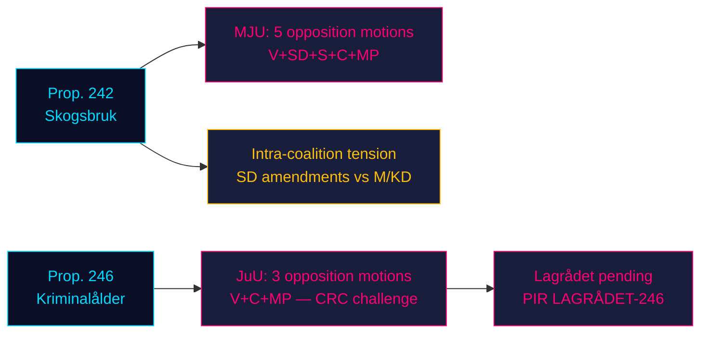

# Opposition Storms Government's Twin Legislative Pillars: Forestry and Criminal Age Face Four-Party Resistance

**Classification**: UNCLASSIFIED // PUBLIC SOURCE // GDPR Art. 9(2)(e,g)
**Date**: 2026-05-07
**Author**: James Pether Sörling
**Confidence**: B3 — Reliable source, possibly true (Admiralty Scale)
**Run ID**: 25482566277

## BLUF

Eight opposition committee motions filed 2026-05-04 mount coordinated resistance across two government propositions: four opposition parties (V, SD, S, C, MP) challenge prop. 2025/26:242 on forestry deregulation via MJU, while V, C, and MP demand rejection of the criminal responsibility age cut to 13 years in prop. 2025/26:246 via JuU. With the September 2026 election approximately 125 days away, both legislative battles carry maximum electoral salience. The government's 165-seat majority faces its most constitutionally consequential confrontation of the parliamentary spring.

## 60-Second Intelligence Read

- **Forestry cluster (MJU, prop. 242)**: V demands near-total rejection; MP demands total rejection; S demands comprehensive impact analysis and independent evaluation; C demands coherent national forestry policy; SD (coalition partner) files amendments — creating an intra-coalition tension that is the critical variable.
- **Criminal age cluster (JuU, prop. 246)**: C (pivotal actor) directly demands rejection of the age cut to 13, maximum sentencing increase, youth care changes, and criminal record changes. V similarly demands near-total rejection. MP rejects age cut to 13 and sentencing provisions. Three opposition parties cite UN Convention on the Rights of the Child (CRC) Art. 40(3)(a) — a constitutional legitimacy challenge.
- **Lagrådet yttrande on prop. 246**: Not yet published (as of 2026-05-07). If Lagrådet flags CRC incompatibility, probability of government retreat rises from ~15% to ~30-40%.
- **S position on criminal age**: S has not yet filed a JuU motion — the decisive gap. S declaration determines whether opposition reaches 163 seats on this vote.
- **Electoral framing**: Both clusters position for the election: SD's forestry amendments create visible intra-coalition discord; V/MP/C criminal age resistance frames child rights as an election issue.
- **Economic backdrop**: Sweden GDP growth 0.82% (2024, World Bank); unemployment 8.69% (2025, World Bank). Fiscal pressures intensify electorate sensitivity to public-sector efficiency and crime-management costs.

## Top Decisions Supported

1. **JuU timing strategy**: When does C push for committee concessions before the Lagrådet yttrande — or wait for it as leverage?
2. **S position declaration**: Will S file an amendment on prop. 246 before the JuU committee deadline (~2026-05-20)?
3. **MJU negotiation vector**: Does SD's motion signal genuine intra-coalition tension or tactical positioning to extract concessions from M/KD?

## Top Forward Trigger

**Lagrådet yttrande on prop. 2025/26:246** — expected ~2026-06-05. If Lagrådet flags CRC Art. 40(3)(a) incompatibility, the political calculus shifts decisively. Government faces a choice: proceed and risk constitutional censure, or withdraw and sustain electoral loss on flagship crime policy.

## Horizon Confidence Summary

| Horizon | Assessment | WEP language |
|---------|-----------|-------------|
| T+72h | Committee deliberations begin; no votes | We assess with high confidence |
| T+7d | S declaration on prop. 246 likely | We probably will see S motion or statement |
| T+30d | Lagrådet yttrande; MJU committee report | We assess it is likely Lagrådet will publish |
| T+election | One or both props modified or defeated | Roughly even chances of government conceding |

