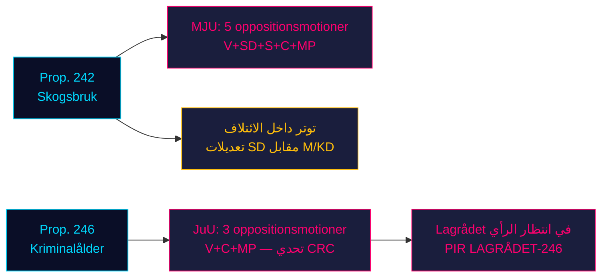

# المعارضة تقتحم ركيزتَي التشريع الحكوميتين: الغابات وسن المسؤولية الجنائية يواجهان مقاومة من أربعة أحزاب

**التصنيف**: غير مصنَّف // مصدر عام // اللائحة الأوروبية للبيانات GDPR Art. 9(2)(e,g)
**التاريخ**: 2026-05-07
**المؤلف**: James Pether Sörling
**مستوى الثقة**: B3 — مصدر موثوق، معلومة محتملة الصحة (مقياس الأدميرالية)
**معرّف الجلسة**: 25482566277

## الخلاصة التنفيذية (BLUF)

ثماني مقترحات من لجان المعارضة قُدِّمت في 2026-05-04 لتنظيم مقاومة منسقة ضد اقتراحَي حكوميين: أربعة أحزاب معارضة (V, SD, S, C, MP) تطعن عبر MJU في الاقتراح prop. 2025/26:242 الخاص بإلغاء تنظيم قطاع الغابات، فيما تطالب V وC وMP عبر JuU برفض خفض سن المسؤولية الجنائية إلى 13 عاماً في الاقتراح prop. 2025/26:246. مع اقتراب انتخابات سبتمبر 2026 بنحو 125 يوماً، تحمل المعركتان التشريعيتان أعلى درجات الأهمية الانتخابية. أغلبية 165 مقعداً للحكومة تواجه أشد مواجهة دستورية في الربيع البرلماني.

## القراءة الاستخباراتية في 60 ثانية

- **مجموعة الغابات (MJU, prop. 242)**: V تطالب برفض شبه كامل؛ MP تطالب بالرفض التام؛ S تطالب بتحليل شامل للتأثير وتقييم مستقل؛ C تطالب بسياسة غابات وطنية متماسكة؛ SD (الشريك في الائتلاف) تُقدّم تعديلات — مما يخلق توتراً داخل الائتلاف يُعدّ المتغير الحاسم.
- **مجموعة السن الجنائي (JuU, prop. 246)**: C (الفاعل المحوري) تطالب مباشرةً برفض تخفيض السن إلى 13 عاماً، ورفع الحد الأقصى للعقوبات، وتعديلات في رعاية الشباب والسجل الجنائي. V تطالب كذلك برفض شبه كامل. MP ترفض تخفيض السن إلى 13 عاماً وأحكام العقوبات. ثلاثة أحزاب معارضة تستند إلى اتفاقية الأمم المتحدة لحقوق الطفل (CRC) المادة 40(3)(a) — تحدٍّ لشرعية الدستور.
- **رأي Lagrådet في prop. 246**: لم يُنشر بعد (حتى 2026-05-07). إذا أشار Lagrådet إلى عدم التوافق مع CRC، ترتفع احتمالية تراجع الحكومة من ~15% إلى ~30-40%.
- **موقف S من السن الجنائي**: لم تُقدّم S حتى الآن أي اقتراح JuU — الفجوة الحاسمة. تصريح S يُحدد ما إذا كانت المعارضة ستصل إلى 163 مقعداً في هذا التصويت.
- **التأطير الانتخابي**: يتموضع الكتلتان للانتخابات: تعديلات SD على قطاع الغابات تُحدث انشقاقاً ائتلافياً مرئياً؛ مقاومة V/MP/C للسن الجنائي تُؤطّر حقوق الطفل كقضية انتخابية.
- **السياق الاقتصادي**: نمو الناتج المحلي الإجمالي السويدي 0.82% (2024، البنك الدولي)؛ البطالة 8.69% (2025، البنك الدولي). الضغوط المالية تُعمّق حساسية الناخبين تجاه كفاءة القطاع العام وتكاليف الجريمة.

## أبرز القرارات المدعومة

1. **استراتيجية توقيت JuU**: متى تضغط C على اللجنة لانتزاع تنازلات قبل رأي Lagrådet — أم تنتظره رافعةً للتفاوض؟
2. **إعلان موقف S**: هل ستُقدّم S تعديلاً على prop. 246 قبل الموعد النهائي للجنة JuU (~2026-05-20)؟
3. **متجه تفاوض MJU**: هل تُشير مقترحات SD إلى توتر ائتلافي حقيقي أم إلى تموضع تكتيكي لانتزاع تنازلات من M/KD؟

## أبرز المحفزات المستقبلية

**رأي Lagrådet في prop. 2025/26:246** — متوقع ~2026-06-05. إذا أشار Lagrådet إلى عدم التوافق مع CRC المادة 40(3)(a)، يتحوّل الحساب السياسي بشكل حاسم. تواجه الحكومة خياراً: الاستمرار وتحمّل مخاطر الرقابة الدستورية، أو التراجع وتحمّل خسارة انتخابية في سياسة الأمن الجنائي.

## ملخص ثقة الآفاق الزمنية

| الأفق | التقييم | صياغة WEP |
|---------|-----------|-------------|
| T+72h | بدء مداولات اللجنة؛ لا تصويتات | نقدّر بثقة عالية |
| T+7d | إعلان S بشأن prop. 246 محتمل | نتوقع على الأرجح اقتراحاً أو بياناً من S |
| T+30d | رأي Lagrådet؛ تقرير لجنة MJU | نرى من المحتمل أن ينشر Lagrådet رأيه |
| T+انتخابات | تعديل اقتراح واحد أو كليهما أو هزيمته | فرص متقاربة لتنازلات حكومية |

<!-- source-sha: 763faff7f9c94520ee112d9155becca626ed9add -->
