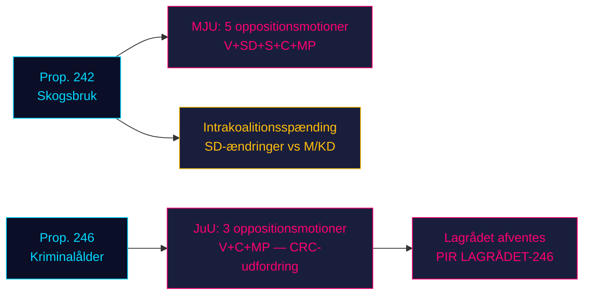

# Oppositionen stormer regeringens to lovgivningssøjler: Skovbrug og kriminalitetsalder møder firepartimodstand

**Klassificering**: IKKE KLASSIFICERET // OFFENTLIG KILDE // GDPR Art. 9(2)(e,g)
**Dato**: 2026-05-07
**Forfatter**: James Pether Sörling
**Konfidens**: B3 — Pålidelig kilde, muligvis sand (Admiralitetsskalaen)
**Kørsels-ID**: 25482566277

## BLUF

Otte oppositionsudvalgsforslag indgivet 2026-05-04 monterer koordineret modstand mod to regeringsforslag: fire oppositionspartier (V, SD, S, C, MP) udfordrer prop. 2025/26:242 om skovbrugsderegulering via MJU, mens V, C og MP kræver afvisning af nedsættelse af den strafferetlige lavalder til 13 år i prop. 2025/26:246 via JuU. Med valget i september 2026 ca. 125 dage væk bærer begge lovgivningskampe maksimal valgmæssig relevans. Regeringens 165-mandatsflertal møder sin mest konstitutionelt afgørende konfrontation i den parlamentariske forårssamling.

## 60-sekunders efterretningslæsning

- **Skovbrugskluster (MJU, prop. 242)**: V kræver nærmest total afvisning; MP kræver total afvisning; S kræver omfattende konsekvensanalyse og uafhængig evaluering; C kræver sammenhængende national skovpolitik; SD (koalitionspartner) indsender ændringsforslag — hvilket skaber en intrakoalitionsspænding, der er den kritiske variabel.
- **Kriminalitetsalderkluster (JuU, prop. 246)**: C (nøgleaktør) kræver direkte afvisning af aldersnedsættelsen til 13 år, maksimal strafskærpelse, ændringer i ungdomspleje og strafferegister. V kræver ligeledes nærmest total afvisning. MP afviser aldersnedsættelse til 13 år og strafudmålingsbestemmelserne. Tre oppositionspartier påberåber sig FN's Børnekonvention (CRC) Art. 40(3)(a) — en konstitutionel legitimitetsudfordring.
- **Lagrådets udtalelse om prop. 246**: Endnu ikke offentliggjort (pr. 2026-05-07). Hvis Lagrådet markerer CRC-uforligelighed, stiger sandsynligheden for et regeringstilbagetog fra ~15% til ~30-40%.
- **S's holdning til kriminalitetsalder**: S har endnu ikke indsendt en JuU-motion — det afgørende hul. S's erklæring afgør, om oppositionen når 163 mandater i denne afstemning.
- **Valgframing**: Begge klustrer positionerer sig til valget: SD's skovbrugsændringer skaber synlig intrakoalitionsdissens; V/MP/C's modstand mod kriminalitetsalderen indrammes som et valgemne om børnerettigheder.
- **Økonomisk baggrund**: Sverige BNP-vækst 0,82% (2024, Verdensbanken); arbejdsløshed 8,69% (2025, Verdensbanken). Finansielt pres intensiverer vælgernes følsomhed over for offentlig effektivitet og kriminalitetsomkostninger.

## Top understøttede beslutninger

1. **JuU-tidsstrategi**: Hvornår presser C på udvalgsmedgivelser før Lagrådets udtalelse — eller afventer den som løftestang?
2. **S's holdningserklæring**: Vil S indsende et ændringsforslag om prop. 246 inden JuU's udvalgsdeadline (~2026-05-20)?
3. **MJU-forhandlingsvektor**: Signalerer SD's motion ægte intrakoalitionsspænding eller taktisk positionering for at opnå indrømmelser fra M/KD?

## Top fremadrettet udløser

**Lagrådets udtalelse om prop. 2025/26:246** — forventet ~2026-06-05. Hvis Lagrådet markerer CRC Art. 40(3)(a)-uforligelighed, forskydes den politiske kalkule afgørende. Regeringen står over for et valg: fortsæt og risiker konstitutionel censur, eller træk tilbage og led en elektoral tab på flagskibs-kriminalpolitik.

## Horisont konfidensoversigt

| Horisont | Vurdering | WEP-formulering |
|---------|-----------|-------------|
| T+72h | Udvalgsforhandlinger begynder; ingen afstemninger | Vi vurderer med høj konfidens |
| T+7d | S's erklæring om prop. 246 sandsynlig | Vi forventer sandsynligvis S's motion eller udtalelse |
| T+30d | Lagrådets udtalelse; MJU-udvalgsrapport | Vi vurderer det sandsynligt, at Lagrådet offentliggør |
| T+valg | Et eller begge forslag ændret eller nedstemt | Omtrent lige chancer for, at regeringen giver indrømmelser |

<!-- source-sha: 763faff7f9c94520ee112d9155becca626ed9add -->
