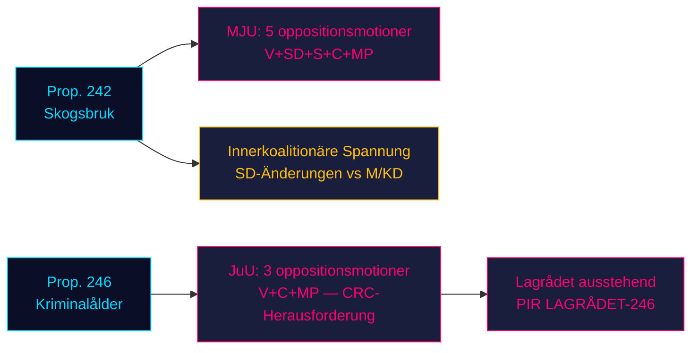

# Opposition stürmt die zwei Gesetzgebungssäulen der Regierung: Forstwirtschaft und Strafmündigkeitsalter stoßen auf Vier-Parteien-Widerstand

**Klassifizierung**: NICHT KLASSIFIZIERT // ÖFFENTLICHE QUELLE // DSGVO Art. 9(2)(e,g)
**Datum**: 2026-05-07
**Autor**: James Pether Sörling
**Konfidenz**: B3 — Zuverlässige Quelle, möglicherweise wahr (Admiralitätsskala)
**Lauf-ID**: 25482566277

## BLUF

Acht Oppositionsausschussanträge, eingereicht am 2026-05-04, organisieren koordinierten Widerstand gegen zwei Regierungsvorlagen: Vier Oppositionsparteien (V, SD, S, C, MP) fordern via MJU prop. 2025/26:242 zur Deregulierung der Forstwirtschaft heraus, während V, C und MP via JuU die Ablehnung der Senkung des Strafmündigkeitsalters auf 13 Jahre in prop. 2025/26:246 fordern. Mit der Wahl im September 2026 ca. 125 Tage entfernt tragen beide Gesetzgebungskämpfe maximale Wahlrelevanz. Die 165-Sitze-Mehrheit der Regierung steht vor ihrer verfassungsrechtlich folgenreichsten Konfrontation des parlamentarischen Frühjahrs.

## 60-Sekunden-Geheimdienstlektüre

- **Forstwirtschaftscluster (MJU, prop. 242)**: V fordert nahezu vollständige Ablehnung; MP fordert vollständige Ablehnung; S fordert umfassende Folgenabschätzung und unabhängige Bewertung; C fordert eine kohärente nationale Forstpolitik; SD (Koalitionspartner) reicht Änderungsanträge ein — was eine innerkoalitionäre Spannung schafft, die die kritische Variable ist.
- **Strafmündigkeitsalter-Cluster (JuU, prop. 246)**: C (Schlüsselakteur) fordert direkt die Ablehnung der Alterssenkung auf 13 Jahre, maximale Straferhöhung, Änderungen in der Jugendfürsorge und im Strafregister. V fordert ebenfalls nahezu vollständige Ablehnung. MP lehnt die Alterssenkung auf 13 Jahre und die Strafzumessungsbestimmungen ab. Drei Oppositionsparteien berufen sich auf die UN-Kinderrechtskonvention (CRC) Art. 40(3)(a) — eine verfassungsrechtliche Legitimitätsherausforderung.
- **Gutachten des Lagrådets zu prop. 246**: Noch nicht veröffentlicht (Stand 2026-05-07). Falls Lagrådet CRC-Unvereinbarkeit markiert, steigt die Wahrscheinlichkeit eines Regierungsrückzugs von ~15% auf ~30-40%.
- **S-Position zum Strafmündigkeitsalter**: S hat noch keinen JuU-Antrag gestellt — die entscheidende Lücke. S' Erklärung bestimmt, ob die Opposition 163 Sitze bei dieser Abstimmung erreicht.
- **Wahlframing**: Beide Cluster positionieren sich für die Wahl: SDs Forstwirtschaftsänderungen schaffen sichtbare innerkoalitionäre Uneinigkeit; V/MP/Cs Widerstand gegen das Strafmündigkeitsalter rahmt Kinderrechte als Wahlthema ein.
- **Wirtschaftlicher Hintergrund**: Schwedens BIP-Wachstum 0,82% (2024, Weltbank); Arbeitslosigkeit 8,69% (2025, Weltbank). Finanzdruck intensiviert die Empfindlichkeit der Wähler gegenüber öffentlicher Effizienz und Kriminalitätskosten.

## Top unterstützte Entscheidungen

1. **JuU-Zeitstrategie**: Wann drängt C auf Ausschusszugeständnisse vor dem Lagrådet-Gutachten — oder wartet darauf als Hebel?
2. **S-Positionserklärung**: Wird S vor der JuU-Ausschlussfrist (~2026-05-20) einen Änderungsantrag zu prop. 246 einreichen?
3. **MJU-Verhandlungsvektor**: Signalisiert SDs Antrag echte innerkoalitionäre Spannung oder taktische Positionierung, um Zugeständnisse von M/KD herauszupressen?

## Top Vorwärtsauslöser

**Lagrådet-Gutachten zu prop. 2025/26:246** — erwartet ~2026-06-05. Falls Lagrådet CRC Art. 40(3)(a)-Unvereinbarkeit markiert, verschiebt sich das politische Kalkül entscheidend. Die Regierung steht vor einer Wahl: weitermachen und Verfassungskritik riskieren, oder zurückziehen und eine Wahlniederlage bei der Flaggschiff-Kriminalpolitik erleiden.

## Horizontkonfidenz-Zusammenfassung

| Horizont | Einschätzung | WEP-Formulierung |
|---------|-----------|-------------|
| T+72h | Ausschussberatungen beginnen; keine Abstimmungen | Wir schätzen mit hoher Konfidenz ein |
| T+7d | S-Erklärung zu prop. 246 wahrscheinlich | Wir erwarten wahrscheinlich S-Antrag oder -Erklärung |
| T+30d | Lagrådet-Gutachten; MJU-Ausschussbericht | Wir schätzen es als wahrscheinlich ein, dass Lagrådet veröffentlicht |
| T+Wahl | Eine oder beide Vorlagen geändert oder abgelehnt | Ungefähr gleiche Chancen für Regierungszugeständnisse |

<!-- source-sha: 763faff7f9c94520ee112d9155becca626ed9add -->
