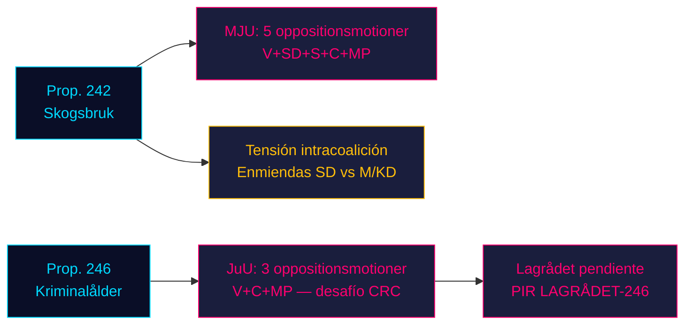

# La oposición asalta los dos pilares legislativos del gobierno: La silvicultura y la edad penal enfrentan resistencia de cuatro partidos

**Clasificación**: SIN CLASIFICAR // FUENTE PÚBLICA // RGPD Art. 9(2)(e,g)
**Fecha**: 2026-05-07
**Autor**: James Pether Sörling
**Confianza**: B3 — Fuente fiable, posiblemente cierta (Escala Almirantazgo)
**ID de ejecución**: 25482566277

## BLUF

Ocho mociones de comisión de la oposición presentadas el 2026-05-04 montan resistencia coordinada contra dos proposiciones gubernamentales: cuatro partidos de oposición (V, SD, S, C, MP) desafían vía MJU la prop. 2025/26:242 sobre desregulación forestal, mientras que V, C y MP exigen vía JuU el rechazo de la reducción de la edad de responsabilidad penal a 13 años en la prop. 2025/26:246. Con las elecciones de septiembre de 2026 a aproximadamente 125 días, ambas batallas legislativas tienen máxima relevancia electoral. La mayoría de 165 escaños del gobierno enfrenta su confrontación constitucionalmente más trascendente de la primavera parlamentaria.

## Lectura de inteligencia en 60 segundos

- **Clúster silvicultura (MJU, prop. 242)**: V exige un rechazo casi total; MP exige rechazo total; S exige un análisis de impacto exhaustivo y evaluación independiente; C exige una política forestal nacional coherente; SD (socio de coalición) presenta enmiendas — creando una tensión intracoalición que es la variable crítica.
- **Clúster edad penal (JuU, prop. 246)**: C (actor pivotal) exige directamente el rechazo de la reducción de edad a 13 años, aumento máximo de penas, cambios en atención a jóvenes y antecedentes penales. V exige igualmente un rechazo casi total. MP rechaza la reducción de edad a 13 años y las disposiciones sobre sentencias. Tres partidos de oposición invocan la Convención de la ONU sobre los Derechos del Niño (CRC) Art. 40(3)(a) — un desafío de legitimidad constitucional.
- **Dictamen de Lagrådet sobre prop. 246**: Aún no publicado (a 2026-05-07). Si Lagrådet marca incompatibilidad con la CRC, la probabilidad de retirada gubernamental sube de ~15% a ~30-40%.
- **Posición de S sobre la edad penal**: S aún no ha presentado una moción JuU — la brecha decisiva. La declaración de S determina si la oposición alcanza 163 escaños en esta votación.
- **Encuadre electoral**: Ambos clústeres se posicionan para las elecciones: las enmiendas forestales de SD crean disenso intracoalición visible; la resistencia de V/MP/C a la edad penal encuadra los derechos del niño como tema electoral.
- **Contexto económico**: Crecimiento del PIB de Suecia 0,82% (2024, Banco Mundial); desempleo 8,69% (2025, Banco Mundial). Las presiones fiscales intensifican la sensibilidad del electorado ante la eficiencia del sector público y los costos del crimen.

## Principales decisiones respaldadas

1. **Estrategia de tiempo JuU**: ¿Cuándo presiona C por concesiones de comisión antes del dictamen de Lagrådet — o lo espera como palanca?
2. **Declaración de posición de S**: ¿Presentará S una enmienda sobre prop. 246 antes del plazo de comisión JuU (~2026-05-20)?
3. **Vector de negociación MJU**: ¿La moción de SD señala tensión intracoalición genuina o posicionamiento táctico para extraer concesiones de M/KD?

## Principal desencadenante prospectivo

**Dictamen de Lagrådet sobre prop. 2025/26:246** — esperado ~2026-06-05. Si Lagrådet marca incompatibilidad con CRC Art. 40(3)(a), el cálculo político se desplaza decisivamente. El gobierno enfrenta una elección: continuar y arriesgar censura constitucional, o retirar y sufrir una pérdida electoral en su política insignia de seguridad ciudadana.

## Resumen de confianza por horizonte

| Horizonte | Evaluación | Lenguaje WEP |
|---------|-----------|-------------|
| T+72h | Las deliberaciones de comisión comienzan; sin votaciones | Evaluamos con alta confianza |
| T+7d | Declaración de S sobre prop. 246 probable | Probablemente veremos moción o declaración de S |
| T+30d | Dictamen de Lagrådet; informe de comisión MJU | Evaluamos como probable que Lagrådet publique |
| T+elección | Una o ambas proposiciones modificadas o rechazadas | Aproximadamente iguales posibilidades de concesiones gubernamentales |

<!-- source-sha: 763faff7f9c94520ee112d9155becca626ed9add -->
