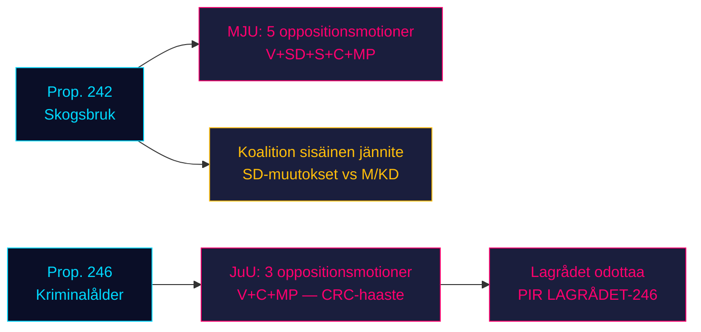

# Oppositio hyökkää hallituksen kahta lainsäädäntöpilaria vastaan: Metsätalous ja rikosoikeudellinen ikä kohtaavat neljän puolueen vastustuksen

**Luokittelu**: LUOKITTELEMATON // JULKINEN LÄHDE // GDPR Art. 9(2)(e,g)
**Päivämäärä**: 2026-05-07
**Tekijä**: James Pether Sörling
**Luottamus**: B3 — Luotettava lähde, mahdollisesti totta (Admiraliteettiasteikko)
**Ajoaika**: 25482566277

## BLUF

Kahdeksan oppositiovaliokunnan motioota jätettiin 2026-05-04 koordinoidun vastustuksen järjestämiseksi kahta hallituksen esitystä vastaan: neljä oppositiopuoluetta (V, SD, S, C, MP) haastaa prop. 2025/26:242 metsätalouden sääntelyn purkamisesta MJU:n kautta, kun taas V, C ja MP vaativat prop. 2025/26:246 rikosoikeudellisen ikärajan alentamisen hylkäämistä 13 vuoteen JuU:n kautta. Syyskuun 2026 vaalien ollessa noin 125 päivän päässä, molemmilla lainsäädäntötaisteluilla on maksimaalinen vaalipoliittinen merkitys. Hallituksen 165 paikan enemmistö kohtaa parlamentaarisen kevätkauden perustuslaillisesti merkittävimmän konfrontaationsa.

## 60 sekunnin tiedustelulukeminen

- **Metsätalousrypäs (MJU, prop. 242)**: V vaatii lähes täydellistä hylkäämistä; MP vaatii täydellistä hylkäämistä; S vaatii kattavaa vaikutusanalyysia ja riippumatonta arviointia; C vaatii johdonmukaista kansallista metsäpolitiikkaa; SD (koalitionkumppani) jättää muutosesityksiä — luoden koalition sisäisen jännitteen, joka on kriittinen muuttuja.
- **Rikosoikeudellisen iän rypäs (JuU, prop. 246)**: C (keskeinen toimija) vaatii suoraan ikärajan alentamisen hylkäämistä 13 vuoteen, enimmäisrangaistuksen korottamista, nuorisohoidon muutoksia ja rikosrekisterin muutoksia. V vaatii samoin lähes täydellistä hylkäämistä. MP hylkää ikärajan alentamisen 13 vuoteen ja rangaistussäännökset. Kolme oppositiopuoluetta vetoaa YK:n lapsen oikeuksien sopimukseen (CRC) Art. 40(3)(a) — perustuslaillinen legitimiteettihaaste.
- **Lainvalmisteluneuvosto (Lagrådet) prop. 246:sta**: Ei vielä julkaistu (per 2026-05-07). Jos Lagrådet merkitsee CRC-yhteensopimattomuuden, hallituksen vetäytymisen todennäköisyys nousee ~15%:sta ~30-40%:iin.
- **S:n kanta rikosoikeudelliseen ikään**: S ei ole vielä jättänyt JuU-motiota — ratkaiseva aukko. S:n julistus määrittää, saavuttaako oppositio 163 paikkaa tässä äänestyksessä.
- **Vaaliframing**: Molemmat rypäät asemoituvat vaaleja varten: SD:n metsätalousmuutokset luovat näkyvää koalition sisäistä erimielisyyttä; V/MP/C:n vastustus rikosoikeudellista ikää kohtaan kehystää lapsen oikeudet vaalikysymykseksi.
- **Taloudellinen tausta**: Ruotsin BKT-kasvu 0,82% (2024, Maailmanpankki); työttömyys 8,69% (2025, Maailmanpankki). Taloudellinen paine voimistaa äänestäjien herkkyyttä julkisen sektorin tehokkuudelle ja rikollisuuden kustannuksille.

## Tärkeimmät tuetut päätökset

1. **JuU-ajoitusstrategia**: Milloin C painostaa valiokunnan myönnytyksiä ennen Lagrådets lausuntoa — vai odottaa sitä vipuvoimana?
2. **S:n kannanotto**: Jättääkö S muutosesityksen prop. 246:sta ennen JuU:n valiokuntamääräaikaa (~2026-05-20)?
3. **MJU-neuvotteluvektori**: Signaloiko SD:n motio aitoa koalition sisäistä jännitettä vai taktista asemoitumista myönnytysten puristamiseksi M/KD:ltä?

## Tärkein eteenpäinkatsova laukaisin

**Lagrådets lausunto prop. 2025/26:246:sta** — odotetaan ~2026-06-05. Jos Lagrådet merkitsee CRC Art. 40(3)(a) -yhteensopimattomuuden, poliittinen laskenta muuttuu ratkaisevasti. Hallitus kohtaa valinnan: jatka ja riskeeraa perustuslaillinen moite, tai vedä takaisin ja kärsi vaalipoliittinen tappio lippulaivarikosoikeuspolitiikassaan.

## Horisontin luottamusyhteenveto

| Horisontti | Arvio | WEP-muotoilu |
|---------|-----------|-------------|
| T+72h | Valiokuntaneuvottelut alkavat; ei äänestyksiä | Arvioimme suurella luottamuksella |
| T+7d | S:n julistus prop. 246:sta todennäköinen | Odotamme todennäköisesti S:n motiota tai lausuntoa |
| T+30d | Lagrådets lausunto; MJU-valiokuntaraportti | Arvioimme sen todennäköiseksi, että Lagrådet julkaisee |
| T+vaali | Yksi tai molemmat esitykset muutettu tai hylätty | Suunnilleen yhtä suuret mahdollisuudet hallituksen myönnytyksille |

<!-- source-sha: 763faff7f9c94520ee112d9155becca626ed9add -->
