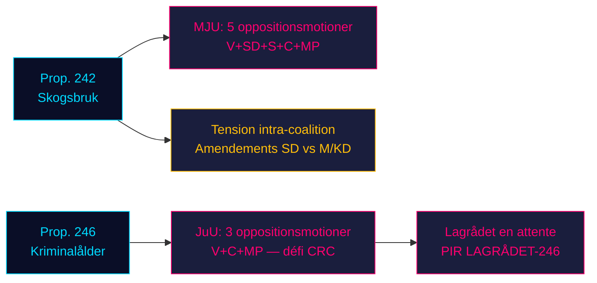

# L'opposition prend d'assaut les deux piliers législatifs du gouvernement : la sylviculture et l'âge de responsabilité pénale face à la résistance de quatre partis

**Classification**: NON CLASSIFIÉ // SOURCE PUBLIQUE // RGPD Art. 9(2)(e,g)
**Date**: 2026-05-07
**Auteur**: James Pether Sörling
**Confiance**: B3 — Source fiable, peut-être vraie (Échelle Amirauté)
**ID d'exécution**: 25482566277

## BLUF

Huit motions des commissions d'opposition déposées le 2026-05-04 organisent une résistance coordonnée contre deux propositions gouvernementales : quatre partis d'opposition (V, SD, S, C, MP) contestent via MJU la prop. 2025/26:242 sur la déréglementation forestière, tandis que V, C et MP exigent via JuU le rejet de l'abaissement de l'âge de responsabilité pénale à 13 ans dans la prop. 2025/26:246. Avec les élections de septembre 2026 à environ 125 jours, les deux batailles législatives revêtent une importance électorale maximale. La majorité de 165 sièges du gouvernement fait face à sa confrontation constitutionnellement la plus conséquente du printemps parlementaire.

## Lecture de renseignement en 60 secondes

- **Cluster sylviculture (MJU, prop. 242)** : V exige un rejet quasi total ; MP exige un rejet total ; S exige une analyse d'impact complète et une évaluation indépendante ; C exige une politique forestière nationale cohérente ; SD (partenaire de coalition) dépose des amendements — créant une tension intra-coalition qui est la variable critique.
- **Cluster âge pénal (JuU, prop. 246)** : C (acteur pivot) exige directement le rejet de l'abaissement de l'âge à 13 ans, l'augmentation maximale des peines, des modifications de la prise en charge des jeunes et du casier judiciaire. V exige de même un rejet quasi total. MP rejette l'abaissement de l'âge à 13 ans et les dispositions sur la peine. Trois partis d'opposition invoquent la Convention des Nations Unies relative aux droits de l'enfant (CRC) Art. 40(3)(a) — un défi à la légitimité constitutionnelle.
- **Avis du Lagrådet sur la prop. 246** : Non encore publié (au 2026-05-07). Si le Lagrådet signale une incompatibilité avec la CRC, la probabilité d'un retrait gouvernemental passe de ~15% à ~30-40%.
- **Position du S sur l'âge pénal** : Le S n'a pas encore déposé de motion JuU — l'écart décisif. La déclaration du S détermine si l'opposition atteint 163 sièges sur ce vote.
- **Cadrage électoral** : Les deux clusters se positionnent pour les élections : les amendements forestiers du SD créent une dissension intra-coalition visible ; la résistance de V/MP/C à l'âge pénal cadre les droits de l'enfant comme enjeu électoral.
- **Contexte économique** : Croissance du PIB suédois 0,82% (2024, Banque mondiale) ; chômage 8,69% (2025, Banque mondiale). Les pressions budgétaires intensifient la sensibilité des électeurs à l'efficacité du secteur public et aux coûts de la criminalité.

## Principales décisions soutenues

1. **Stratégie temporelle JuU** : Quand C pousse-t-il pour des concessions de commission avant l'avis du Lagrådet — ou attend-il pour en faire un levier ?
2. **Déclaration de position du S** : Le S déposera-t-il un amendement à la prop. 246 avant la date limite de commission JuU (~2026-05-20) ?
3. **Vecteur de négociation MJU** : La motion du SD signale-t-elle une tension intra-coalition réelle ou un positionnement tactique pour obtenir des concessions de M/KD ?

## Principal déclencheur prospectif

**Avis du Lagrådet sur la prop. 2025/26:246** — attendu ~2026-06-05. Si le Lagrådet signale une incompatibilité avec l'Art. 40(3)(a) de la CRC, le calcul politique se déplace de façon décisive. Le gouvernement fait face à un choix : continuer et risquer une censure constitutionnelle, ou se retirer et subir une perte électorale sur sa politique phare en matière de criminalité.

## Résumé de confiance par horizon

| Horizon | Évaluation | Langage WEP |
|---------|-----------|-------------|
| T+72h | Les délibérations de commission commencent ; pas de votes | Nous estimons avec une haute confiance |
| T+7d | Déclaration du S sur la prop. 246 probable | Nous prévoyons probablement une motion ou déclaration du S |
| T+30d | Avis du Lagrådet ; rapport de commission MJU | Nous estimons probable que le Lagrådet publie |
| T+élection | Une ou les deux propositions modifiées ou rejetées | Chances approximativement égales de concessions gouvernementales |

<!-- source-sha: 763faff7f9c94520ee112d9155becca626ed9add -->
