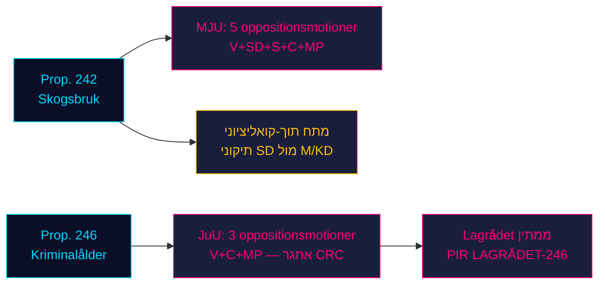

# האופוזיציה פורצת את שני עמודי החקיקה של הממשלה: הייעור וגיל האחריות הפלילית עומדים בפני התנגדות ארבעה מפלגות

**סיווג**: לא מסווג // מקור ציבורי // GDPR Art. 9(2)(e,g)
**תאריך**: 2026-05-07
**מחבר**: James Pether Sörling
**רמת ביטחון**: B3 — מקור אמין, ייתכן שנכון (סולם האדמירליות)
**מזהה הרצה**: 25482566277

## BLUF

שמונה הצעות ועדה אופוזיציוניות שהוגשו ב-2026-05-04 מגייסות התנגדות מתואמת נגד שני הצעות חוק ממשלתיות: ארבע מפלגות אופוזיציה (V, SD, S, C, MP) מערערות דרך MJU על prop. 2025/26:242 בדבר ביטול הסדרת הייעור, בעוד V, C ו-MP דורשות דרך JuU לדחות את הורדת גיל האחריות הפלילית ל-13 בפרופ. 2025/26:246. כאשר בחירות ספטמבר 2026 נמצאות כ-125 ימים קדימה, לשתי הקרבות החקיקתיות יש רלוונטיות בחירתית מקסימלית. רוב של 165 מנדטים של הממשלה עומד בפני העימות החוקתי המשמעותי ביותר של האביב הפרלמנטרי.

## קריאת מודיעין של 60 שניות

- **אשכול הייעור (MJU, prop. 242)**: V דורשת דחייה כמעט מוחלטת; MP דורשת דחייה מוחלטת; S דורשת ניתוח השפעות מקיף והערכה עצמאית; C דורשת מדיניות יערות לאומית קוהרנטית; SD (שותפת הקואליציה) מגישה תיקונים — ויוצרת מתח תוך-קואליציוני שהוא המשתנה הקריטי.
- **אשכול גיל פלילי (JuU, prop. 246)**: C (שחקן מרכזי) דורשת ישירות לדחות את הורדת הגיל ל-13, העלאת עונש מקסימלי, שינויים בטיפול בנוער ובפנקס הפלילי. V דורשת אף היא דחייה כמעט מוחלטת. MP דוחה הורדת גיל ל-13 וסעיפי הענישה. שלוש מפלגות אופוזיציה מפנות לאמנת האו"ם לזכויות הילד (CRC) Art. 40(3)(a) — אתגר לגיטימיות חוקתי.
- **חוות דעת Lagrådet על prop. 246**: טרם פורסמה (נכון ל-2026-05-07). אם Lagrådet מסמן חוסר תאימות ל-CRC, הסתברות נסיגת הממשלה עולה מ-~15% ל-~30-40%.
- **עמדת S על גיל פלילי**: S טרם הגישה הצעה ל-JuU — הפער המכריע. הצהרת S קובעת האם האופוזיציה מגיעה ל-163 מנדטים בהצבעה זו.
- **מסגור בחירתי**: שני האשכולות מתמצבים לקראת הבחירות: תיקוני SD לייעור יוצרים חוסר הסכמה גלוי בתוך הקואליציה; התנגדות V/MP/C לגיל הפלילי ממסגרת זכויות ילדים כנושא בחירות.
- **רקע כלכלי**: צמיחת תוצר ישראל שוודיה 0.82% (2024, הבנק העולמי); אבטלה 8.69% (2025, הבנק העולמי). לחצים פיסקליים מגבירים את רגישות הבוחרים ליעילות המגזר הציבורי ועלויות הפשיעה.

## ההחלטות המרכזיות הנתמכות

1. **אסטרטגיית תזמון JuU**: מתי לוחץ C על ועדה לוויתורים לפני חוות דעת Lagrådet — או ממתין לה כמנוף?
2. **הצהרת עמדת S**: האם S תגיש תיקון על prop. 246 לפני מועד הוועדה של JuU (~2026-05-20)?
3. **וקטור משא ומתן MJU**: האם הצעת SD מאותתת מתח קואליציוני אמיתי או מיצוב טקטי לסחיטת ויתורים מ-M/KD?

## הגורם המניע העתידי המרכזי

**חוות דעת Lagrådet על prop. 2025/26:246** — צפויה ~2026-06-05. אם Lagrådet מסמן חוסר תאימות עם CRC Art. 40(3)(a), החשבון הפוליטי משתנה באופן מכריע. הממשלה עומדת בפני בחירה: להמשיך ולסכן ביקורת חוקתית, או לסגת ולסבול הפסד בחירתי במדיניות הפשיעה הדגלית.

## סיכום רמות ביטחון לפי אופקים

| אופק | הערכה | ניסוח WEP |
|---------|-----------|-------------|
| T+72h | דיוני ועדה מתחילים; ללא הצבעות | אנו מעריכים בביטחון גבוה |
| T+7d | הצהרת S על prop. 246 סבירה | אנו צופים ככל הנראה הצעה או הצהרה מ-S |
| T+30d | חוות דעת Lagrådet; דוח ועדת MJU | אנו מעריכים סביר ש-Lagrådet יפרסם |
| T+בחירות | הצעה אחת או שתיהן יתוקנו או יידחו | סיכויים בערך שווים לויתורי ממשלה |

<!-- source-sha: 763faff7f9c94520ee112d9155becca626ed9add -->
