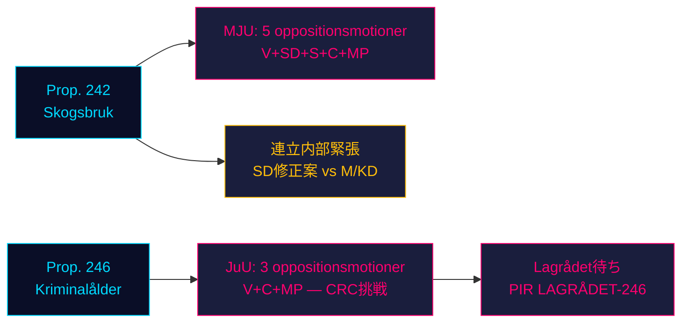

# 野党が政府の二大立法柱に突進：林業と刑事責任年齢が四党の抵抗に直面

**分類**: 未分類 // 公開情報源 // GDPR Art. 9(2)(e,g)
**日付**: 2026-05-07
**著者**: James Pether Sörling
**信頼度**: B3 — 信頼できる情報源、おそらく真実（海軍省尺度）
**実行ID**: 25482566277

## BLUF

2026-05-04に提出された8つの野党委員会動議が、二つの政府提案に対する協調抵抗を組織した。四野党（V、SD、S、C、MP）はMJUを通じてprop. 2025/26:242の林業規制緩和に反対し、V、C、MPはJuUを通じてprop. 2025/26:246における刑事責任年齢の13歳への引き下げの否決を求める。2026年9月の選挙まで約125日となり、両立法闘争は最大の選挙的重要性を帯びる。政府の165議席多数は、議会春季の最も憲法的に重要な対立に直面している。

## 60秒インテリジェンス読み取り

- **林業クラスター（MJU、prop. 242）**: Vはほぼ完全な否決を要求；MPは完全否決を要求；Sは包括的影響分析と独立評価を要求；Cは一貫した国家林業政策を要求；SD（連立パートナー）は修正案を提出 — 重要変数である連立内部緊張を生む。
- **刑事年齢クラスター（JuU、prop. 246）**: C（ピボット的行為者）は13歳への年齢引き下げの否決、最高刑の引き上げ、少年ケアの変更、前科記録の変更を直接要求。Vも同様にほぼ完全否決を要求。MPは13歳への年齢引き下げと量刑規定を否決。三野党は国連子どもの権利条約（CRC）Art. 40(3)(a)を援用 — 憲法的正当性への挑戦。
- **prop. 246に関するLagrådets意見**: 2026-05-07時点で未発表。LagrådatがCRC非適合を指摘すれば、政府後退の確率が~15%から~30-40%に上昇する。
- **刑事年齢に関するSの立場**: SはまだJuU動議を提出していない — 決定的な空白。Sの宣言が、この票決で野党が163議席に達するかどうかを決定する。
- **選挙的フレーミング**: 両クラスターが選挙に向けて布石を打つ：SDの林業修正案は連立内の可視的不和を生む；V/MP/Cの刑事年齢への抵抗は子どもの権利を選挙争点として位置づける。
- **経済的背景**: スウェーデンGDP成長率0.82%（2024年、世界銀行）；失業率8.69%（2025年、世界銀行）。財政圧力が公共部門効率と犯罪コストへの有権者の感受性を強める。

## 主要な支持決定事項

1. **JuU時間戦略**: LagrådetsのアドバイスCが委員会の譲歩を求めるタイミング — それとも交渉のテコとして待つのか？
2. **Sの立場表明**: SはJuU委員会期限（~2026-05-20）前にprop. 246への修正案を提出するか？
3. **MJU交渉ベクトル**: SDの動議は本物の連立内緊張を示すのか、それともM/KDから譲歩を引き出すための戦術的布石か？

## 主要な将来トリガー

**prop. 2025/26:246に関するLagrådets意見** — ~2026-06-05に予想。LagrådatsがCRC Art. 40(3)(a)の不適合を指摘すれば、政治的計算が決定的に変わる。政府は選択を迫られる：続行して憲法的非難のリスクを負うか、撤退して主力犯罪政策で選挙的損失を被るか。

## 時間軸信頼度サマリー

| 時間軸 | 評価 | WEP表現 |
|---------|-----------|-------------|
| T+72h | 委員会審議開始；採決なし | 高い確信を持って評価 |
| T+7d | prop. 246に関するSの宣言の可能性 | おそらくSの動議または声明を見込む |
| T+30d | Lagrådets意見；MJU委員会報告 | Lagrådatsが発表するものと評価 |
| T+選挙 | 一方または両方の提案が修正または否決 | 政府譲歩の確率はほぼ五分五分 |

<!-- source-sha: 763faff7f9c94520ee112d9155becca626ed9add -->
