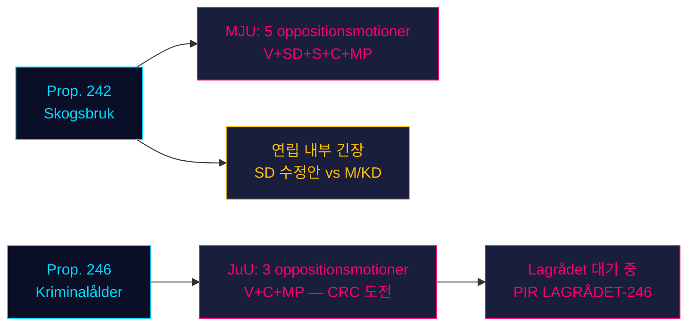

# 야당이 정부의 두 가지 입법 기둥을 공격: 임업과 형사 책임 연령이 4당의 저항에 직면

**분류**: 비밀 해제 // 공개 출처 // GDPR Art. 9(2)(e,g)
**날짜**: 2026-05-07
**저자**: James Pether Sörling
**신뢰도**: B3 — 신뢰할 수 있는 출처, 사실일 가능성 있음 (해군부 척도)
**실행 ID**: 25482566277

## BLUF

2026-05-04에 제출된 야당 위원회 동의 8건이 두 가지 정부 제안에 대한 조율된 저항을 조직했다. 네 야당(V, SD, S, C, MP)은 MJU를 통해 prop. 2025/26:242의 임업 규제 완화에 이의를 제기하고, V, C, MP는 JuU를 통해 prop. 2025/26:246의 형사 책임 연령 13세 인하 거부를 요구한다. 2026년 9월 선거가 약 125일 앞으로 다가와, 두 입법 투쟁은 최대 선거적 중요성을 띤다. 정부의 165석 다수는 의회 봄의 가장 헌법적으로 중대한 대결에 직면해 있다.

## 60초 정보 읽기

- **임업 클러스터 (MJU, prop. 242)**: V는 거의 전면 거부를 요구; MP는 전면 거부 요구; S는 포괄적 영향 분석과 독립 평가 요구; C는 일관된 국가 임업 정책 요구; SD(연립 파트너)는 수정안 제출 — 핵심 변수인 연립 내부 긴장을 초래.
- **형사 연령 클러스터 (JuU, prop. 246)**: C(핵심 행위자)는 13세 연령 인하 거부, 최대 형량 인상, 청소년 보호 변경, 전과 기록 변경을 직접 요구. V도 거의 전면 거부를 요구. MP는 13세 연령 인하와 양형 조항을 거부. 세 야당은 유엔 아동 권리 협약(CRC) Art. 40(3)(a)을 원용 — 헌법적 정당성에 대한 도전.
- **prop. 246에 관한 Lagrådet 의견**: 2026-05-07 기준 아직 미발표. Lagrådet이 CRC 불일치를 표시하면, 정부 후퇴 가능성이 ~15%에서 ~30-40%로 상승.
- **형사 연령에 관한 S의 입장**: S는 아직 JuU 동의를 제출하지 않았다 — 결정적인 공백. S의 선언이 이 표결에서 야당이 163석에 도달할지를 결정한다.
- **선거적 프레이밍**: 두 클러스터는 선거를 위해 포지셔닝: SD의 임업 수정안은 연립 내 가시적 불화를 초래; V/MP/C의 형사 연령 저항은 아동 권리를 선거 이슈로 프레이밍.
- **경제적 배경**: 스웨덴 GDP 성장률 0.82% (2024, 세계은행); 실업률 8.69% (2025, 세계은행). 재정 압력이 공공 부문 효율성과 범죄 비용에 대한 유권자 민감도를 강화.

## 주요 지원 결정 사항

1. **JuU 타이밍 전략**: C가 Lagrådet 의견 전에 위원회 양보를 압박하는 시점 — 아니면 지렛대로 기다리는가?
2. **S의 입장 선언**: S가 JuU 위원회 기한(~2026-05-20) 전에 prop. 246에 대한 수정안을 제출할 것인가?
3. **MJU 협상 벡터**: SD의 동의가 진정한 연립 내부 긴장을 신호하는가, 아니면 M/KD에서 양보를 얻어내기 위한 전술적 포지셔닝인가?

## 주요 미래 트리거

**prop. 2025/26:246에 관한 Lagrådet 의견** — ~2026-06-05 예상. Lagrådet이 CRC Art. 40(3)(a) 불일치를 표시하면, 정치적 계산이 결정적으로 바뀐다. 정부는 선택에 직면: 계속하며 헌법적 비판 위험을 감수하거나, 철회하여 주력 범죄 정책에서 선거적 손실을 입거나.

## 시간적 신뢰도 요약

| 시간축 | 평가 | WEP 표현 |
|---------|-----------|-------------|
| T+72h | 위원회 심의 시작; 표결 없음 | 높은 신뢰도로 평가 |
| T+7d | prop. 246에 관한 S의 선언 가능성 | S의 동의 또는 성명이 있을 것으로 예상 |
| T+30d | Lagrådet 의견; MJU 위원회 보고서 | Lagrådet이 발표할 것으로 평가 |
| T+선거 | 하나 또는 두 제안이 수정 또는 거부 | 정부 양보 가능성이 거의 동등 |

<!-- source-sha: 763faff7f9c94520ee112d9155becca626ed9add -->
