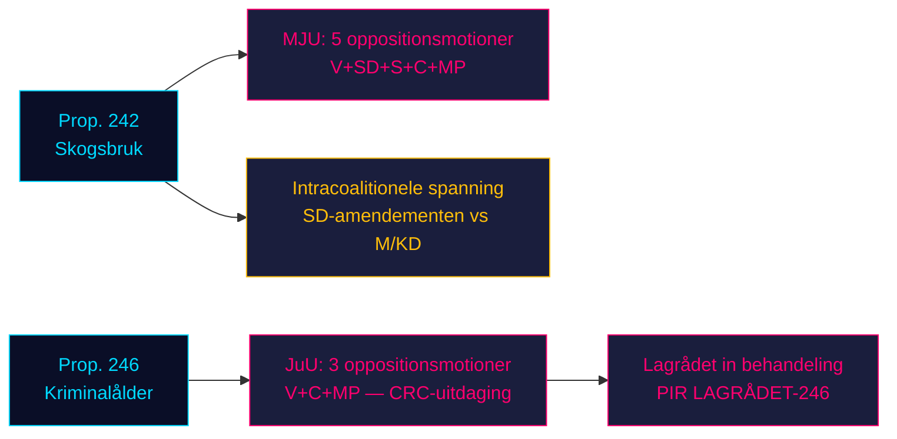

# De oppositie bestormt de twee wetgevingspijlers van de regering: Bosbouw en strafrechtelijke leeftijd krijgen weerstand van vier partijen

**Classificatie**: NIET GERUBRICEERD // PUBLIEKE BRON // AVG Art. 9(2)(e,g)
**Datum**: 2026-05-07
**Auteur**: James Pether Sörling
**Betrouwbaarheid**: B3 — Betrouwbare bron, mogelijk waar (Admiraliteitsschaal)
**Uitvoerings-ID**: 25482566277

## BLUF

Acht commissiemotities van de oppositie ingediend op 2026-05-04 organiseren gecoördineerde weerstand tegen twee regeringsvoorstellen: vier oppositiepartijen (V, SD, S, C, MP) betwisten via MJU prop. 2025/26:242 over bosbouwderegulering, terwijl V, C en MP via JuU de afwijzing eisen van de verlaging van de strafrechtelijke leeftijd naar 13 jaar in prop. 2025/26:246. Met de verkiezingen van september 2026 ongeveer 125 dagen weg, dragen beide wetgevingsstrijd de maximale electorale relevantie. De 165-zetelmeerderheid van de regering staat voor haar meest constitutioneel consequente confrontatie van de parlementaire lente.

## 60-seconden inlichtingenlezing

- **Bosbouwcluster (MJU, prop. 242)**: V eist bijna volledige afwijzing; MP eist volledige afwijzing; S eist uitgebreide impactanalyse en onafhankelijke evaluatie; C eist een coherent nationaal bosbeleid; SD (coalitiegenoot) dient amendementen in — wat een intracoalitionele spanning creëert die de kritische variabele is.
- **Strafrechtelijke leeftijdscluster (JuU, prop. 246)**: C (spilfiguur) eist direct de afwijzing van de leeftijdsverlaging naar 13 jaar, maximale strafverzwaring, wijzigingen in jeugdzorg en strafregister. V eist eveneens bijna volledige afwijzing. MP verwerpt de leeftijdsverlaging naar 13 jaar en de strafbepalingsbepalingen. Drie oppositiepartijen beroepen zich op het VN-Verdrag inzake de rechten van het kind (CRC) Art. 40(3)(a) — een constitutionele legitimiteitsvraag.
- **Lagrådet-advies over prop. 246**: Nog niet gepubliceerd (per 2026-05-07). Als Lagrådet CRC-onverenigbaarheid signaleert, stijgt de kans op een regeringsterugtrekking van ~15% naar ~30-40%.
- **S-positie over de strafrechtelijke leeftijd**: S heeft nog geen JuU-motie ingediend — de beslissende leemte. S' verklaring bepaalt of de oppositie 163 zetels bereikt bij deze stemming.
- **Electorale framing**: Beide clusters positioneren zich voor de verkiezingen: SD's bosbouwamendemeenten creëren zichtbare intracoalitionele onenigheid; V/MP/C's weerstand tegen de strafrechtelijke leeftijd kaadert kinderrechten als verkiezingsthema.
- **Economische achtergrond**: Zweedse bbp-groei 0,82% (2024, Wereldbank); werkloosheid 8,69% (2025, Wereldbank). Budgettaire druk intensiveert de gevoeligheid van kiezers voor efficiëntie van de publieke sector en misdaadkosten.

## Belangrijkste ondersteunde beslissingen

1. **JuU-tijdsstrategie**: Wanneer dringt C aan op commissieconcessies vóór het Lagrådet-advies — of wacht het erop als hefboom?
2. **S-positieverklaring**: Zal S vóór de JuU-commissiedeadline (~2026-05-20) een amendement op prop. 246 indienen?
3. **MJU-onderhandelingsvector**: Signaleert SD's motie echte intracoalitionele spanning of tactische positionering om concessies van M/KD af te dwingen?

## Belangrijkste voorwaartse trigger

**Lagrådet-advies over prop. 2025/26:246** — verwacht ~2026-06-05. Als Lagrådet CRC Art. 40(3)(a)-onverenigbaarheid signaleert, verschuift het politieke kalkul beslissend. De regering staat voor een keuze: doorgaan en constitutionele afkeuring riskeren, of terugtrekken en een electoraal verlies lijden op haar vlaggeschip-criminaliteitsbeleid.

## Horizontvertrouwenssamenvatting

| Horizon | Beoordeling | WEP-taal |
|---------|-----------|-------------|
| T+72h | Commissiebesprekingen beginnen; geen stemmingen | Wij schatten in met hoge zekerheid |
| T+7d | S-verklaring over prop. 246 waarschijnlijk | Wij verwachten waarschijnlijk S-motie of verklaring |
| T+30d | Lagrådet-advies; MJU-commissierapport | Wij schatten het in als waarschijnlijk dat Lagrådet publiceert |
| T+verkiezing | Een of beide voorstellen gewijzigd of verworpen | Ongeveer gelijke kansen op regeringsconcessies |

<!-- source-sha: 763faff7f9c94520ee112d9155becca626ed9add -->
