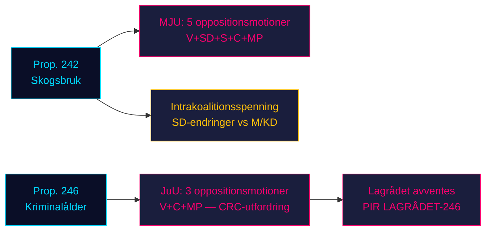

# Opposisjonen stormer regjeringens to lovgivningspilarer: Skogbruk og kriminell alder møter firepartimotstand

**Klassifisering**: UGRADERT // OFFENTLIG KILDE // GDPR Art. 9(2)(e,g)
**Dato**: 2026-05-07
**Forfatter**: James Pether Sörling
**Konfidens**: B3 — Pålitelig kilde, muligens sann (Admiralitetsskalaen)
**Kjøring-ID**: 25482566277

## BLUF

Åtte opposisjonsutvalgsforslag innlevert 2026-05-04 monterer koordinert motstand mot to regjeringsproposisjoner: fire opposisjonspartier (V, SD, S, C, MP) utfordrer prop. 2025/26:242 om skogbruksderegulering via MJU, mens V, C og MP krever avslag på nedsettelse av den strafferettslige lavalderen til 13 år i prop. 2025/26:246 via JuU. Med valget i september 2026 ca. 125 dager unna bærer begge lovgivningskampene maksimal valgmessig relevans. Regjeringens 165-mandat flertall møter sin mest konstitusjonelt avgjørende konfrontasjon i den parlamentariske vårsesjonen.

## 60-sekunders etterretningslesing

- **Skogbrukskluster (MJU, prop. 242)**: V krever nesten totalt avslag; MP krever totalt avslag; S krever omfattende konsekvensanalyse og uavhengig evaluering; C krever en sammenhengende nasjonal skogpolitikk; SD (koalisjonspartner) leverer endringsforslag — noe som skaper en intrakoalitionsspenning som er den kritiske variabelen.
- **Kriminalitetsalderkluster (JuU, prop. 246)**: C (nøkkelaktør) krever direkte avslag på aldersnedsettelsen til 13 år, maksimal straffskjerpelse, endringer i ungdomsomsorg og strafferegister. V krever likeledes nesten totalt avslag. MP avviser aldersnedsettelse til 13 år og straffeutmålingsbestemmelsene. Tre opposisjonspartier påberoper seg FNs barnekonvensjon (CRC) Art. 40(3)(a) — en konstitusjonell legitimitetsutfordring.
- **Lagrådets uttalelse om prop. 246**: Ennå ikke publisert (per 2026-05-07). Hvis Lagrådet markerer CRC-uforenlighet, øker sannsynligheten for et regjeringstilbaketog fra ~15% til ~30-40%.
- **S's holdning til kriminalitetsalder**: S har ennå ikke levert en JuU-forslag — det avgjørende gapet. S's erklæring avgjør om opposisjonen når 163 mandater i denne avstemningen.
- **Valgframing**: Begge klustrer posisjonerer seg for valget: SD's skogbruksendringer skaper synlig intrakoalisjons-dissens; V/MP/C's motstand mot kriminalitetsalderen innrammes som et valgspørsmål om barnerettigheter.
- **Økonomisk bakgrunn**: Sverige BNP-vekst 0,82% (2024, Verdensbanken); arbeidsledighet 8,69% (2025, Verdensbanken). Finansielt press intensiverer velgernes følsomhet for offentlig effektivitet og kriminalitetskostnader.

## Topp understøttede beslutninger

1. **JuU-tidsstrategi**: Når presser C på utvalgsinnrømmelser før Lagrådets uttalelse — eller avventer den som løftestang?
2. **S's holdningserklæring**: Vil S levere et endringsforslag om prop. 246 innen JuU's utvalgsfrist (~2026-05-20)?
3. **MJU-forhandlingsvektor**: Signaliserer SD's forslag ekte intrakoalisjons-spenning eller taktisk posisjonering for å presse ut innrømmelser fra M/KD?

## Topp fremadrettet utløser

**Lagrådets uttalelse om prop. 2025/26:246** — forventet ~2026-06-05. Hvis Lagrådet markerer CRC Art. 40(3)(a)-uforenlighet, forskyves den politiske kalkylen avgjørende. Regjeringen står overfor et valg: fortsett og risiker konstitusjonell sensur, eller trekk tilbake og lider et valgmessig tap på flaggskips kriminalpolitikk.

## Horisontkonfidensoversikt

| Horisont | Vurdering | WEP-formulering |
|---------|-----------|-------------|
| T+72h | Utvalgsforhandlinger begynner; ingen avstemninger | Vi vurderer med høy konfidens |
| T+7d | S's erklæring om prop. 246 sannsynlig | Vi forventer sannsynligvis S's forslag eller uttalelse |
| T+30d | Lagrådets uttalelse; MJU-utvalgsrapport | Vi vurderer det sannsynlig at Lagrådet publiserer |
| T+valg | Et eller begge forslag endret eller nedstemt | Omtrent like sjanser for at regjeringen gir innrømmelser |

<!-- source-sha: 763faff7f9c94520ee112d9155becca626ed9add -->
