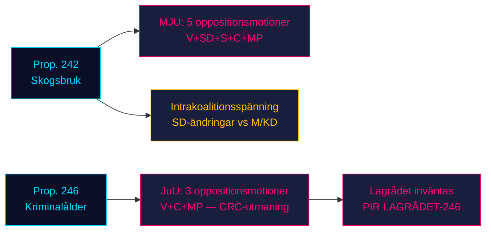

# Oppositionen stormar regeringens dubbla lagstiftningspelare: Skogsbruk och kriminalålder möter fyrapartimotstånd

**Klassificering**: HEMLIGHETSSTÄMPLAT EJ // OFFENTLIG KÄLLA // GDPR Art. 9(2)(e,g)
**Datum**: 2026-05-07
**Författare**: James Pether Sörling
**Konfidens**: B3 — Tillförlitlig källa, möjligen sant (Admiralitetsskalan)
**Körnings-ID**: 25482566277

## BLUF

Åtta oppositionsutskottsmotioner inlämnade 2026-05-04 monterar koordinerat motstånd mot två regeringspropositioner: fyra oppositionspartier (V, SD, S, C, MP) utmanar prop. 2025/26:242 om skogsbruksavreglering via MJU, medan V, C och MP kräver avslag på sänkning av straffansvarsåldern till 13 år i prop. 2025/26:246 via JuU. Med riksdagsvalet i september 2026 ungefär 125 dagar bort, bär båda lagstiftningssllagen maximal elektoral relevans. Regeringens 165-mandasjövikt möter sin mest konstitutionellt avgörande konfrontation under den parlamentariska våren.

## 60-sekunders underrättelseläsning

- **Skogsbrukskluster (MJU, prop. 242)**: V kräver nästan totalt avslag; MP kräver totalt avslag; S kräver omfattande konsekvensanalys och oberoende utvärdering; C kräver en sammanhängande nationell skogspolitik; SD (koalitionspartner) lämnar ändringsyrkanden — vilket skapar en intrakoalitionsspänning som är den kritiska variabeln.
- **Kriminalålderskluster (JuU, prop. 246)**: C (pivotal aktör) kräver direkt avslag på sänkning av åldern till 13 år, maximalt straffhöjning, ändringar i ungdomsvård och kriminalregister. V kräver likaså nästan totalt avslag. MP avvisar ålderssänkning till 13 år och straffsatsningsbestämmelserna. Tre oppositionspartier åberopar FN:s barnkonvention (CRC) Art. 40(3)(a) — en konstitutionell legitimitetsutmaning.
- **Lagrådsyttrande om prop. 246**: Ännu inte publicerat (per 2026-05-07). Om Lagrådet flaggar CRC-inkompatibilitet ökar sannolikheten för ett regeringsreträtt från ~15% till ~30-40%.
- **S position om kriminalålder**: S har ännu inte lämnat en JuU-motion — det avgörande gapet. S:s deklaration avgör om oppositionen når 163 mandat i denna omröstning.
- **Valframing**: Båda klustren positionerar inför valet: SD:s skogsbruksändringar skapar synlig intrakoalitionsdissens; V/MP/C-motståndet mot kriminalåldern ramar in barnrättigheter som en valfråga.
- **Ekonomisk bakgrund**: Sveriges BNP-tillväxt 0,82% (2024, Världsbanken); arbetslöshet 8,69% (2025, Världsbanken). Finanstryck intensifierar väljarnas känslighet för offentlig sektors effektivitet och brottskostnader.

## Topp beslut som stöds

1. **JuU-tidsstrategi**: När pressar C på utskottsmedgivanden före Lagrådets yttrande — eller inväntar det som hävstång?
2. **S positionsdeklaration**: Kommer S att lämna ett ändringsyrkande om prop. 246 före JuU:s utskottsdeadline (~2026-05-20)?
3. **MJU-förhandlingsvektor**: Signalerar SD:s motion äkta intrakoalitionsspänning eller taktisk positionering för att pressa ut medgivanden från M/KD?

## Topp framåtutlösare

**Lagrådets yttrande om prop. 2025/26:246** — förväntas ~2026-06-05. Om Lagrådet flaggar CRC Art. 40(3)(a)-inkompatibilitet förskjuts den politiska kalkylen avgörande. Regeringen står inför ett val: fortsätt och riskera konstitutionell censur, eller dra tillbaka och drabbas av en elektoral förlust på flaggskeppsbrott policy.

## Horisontkonfidenssummering

| Horisont | Bedömning | WEP-formulering |
|---------|-----------|-------------|
| T+72h | Utskottsöverläggningar inleds; inga omröstningar | Vi bedömer med hög konfidens |
| T+7d | S:s deklaration om prop. 246 trolig | Vi förväntar oss sannolikt S:s motion eller uttalande |
| T+30d | Lagrådets yttrande; MJU-utskottsrapport | Vi bedömer det som sannolikt att Lagrådet publicerar |
| T+val | En eller båda propositioner ändrade eller besegrade | Ungefär lika chans för att regeringen ger efter |

<!-- source-sha: 763faff7f9c94520ee112d9155becca626ed9add -->
