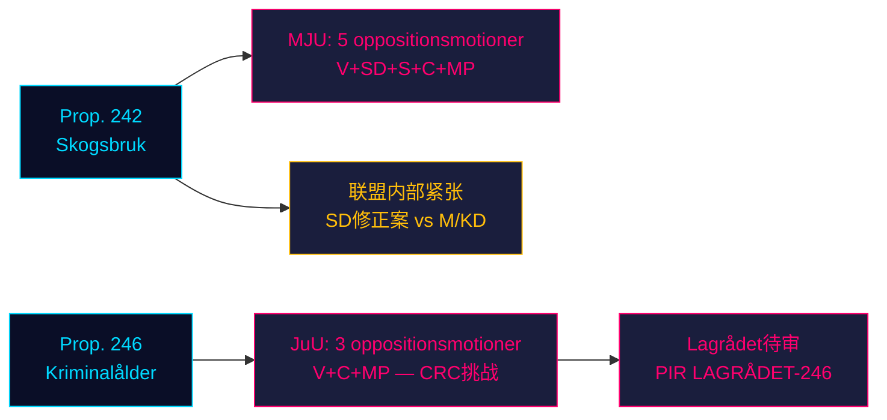

# 反对派冲击政府两大立法支柱：林业与刑事责任年龄遭四党抵制

**分类**: 非保密 // 公开来源 // GDPR Art. 9(2)(e,g)
**日期**: 2026-05-07
**作者**: James Pether Sörling
**可信度**: B3 — 可靠来源，可能属实（海军部量表）
**运行ID**: 25482566277

## BLUF

2026-05-04提交的八项反对党委员会动议协调对两项政府提案的抵制：四个反对党（V、SD、S、C、MP）通过MJU挑战prop. 2025/26:242关于林业放松管制的提案，而V、C和MP则通过JuU要求否决prop. 2025/26:246中将刑事责任年龄降低至13岁的议案。距2026年9月大选约125天，两场立法斗争具有最高的选举重要性。政府的165席多数面临议会春季最具宪法影响力的对抗。

## 60秒情报速读

- **林业集群（MJU，prop. 242）**：V要求几乎全面否决；MP要求全面否决；S要求全面影响分析和独立评估；C要求连贯的国家林业政策；SD（联合执政伙伴）提交修正案——制造联盟内部紧张，这是关键变量。
- **刑事年龄集群（JuU，prop. 246）**：C（关键行为者）直接要求否决年龄降至13岁、最高刑期增加、青少年保护修改及犯罪记录修改。V同样要求几乎全面否决。MP拒绝年龄降至13岁及量刑条款。三个反对党援引联合国儿童权利公约（CRC）第40(3)(a)条——宪法合法性挑战。
- **关于prop. 246的Lagrådet意见**：尚未发布（截至2026-05-07）。若Lagrådet标记CRC不兼容，政府退让概率从~15%上升至~30-40%。
- **S在刑事年龄问题上的立场**：S尚未提交JuU动议——决定性空缺。S的声明决定反对派能否在此次投票中达到163席。
- **选举框架**：两个集群均为选举定位：SD的林业修正案制造可见的联盟内部不和；V/MP/C对刑事年龄的抵制将儿童权利框架为选举议题。
- **经济背景**：瑞典GDP增长0.82%（2024年，世界银行）；失业率8.69%（2025年，世界银行）。财政压力加剧选民对公共部门效率和犯罪成本的敏感性。

## 主要支持决策

1. **JuU时机策略**：C何时在Lagrådet意见发布前向委员会施压获取让步——还是等待其作为筹码？
2. **S的立场声明**：S是否会在JuU委员会截止日期（~2026-05-20）前就prop. 246提交修正案？
3. **MJU谈判向量**：SD的动议是否预示真正的联盟内部紧张，还是为从M/KD获取让步的战术定位？

## 主要前瞻触发因素

**Lagrådet关于prop. 2025/26:246的意见**——预计~2026-06-05。若Lagrådet标记CRC第40(3)(a)条不兼容，政治计算将决定性地转变。政府面临选择：继续并承担宪法批评风险，或撤回并在旗舰犯罪政策上蒙受选举失败。

## 时间轴可信度摘要

| 时间轴 | 评估 | WEP表述 |
|---------|-----------|-------------|
| T+72h | 委员会审议开始；无投票 | 我们以高可信度评估 |
| T+7d | S关于prop. 246的声明可能 | 我们认为S可能提交动议或声明 |
| T+30d | Lagrådet意见；MJU委员会报告 | 我们评估Lagrådet很可能发布 |
| T+大选 | 一项或两项提案被修改或否决 | 政府让步的可能性大致相当 |

<!-- source-sha: 763faff7f9c94520ee112d9155becca626ed9add -->
