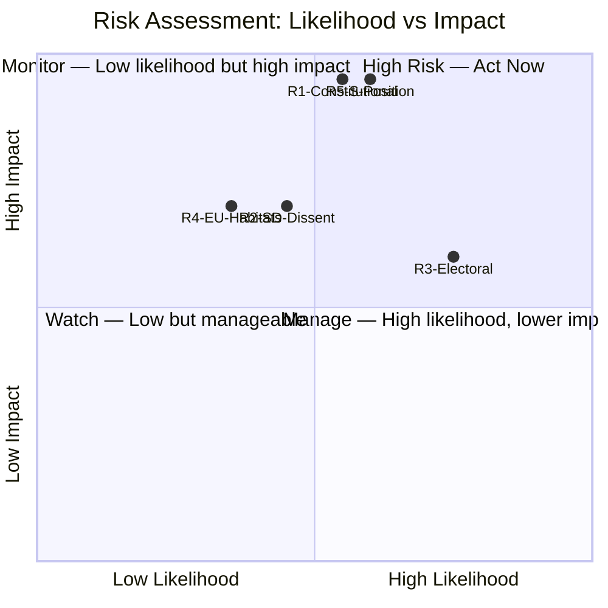

# Risk Assessment — Opposition Motions 2026-05-07

**Framework**: 5-dimension risk register (Likelihood × Impact)
**Date**: 2026-05-07 | **Author**: James Pether Sörling

## Risk Register

| Risk ID | Dimension | Description | L (1-5) | I (1-5) | L×I | Tier |
|---------|-----------|-------------|---------|---------|-----|------|
| R1 | Constitutional | Lagrådet flags CRC incompatibility for prop. 246 → government retreats or faces constitutional censure | 3 | 5 | 15 | 🔴 High |
| R2 | Political cohesion | SD's forestry amendments rejected by M/KD → SD votes against or abstains, government majority narrows | 2 | 4 | 8 | 🟠 Medium |
| R3 | Electoral | Criminal age cut becomes dominant election issue; opposition parties painted as "soft on crime" | 4 | 3 | 12 | 🔴 High |
| R4 | Institutional | EU Commission opens Art. 6 Habitats Directive infringement against prop. 242 provisions | 2 | 4 | 8 | 🟠 Medium |
| R5 | Legislative | S files JuU amendment on prop. 246 → government majority at 165 vs 163 on key provisions | 3 | 5 | 15 | 🔴 High |

## Detailed Risk Assessments

### R1 — Constitutional: Lagrådet CRC Finding
**Description**: Three parties (V HD024142, C HD024146, MP HD024148) explicitly invoke CRC Art. 40(3)(a) as grounds for rejecting the age cut to 13 in prop. 2025/26:246. If Lagrådet's yttrande (expected ~2026-06-05) concurs that the age cut is incompatible with CRC, the government faces the choice of proceeding with a Lagrådet-flagged bill or withdrawing. Proceeding risks Sweden's international obligations under CRC; withdrawing is a high-profile electoral defeat on flagship crime policy.

**Cascading chains**: R1 → R3 (constitutional retreat amplifies electoral damage) → R5 (S joins emboldened opposition)

**Posterior probability with trigger (Lagrådet CRC finding)**: P(government withdrawal) rises from ~15% to ~35%

**Mitigation**: Government could modify the age provision (e.g., raise floor from 13 to 14) before Lagrådet review, defusing the CRC argument while preserving political narrative.

### R2 — Coalition Cohesion: SD MJU Dissent
**Description**: SD (HD024143) files amendments against prop. 2025/26:242 — a government bill it co-governs. If MJU committee adopts SD's yrkanden, SD is satisfied but government bill is modified (moderate outcome). If SD's yrkanden are rejected in committee, SD faces constituency pressure and may abstain or vote against in chamber.

**Cascading chains**: R2 → coalition fragmentation narrative → R3 (election framing: "TidöPakten cracks")

**Posterior probability**: P(SD yrkanden accommodated in committee) ~55%; P(SD dissent continues) ~30%; P(SD votes against/abstains on prop. 242) ~15%

### R3 — Electoral: Crime Framing
**Description**: The criminal age debate is a prime election-year issue. Public polling (Novus/SIFO, referenced in prior cycles) shows ~60% support for tougher juvenile crime measures. Opposition's CRC framing may resonate with legal professionals and urban educated voters but risks alienating crime-concerned suburban and rural voters — Sweden's critical electoral battleground.

**Cascading chains**: R3 → V/C/MP lose suburban voters → government electoral advantage on crime

**Mitigation**: Opposition must couple CRC argument with alternative juvenile crime proposals (e.g., V's BRÅ research demand, MP's youth justice review).

### R4 — EU Compliance: Habitats Directive
**Description**: V (HD024141) and MP (HD024147) challenge prop. 242's compatibility with EU Habitats Directive Art. 6 and NRL Regulation 2024/1991. Naturvårdsverket has not yet published a formal compliance opinion (PIR EU-HABITATS-SE). If the EC monitors Swedish forestry reform in its 2026-2027 compliance cycle, an infringement procedure against prop. 242 provisions is possible.

**Timeline**: EC annual Habitats Directive reporting ~2027-03; short-term risk is domestic MJU committee debate.

### R5 — Legislative: S Joins CRC Opposition
**Description**: S (94 seats) has not filed a JuU motion on prop. 246. If S declares a position before the JuU committee deadline (~2026-05-20) joining V+C+MP, the combined opposition would hold 163 seats vs TidöPakten's 165 on affected provisions — a razor-thin government majority.

**Intelligence gap**: S declaration is the single most important outstanding intelligence question for this cycle. PIR S-CRC-JOIN.

## Risk Heat Map

