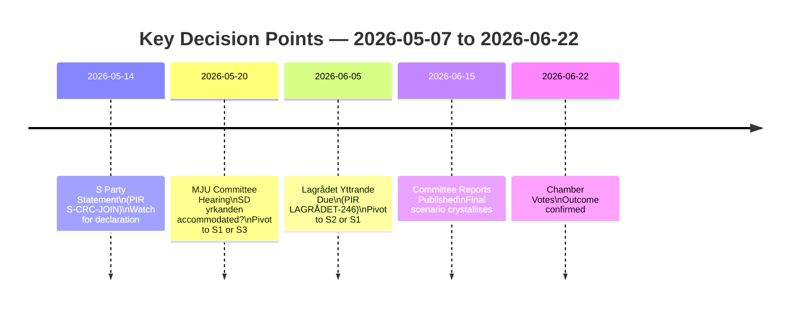

# Scenario Analysis — Opposition Motions 2026-05-07

**Framework**: ≥3 scenarios, probabilities summing 100%, leading indicators per scenario
**Date**: 2026-05-07 | **Author**: James Pether Sörling

## Scenario Overview

Three primary scenarios through to chamber vote (~2026-06-22):

| # | Scenario | Probability | Trigger | Outcome |
|---|----------|-------------|---------|---------|
| S1 | Government prevails — limited concessions | **55%** | SD yrkanden partially accommodated; S silent | Both props pass; minor MJU amendments for SD |
| S2 | Lagrådet forces prop. 246 delay | **25%** | Lagrådet negative yttrande on CRC Art. 40(3)(a) | Prop. 246 delayed or amended; criminal age raised from 13 to 14+ |
| S3 | Coalition crisis — prop. 242 defeat or withdrawal | **10%** | SD votes against; S + C + V + MP form blocking majority | Prop. 242 fails or withdrawn; government credibility damage |
| S4 | Double crisis — both proposals fail or are delayed | **10%** | S1 + R2 both triggered simultaneously | Electoral earthquake; early election scenario not excluded |

**Total: 100%**

---

## S1 — Government Prevails (55%)

**Narrative**: MJU committee accommodates SD's HD024143 yrkanden (notification thresholds, Sámi consultation clause). SD returns to government alignment. MJU committee rejects V, S, C, MP motions on lines. JuU committee awaits Lagrådet yttrande but proceeds; Lagrådet issues mild concern note (not blocking); JuU proceeds to chamber. S remains silent on prop. 246. Both bills pass.

**Leading indicators (monitor for this scenario)**:
- [ ] SD public statement withdrawing opposition to prop. 242 after committee hearing
- [ ] MJU committee preliminary report lists SD yrkanden as "beaktas" or incorporated
- [ ] S party press release declining to comment on prop. 246 through committee phase
- [ ] Lagrådet yttrande on prop. 246 issues "concerns" but not constitutional invalidity

**Electoral consequences**: Government claims both bills as achievements. SD claims credit for forestry amendments. Opposition challenge loses steam before September election.

---

## S2 — Lagrådet Forces Prop. 246 Delay (25%)

**Narrative**: Lagrådet issues yttrande finding CRC Art. 40(3)(a) incompatibility with 13-year straffbarhetsålder floor. Government either (a) withdraws and refiles with 14-year floor, or (b) proceeds with flagged bill — risking constitutional challenge. JuU delays committee report. Chamber vote on prop. 246 pushed to autumn or next riksmöte.

**Leading indicators (monitor for this scenario)**:
- [ ] Lagrådet website publishes "Yttrande prop. 2025/26:246" (check weekly)
- [ ] Lagrådet yttrande section mentions "barnkonventionen" or "artikel 40"
- [ ] Justitiedepartementet issues statement on "beredningstid" for prop. 246
- [ ] S declaration on prop. 246 — if S joins V + C + MP, government has less room to proceed

**Electoral consequences**: Opposition wins partial victory — criminal age bill delayed, CRC argument vindicated. Government must manage "tough on crime" brand damage.

---

## S3 — Coalition Crisis: Prop. 242 Defeat (10%)

**Narrative**: MJU committee rejects SD's amendments. SD votes against prop. 242 in chamber. With S+V+C+MP opposing, combined opposition = 163 + SD's ~73 seats = exceeds 165 TidöPakten. Prop. 242 fails. This is the minority-outcome scenario.

**Leading indicators (monitor for this scenario)**:
- [ ] SD MJU spokesperson public statement that yrkanden "must be accepted as condition for support"
- [ ] MJU committee preliminary report lists SD yrkanden as "avslås"
- [ ] Opposition joint statement coordinating opposition to prop. 242

**Electoral consequences**: Government credibility damaged. "TidöPakten in crisis" narrative dominates media. M/SD relationship strained. High electoral volatility.

---

## S4 — Double Crisis (10%)

**Narrative**: Both S3 (prop. 242 fails/withdrawn) AND S2 (prop. 246 delayed by Lagrådet) materialise simultaneously. Government faces two major legislative defeats within 4 months of election. Extraordinary extraordinary situation — could trigger confidence vote or informal negotiations.

**Leading indicators (monitor for this scenario)**:
- [ ] All S3 indicators fire AND Lagrådet negative yttrande confirmed within same week
- [ ] Opposition parties issue coordinated joint statements on both clusters
- [ ] Media polling shows TidöPakten approval drops >5 points in a two-week period

**Electoral consequences**: Potentially election-defining. Government may call early election or reshuffle.

---

## Scenario Monitoring Dashboard

