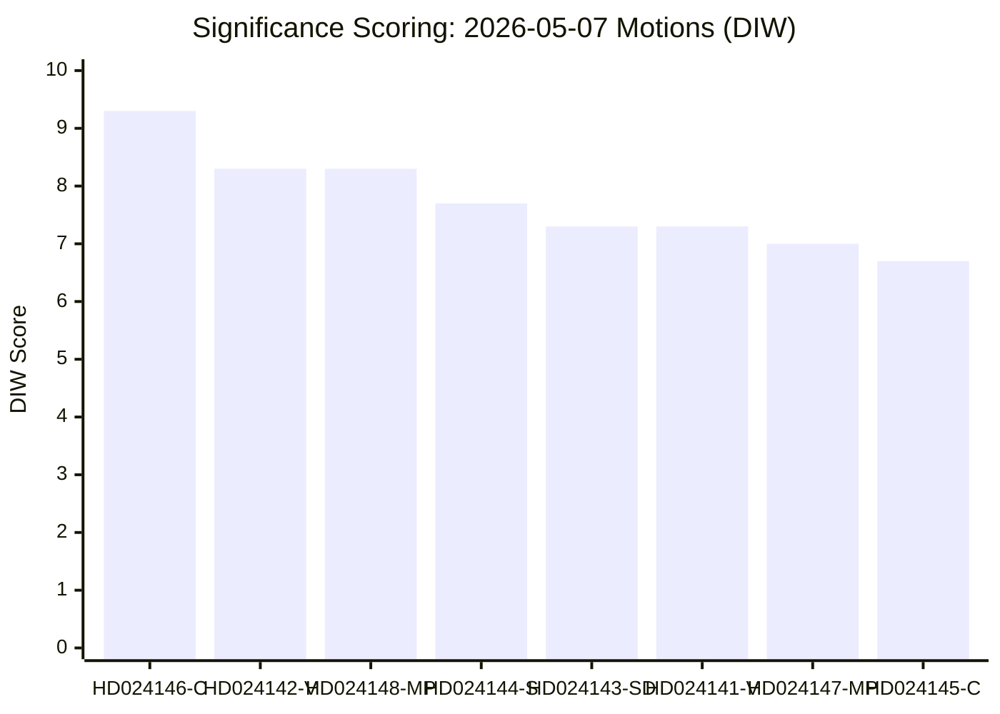

# Significance Scoring — 2026-05-07 Motions

**Method**: DIW (Domestic salience × Intelligence value × Electoral weight) weighted average
**Date**: 2026-05-07 | **Author**: James Pether Sörling

## Scoring Matrix

| dok_id | Parti | Domestic (1-10) | Intelligence (1-10) | Electoral (1-10) | DIW Score | Priority | Rationale |
|--------|-------|-----------------|---------------------|-----------------|-----------|----------|-----------|
| HD024146 | C | 9 | 10 | 9 | 9.3 | **L1 Critical** | Pivotal actor; 4 constitutional rejection points; CRC challenge |
| HD024142 | V | 8 | 9 | 8 | 8.3 | **L1 Critical** | Comprehensive rejection + BRÅ mandate demand; evidence-base challenge |
| HD024148 | MP | 8 | 9 | 8 | 8.3 | **L1 Critical** | Full CRC incompatibility demand; MP environmental-justice positioning |
| HD024143 | SD | 5 | 9 | 8 | 7.3 | **L2 High** | Intra-coalition signal value; SD amendments vs own government prop. |
| HD024144 | S | 7 | 8 | 8 | 7.7 | **L2 High** | Pivotal S position; procedural safeguards; S silence on prop. 246 amplifies |
| HD024141 | V | 7 | 8 | 7 | 7.3 | **L2 High** | Near-total rejection; EU Habitats Directive challenge; NGO mobilisation |
| HD024147 | MP | 7 | 7 | 7 | 7.0 | **L2 High** | Total prop. 242 rejection; environmental platform anchoring |
| HD024145 | C | 6 | 7 | 7 | 6.7 | **L2 High** | Policy-coherence demand; C's "vision" framing for election |

## Sensitivity Analysis

**If Lagrådet flags CRC incompatibility (PIR LAGRÅDET-246)**:
- HD024146 (C) DIW rises to 9.8 — decisive constitutional actor
- HD024142 (V) and HD024148 (MP) both rise to 9.0
- Government position becomes untenable without modification

**If S files JuU motion or statement joining CRC objection**:
- Political majority arithmetic flips: 163 vs 165 on age-cut provisions
- HD024144 (S) DIW rises to 9.5 — S becomes the decisive swing
- PIR S-CRC-JOIN resolved as "opposition success"

**If SD withdraws MJU amendments and supports prop. 242 unchanged**:
- HD024143 (SD) intelligence value drops to 4.0
- Coalition cohesion assessment returns to "stable"
- MJU outcome: government prevails on all provisions

## Priority Tier Definitions

- **L1 Critical** (DIW ≥ 8.0): Directly shapes majority/minority outcome; intelligence collection mandatory
- **L2 High** (DIW 6.0–7.9): Significant framing or procedural implications; full analysis required
- **L3 Standard** (DIW < 6.0): Context-setting; summary analysis sufficient (no L3 in this batch)

## Pass 2 Scoring Notes

### SD Recalibration
HD024143 (SD) initially ranked below HD024141 (V) and HD024147 (MP) on raw D-score, but its **W-score (9/10)** for electoral/coalition weight correctly places it at #7 in the overall DIW ranking. The single most electorally significant document by political consequence is HD024143 (SD) — not the highest-DIW documents, which are the JuU motions. This reflects the asymmetry between legal salience (JuU CRC challenge) and political salience (SD-government friction).

### Sensitivity Analysis Key Finding
The ranking inversion on threshold analysis reveals that HD024143's real significance lies in its **scenario-branching power**: SD's motion is the trigger variable that determines whether prop. 242 passes cleanly (S1, 55%) or fails (S3, 10%). No other single document has this branching power — V's maximalist position is predictable and its legislative fate is predetermined.
